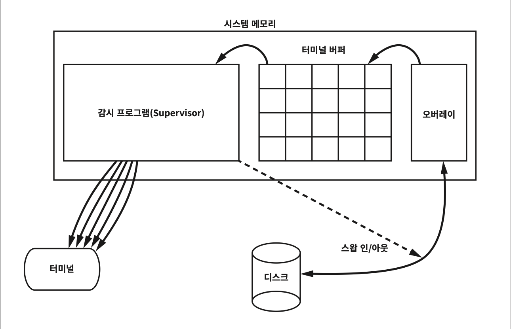

# Appendix A: Architecture Archaeology (아키텍처 고고학)

## 핵심 질문

소프트웨어 아키텍처의 원칙은 언제부터 존재했는가? 1970년대부터 1990년대 초반까지, 한 프로그래머의 45년 경력에서 어떤 아키텍처적 교훈이 축적되었는가? 그리고 그 교훈들은 오늘날의 클린 아키텍처 원칙과 어떻게 연결되는가?

---

## 1. 부록의 성격

이 부록은 Robert C. Martin(Uncle Bob)의 자서전적 회고록이다. 1970년부터 1990년대 초반까지 그가 참여한 프로젝트들을 아키텍처 관점에서 되짚으며, 좋은 아키텍처의 원칙이 어떻게 경험에서 비롯되었는지를 보여준다. 일부는 아키텍처와 직접 관련되고, 일부는 저자의 경력과 정체성 형성에 관한 이야기다.

> **핵심 통찰**: 클린 아키텍처의 원칙은 이론에서 연역된 것이 아니라, 수십 년에 걸친 실패와 성공의 경험에서 귀납적으로 도출되었다.

---

## 2. 조합 회계 시스템 (1971)

### 2.1 배경: GE Datanet 30

1960년대 후반, ASC Tabulating이라는 회사가 전미 트럭 운전사 조합(Teamsters Union)의 Local 705 지역 조합에 회계 시스템을 제공하기로 계약을 체결했다. 이 시스템은 GE Datanet 30이라는 거대한 머신(*이 머신은 방 전체를 가득 채웠으며, 집적 회로 이전 시대의 트랜지스터 기반 컴퓨터였다. 디스크 드라이브의 플래터는 지름 36인치, 두께 3/8인치에 달했고, 전원이 켜지면 제트 엔진 같은 소리가 났다.*) 위에서 동작했다.

| 항목 | 사양 |
|------|------|
| 메모리 | 16K x 18비트 코어 메모리 |
| 사이클 타임 | 7마이크로초 (약 142kHz) |
| 디스크 | 약 20MB, 36인치 플래터 12개 이상 |
| 터미널 | CRT 터미널, 초당 30문자 |
| 프로그래밍 | 어셈블러, 운영체제 없음, 파일 시스템 없음 |

파일 시스템이 없었기 때문에 데이터를 저장하려면 디스크의 트랙, 플래터, 섹터를 직접 지정하여 기록해야 했다. 디스크 드라이버도 직접 작성해야 했다.

### 2.2 Varian 620/f로의 전환

1971년, 18살이었던 Uncle Bob과 두 명의 친구가 고용되어 전체 시스템을 Varian 620/f 미니컴퓨터로 교체하는 작업을 맡았다. Varian 머신은 32K x 16비트 코어 메모리에 사이클 타임 약 1마이크로초로, Datanet 30보다 훨씬 강력했다. 하지만 여전히 운영체제도, 파일 시스템도, 고수준 언어도 없었다. 오직 어셈블러뿐이었다.

### 2.3 오버레이 아키텍처

시스템 전체를 32K에 욱여 넣는 대신, **오버레이(overlay) 시스템**을 만들었다.



동작 방식은 다음과 같았다:

1. 애플리케이션이 디스크에서 오버레이 전용 메모리 블록으로 로드된다
2. 애플리케이션이 특정 터미널 버퍼가 가득 찰 때까지 출력을 생성한다
3. 버퍼가 가득 차면 감시 프로그램(Supervisor)이 애플리케이션을 스왑-아웃한다
4. 감시 프로그램이 초당 30문자 속도로 버퍼 내용을 터미널로 흘려보낸다
5. 버퍼가 거의 비면 애플리케이션을 다시 스왑-인하여 버퍼를 채운다

인터럽트와 입출력을 관리하는 선점형 감시 프로그램, 디스크 드라이버, 터미널 드라이버 등 시스템의 모든 것을 직접 작성했으며, 주당 80시간씩 8~9개월 만에 완성했다.

### 2.4 아키텍처적 교훈: 두 개의 경계

이 단순한 시스템에도 **두 개의 명확한 경계**가 존재했다.

| 경계 | 설명 | 의존성 방향 |
|------|------|------------|
| **문자 출력 경계** | 애플리케이션은 문자열을 감시 프로그램에 전달할 뿐, 출력이 30문자/초로 터미널에 전송된다는 사실을 알지 못했다 | 정상 (제어흐름과 동일) |
| **애플리케이션 구동 경계** | 감시 프로그램이 애플리케이션을 구동했지만, 애플리케이션에 대한 컴파일타임 의존성이 없었다. 오버레이 영역의 고정된 메모리 주소가 다형적 인터페이스 역할을 했다 | **역전** (의존성 역전) |

> **핵심 통찰**: 의존성 역전(DIP)의 원리는 1971년에도 이미 동작하고 있었다. 오버레이 영역의 고정 메모리 주소는 오늘날의 인터페이스와 동일한 역할을 했다.

---

## 3. 레이저 트리밍 (1973)

### 3.1 테라다인 응용 시스템

Uncle Bob은 1973년 시카고에 위치한 테라다인 응용 시스템(Teradyne Applied Systems, TAS)에 합류했다. 이 회사는 세라믹 기판 위의 저항기를 레이저로 정밀하게 깎아 저항값을 맞추는(허용 오차 0.1% 수준) 시스템을 만들었다.

컴퓨터는 M365로, PDP-8을 향상시킨 자체 제작 미니컴퓨터였다. 개발 환경은 원시적이었다.

| 항목 | 사양 |
|------|------|
| 대용량 기억장치 | 테이프 카트리지 (8트랙 오디오 카세트와 유사) |
| 테이프 속도 | 초당 1피트, 한 방향으로만 이동 (되감기 불가) |
| 콘솔 | 72문자 x 24줄 형광 녹색 아스키 CRT, 대문자만 지원 |
| 편집 방식 | 50줄 단위 블록 편집, 이전 블록으로 돌아가기 불가 |

### 3.2 개발 프로세스의 고통

프로그램을 편집하려면 종이에 출력한 후 편집할 부분을 빨간 잉크로 표시하고, 한 블록씩 순서대로 편집해야 했다. 이전 블록으로 돌아갈 수 없었기 때문이다.

약 20,000줄의 코드를 컴파일하는 데 거의 30분이 걸렸고, 컴파일 중 테이프 읽기 오류가 발생할 확률은 약 10분의 1이었다. 오류가 발생하면 30분짜리 컴파일을 처음부터 다시 시작해야 했다.

### 3.3 MOP와 계층 구조

시스템의 아키텍처에는 MOP(Master Operating Program)가 있었고, 그 위에 측정 하드웨어, 이동식 테이블, 레이저를 제어하는 유틸리티 계층이 있었다. 그리고 격리 계층에서 애플리케이션을 위한 가상 머신 인터페이스를 제공했으며, 애플리케이션은 도메인 특화 언어(DSL)로 작성되었다.

하지만 **경계는 어떻게 해도 분명해지지 않았다**. MOP와 유틸리티 계층 사이, 심지어 시스템 코드와 DSL 애플리케이션 사이의 경계조차 제대로 강제되지 않았다. 모든 곳에 결합이 존재했다.

---

## 4. 알루미늄 다이캐스팅 모니터링 (1970년대 중반)

Uncle Bob은 아웃보드 마린 코퍼레이션(OMC)에서 알루미늄 다이캐스팅 기계의 작업 사이클을 모니터링하는 시스템을 개발했다. IBM System/7을 사용했으며, 언어는 역시 어셈블러였다.

아키텍처적으로 흥미로운 점은 System/7의 **SPI(Set Program Interrupt)** 명령어였다. 이 명령어로 프로세서의 인터럽트를 발생시켜 큐에 있는 우선순위가 낮은 인터럽트를 조작할 수 있었다. 오늘날의 `Thread.yield()`와 동일한 개념이다.

Uncle Bob은 이 직장에서 유일하게 해고당했다고 고백한다. 문화적으로 맞지 않았기 때문이다.

---

## 5. 4-TEL (1976~1988)

### 5.1 시스템 개요

1976년 10월, Uncle Bob은 테라다인 사의 다른 지사로 복귀하여 12년을 보냈다. 4-TEL은 매일 밤 서비스 대상 지역의 모든 전화 회선을 테스트하여 수리가 필요한 회선을 정리한 보고서를 생성하는 시스템이었다.

### 5.2 SAC/COLT 분리: 경계의 힘

초기에는 COLT(중앙 사무소 회선 테스터) 컴퓨터가 모든 일을 담당했고, SAC(서비스 지역 컴퓨터)은 단순한 멀티플렉서에 불과했다. 하지만 30cps의 통신 속도는 너무 느렸고, M365의 코어 메모리는 비쌌다.

**해결책**: 전화를 걸고 회선을 측정하는 소프트웨어(COLT)와 결과를 분석하고 출력하는 소프트웨어(SAC)를 **분리**했다.

| 분리 전 | 분리 후 |
|--------|--------|
| COLT가 모든 일을 처리 | COLT: 발신/측정만 담당 |
| SAC은 단순 멀티플렉서 | SAC: 분석/보고서/UI 담당 |
| 느린 응답 속도 | 빠른 화면 갱신 |
| 큰 메모리 필요 | COLT 메모리 사용량 대폭 감소 |

SAC과 COLT는 매우 작은 데이터 패킷으로 통신했다. 이 패킷들은 "XXXX로 전화걸기", "측정하기" 같은 단순한 형태의 DSL이었다. **경계가 매우 분명했고, 결합이 잘 분리되었다.**

### 5.3 벡터화 프로젝트: 플러그인 아키텍처의 발명

M365를 8085 마이크로프로세서 기반 마이크로컴퓨터로 교체하면서, 소프트웨어는 30K 크기의 단일 바이너리로 컴파일되어 30개의 EPROM 칩에 나누어 구워졌다. 문제는 사소한 코드 변경이라도 **모든 칩의 주소가 변경**되어 30개 칩 전체를 교체해야 한다는 것이었다.

현장에서 칩 교체 시 발생하는 문제들:

- 라벨이 잘못 붙거나 떨어지는 경우
- 엉뚱한 칩을 교체하는 경우
- 칩의 핀이 망가지는 경우
- 30개 칩 전체의 여분을 항상 가지고 다녀야 하는 불편

**벡터화** 프로젝트로 이 문제를 해결했다:

1. 30K 프로그램을 독립적으로 컴파일 가능한 32개의 소스 파일로 분리
2. 각 소스 파일의 시작 부분에 해당 칩의 모든 서브루틴 주소를 저장하는 고정 크기(40바이트) 데이터 구조 생성
3. RAM에 벡터라고 하는 특수 영역을 생성하여 32개 소스 파일의 포인터를 저장
4. 모든 서브루틴 호출을 RAM 벡터를 통한 **간접 호출**로 변경
5. 부팅 시 각 칩의 벡터 테이블을 RAM 벡터 영역으로 로드

이제 버그를 고치거나 기능을 추가할 때 한두 개의 칩만 재컴파일하여 교체하면 되었다. 심지어 빈 칩 소켓에 새 칩을 꽂는 것만으로 기능을 추가할 수도 있었다.

> **핵심 통찰**: 이것은 **다형적 디스패치(polymorphic dispatch)의 발명**이었다. 칩은 플러그인이었고, 벡터 테이블은 가상 함수 테이블(vtable)이었다. 객체 지향의 핵심 원리가 아키텍처적 필요에 의해 독립적으로 재발견된 것이다.

### 5.4 파견 결정 코드: 클린 코드의 가치

파견 결정(dispatch decision) 코드는 시스템의 핵심 수익원이었지만, 작성자가 3주간 천장만 쳐다보다 이틀 만에 코드를 쏟아내고 퇴사했다. 아무도 이 코드를 이해하지 못했고, 수정할 때마다 망가졌다. 결국 경영진은 **코드를 동결**하고 절대 수정하지 말라고 지시했다.

### 5.5 SAC의 아키텍처 문제

SAC 시스템은 60,000줄짜리 단일 모노리틱 어셈블러 프로그램이었다. 장치 제어 로직이나 UI 로직이 업무 규칙에서 전혀 격리되지 않았다. 모뎀 제어 코드가 코드 도처에 비트 수준으로 흩어져 있었다.

새로운 모뎀이 완전히 다른 제어 구조로 제작되었을 때, 코드 수백 곳을 수정하는 대신 직렬 통신 버스의 서브루틴을 수정하여 비트 패턴을 변환하는 끔찍한 방편을 택해야 했다.

> **핵심 통찰**: 하드웨어를 업무 규칙에서 격리하는 일의 가치, 그리고 인터페이스를 추상화하는 일의 가치를 뼈저리게 배웠다.

### 5.6 야심 찬 재설계의 실패

1980년대, C와 유닉스 기반으로 SAC을 완전히 재설계하려는 시도가 있었다. "타이거 팀"이 꾸려졌지만, 예전 시스템을 활발하게 유지보수하던 수많은 프로그래머들의 변경 속도를 따라잡지 못했다. 유럽 확장으로 인한 코드 포크 문제까지 겹치면서 재설계 프로젝트는 수년간 지연되었다.

---

## 6. C 언어와 BOSS (1970년대 후반~1980년대)

### 6.1 PDP-11과 C의 만남

하드웨어 엔지니어 리더가 CEO를 설득하여 PDP-11/60을 구입했다. Uncle Bob은 이 컴퓨터에 50MB(25MB x 2) 디스크를 장착하고, 크로스-컴파일러 시스템을 구축하여 PDP-11에서 8085용 코드를 컴파일할 수 있게 만들었다.

이후 C 언어를 발견하고, Whitesmiths사의 C 컴파일러를 구매해 8085용 어셈블러 코드를 출력할 수 있게 했다.

### 6.2 BOSS: 최초의 운영체제

BOSS(Basic Operating System and Scheduler)(*나중에 "Bob's Only Successful Software"라는 새 이름이 붙었다.*)는 8085에서 사용할 간단한 태스크 전환 프로그램이었다. 거의 대부분 C로 작성되었으며, 비선점형 폴링 기반으로 동작했다.

핵심 API는 단 하나였다:

```c
block(eventCheckFunction);
```

이 호출은 현재 태스크를 중단시키고, `eventCheckFunction`을 폴링 목록에 넣은 후, 폴링 목록의 함수들을 하나씩 호출하며 `true`를 반환하는 함수와 연결된 태스크를 실행하는 방식이었다.

BOSS는 이후 수많은 프로젝트의 토대가 되었다.

---

## 7. pCCU (1980년대 초반)

디지털 교환기의 등장으로 COLT의 발신/측정 기능을 분리해야 했다. 여러 명이 1년간 개발해야 하는 CCU/CMU 아키텍처가 필요했지만, 어느 날 상사가 "다음 달까지 동작하게 만들어야 한다"고 통보했다.

다행히 대상 고객사가 매우 작았기에, 중앙 교환국에 간단한 컴퓨터를 배치하고 두 대의 COLT와 모뎀으로 연결하는 pCCU를 약 **일주일 만에** 개발했다. BOSS 기반에 C로 작성된 최초의 배포 제품이었다.

---

## 8. DLU/DRU (1980년대 초반)

### 8.1 문제

텍사스의 한 전화 회사가 지리적으로 넓은 영역에 원격 터미널을 제공해야 했다. 1980년대 초반에는 원격 터미널이 흔하지 않았고, 300bps 모뎀은 너무 느렸다.

### 8.2 해결책

- **DLU**(Display Local Unit): SAC 컴퓨터에 플러그인되어 문자 스트림을 9600bps 모뎀 링크로 다중화
- **DRU**(Display Remote Unit): 원격지에 배치되어 9600bps 링크의 데이터를 역다중화하여 로컬 터미널로 전송

### 8.3 두 가지 아키텍처의 비교

두 명의 개발자가 각각 다른 아키텍처를 선택했다.

| | DLU (Uncle Bob) | DRU (Mike Carew) |
|---|------|------|
| **아키텍처** | 데이터 흐름(dataflow) 모델 | 터미널별 독립 태스크 |
| **비유** | 공장의 조립 라인 | 혼자 전체 제품을 만드는 장인 여러 명 |
| **특징** | 각 태스크가 특정 문제를 처리하고 큐를 통해 다음 태스크에 전달 | 터미널별 하나의 거대한 태스크가 모든 일을 처리 |

두 아키텍처 모두 잘 동작했다.

> **핵심 통찰**: 소프트웨어 아키텍처가 완전히 다르더라도 효과는 동등할 수 있다.

---

## 9. VRS: 음성 응답 시스템 (1980년대)

### 9.1 시스템 개요

VRS(Voice Response System)는 케이블 수리기사가 시스템에 직접 전화하여 터치 톤으로 지시를 내리고, 시스템이 음성으로 결과를 읽어주는 시스템이었다.

### 9.2 데이터베이스 결합의 재앙

마이크로컴퓨터, 유닉스, C, SQL 데이터베이스를 모두 사용했다. 데이터베이스는 유니파이(UNIFY)를 선택했고, **임베디드 SQL** 기술을 코드 도처에 사용했다.

시스템은 성공적으로 동작했다. 그런데 유니파이 제품의 계약이 취소되었다.

다른 데이터베이스로 교체하려고 3개월간 고생했지만 **결국 포기**했다. 유니파이에 너무 강하게 결합되어 있었기 때문이다. 결국 유니파이를 유지보수해 줄 서드파티를 고용했고, 비용은 해마다 증가했다.

> **핵심 통찰**: 데이터베이스는 세부사항이며, 시스템의 업무 규칙과는 반드시 분리해야 한다. 서드파티 소프트웨어에 강하게 결합되면 교체가 불가능해진다.

---

## 10. 전자 접수원 (1983)

### 10.1 최초의 음성 사서함

CEO가 컴퓨터, 통신, 음성 시스템의 융합에서 새로운 제품을 발굴하도록 세 명의 팀을 구성했다. 전자 접수원(Electronic Receptionist, ER)이 탄생했다.

- 고객이 전화를 걸면 ER이 터치 톤으로 상대방 이름의 철자를 받아 연결
- 연결 실패 시 대체 번호 목록을 순차적으로 시도
- 최종 실패 시 음성 메시지를 받아 기록
- 주기적으로 상대방을 찾아 메시지 전송

이것은 **최초의 음성 사서함 시스템**이었고, 특허도 보유하고 있었다(하지만 사무용 기기 시장 진입에 실패하여 특허 신청을 취소했고, 석 달 후 다른 회사가 그 특허를 가져갔다).

### 10.2 서비스 지향 아키텍처

각 전화선은 MP/M 운영체제 위의 리스너 프로세스가 감시했다. 전화가 오면 일련의 상태를 따라 처리되며, 각 상태를 담당하는 핸들러 프로세스가 제어권을 넘겨받았다. 서비스 간 메시지 전달은 디스크를 통해 이루어졌다.

---

## 11. 수리기사 파견 시스템: CDS (1985)

### 11.1 마이크로서비스의 원형

CDS(Craft Dispatch System)는 ER의 서비스 지향 아키텍처를 더 공격적으로 적용한 시스템이다.

핵심 아키텍처 요소:

| 요소 | 설명 |
|------|------|
| **외부 상태 머신** | 텍스트 파일로 표현, 코드 변경 없이 애플리케이션 흐름 변경 가능 (개방-폐쇄 원칙) |
| **3DBB** | 공유 메모리 기반 서비스 간 통신 메커니즘, 이름 기반 데이터 접근 |
| **FLD** | 이름과 데이터를 재귀적 계층 구조로 연관 짓는 이진 트리 — 오늘날의 XML/JSON에 대응 |
| **핫-스왑** | 시스템 실행 중에도 상태 머신 텍스트 파일을 수정하여 흐름 변경 가능 |

> **핵심 통찰**: XML에 대응하는 FLD 포맷으로, 소켓에 대응되는 공유 메모리(3DBB)를 통해 통신하는 마이크로서비스가 1985년에 이미 존재했다. 하늘 아래 새로운 것은 없다.

---

## 12. Clear Communications (1988)

### 12.1 스타트업의 광기

1988년 테라다인에서 직원 몇 명이 퇴사하여 Clear Communications라는 스타트업을 만들었다. T1 회선의 통신 품질 검사 시스템용 소프트웨어를 구축하는 것이 목표였다.

매주 70~80시간을 일했다. ISO 7 통신 계층 전체를 맨땅에서 작성했고, 3,000줄짜리 C 함수 `gi()`(Graphic Interpreter)를 작성했다. 아키텍처를 생각할 시간은 없었다.

3년이 지나도 소프트웨어를 판매하지 못했고, 벤처 캐피털은 진저리를 치기 시작했다.

### 12.2 C++, OO, 그리고 "엉클 밥"

이 시기에 두 가지 중요한 일이 일어났다:

1. **넷뉴스 토론**: uucp 연결을 통해 C++와 객체 지향에 대해 수백 명과 토론하면서 SOLID 원칙의 기초가 마련되었다
2. **C++ 전환**: 썬 마이크로시스템즈의 C++ 컴파일러가 출시되어 C++로 전환

"엉클 밥"이라는 별명은 동료 Billy Vogel이 지어준 것이다. 처음에는 싫어했지만, 나중에 그리워져서 이메일 서명란에 슬쩍 넣었고, 결국 좋은 브랜드가 되었다.

---

## 13. ROSE (1990)

### 13.1 래쇼날과 부치

채용 담당자의 전화로 래쇼날(Rational)사에 합류하여, 부치 다이어그램(Booch diagram)을 그릴 수 있는 도구인 ROSE를 개발했다. 부치 표기법은 UML의 전조였다.

### 13.2 로즈의 아키텍처

로즈는 진짜 계층 기반 아키텍처를 가진 거대한 C++ 애플리케이션이었다. 컴파일러와 유사한 구조로, 그래픽 표기법을 파싱하여 내부 표현으로 변환하고, 가공하여 데이터베이스에 저장했다.

하지만 두 가지 실수가 있었다:

| 실수 | 내용 |
|------|------|
| **객체 지향 데이터베이스** | 마법처럼 동작할 것을 기대했지만, 실제로는 크고, 느리며, 거슬리고, 값비싼 서드파티 프레임워크였다 |
| **과도한 아키텍처** | 필요한 것보다 훨씬 많은 계층이 있었고, 각 계층이 통신 오버헤드를 발생시켜 팀 생산성이 급격히 떨어졌다 |

수많은 인력이 몇 년에 걸쳐 노력했지만 결국 도구 전체가 폐기되고, 위스콘신의 작은 팀이 만든 앙증맞은 애플리케이션으로 대체되었다.

> **핵심 통찰**: 아키텍처가 뛰어나더라도 커다란 실패로 끝날 수 있다. 아키텍처는 반드시 **문제의 규모에 적합할 정도만큼만** 유연해야 한다. 작은 데스크톱 도구에 엔터프라이즈급 아키텍처를 설계하는 일은 실패로 가는 지름길이다.

---

## 14. 건축사 인증 시험 (1990년대 초반)

### 14.1 재사용 프레임워크의 함정

ETS(Educational Testing Service)와 미국 건축사 등록원(NCARB)의 건축사 인증 시험 자동화 프로젝트에 참여했다. 18개의 GUI 비네트 애플리케이션과 18개의 채점 애플리케이션, 총 36개의 애플리케이션이 필요했다.

Uncle Bob과 Jim Newkirk는 36개 애플리케이션에서 공통으로 사용할 재사용 가능한 프레임워크를 먼저 개발하기로 결심했다.

### 14.2 첫 번째 시도: 실패

가장 복잡한 애플리케이션(비네트 그란데)을 기반으로 1년간 프레임워크를 개발했다. 결과는 45,000줄의 프레임워크 코드와 6,000줄의 애플리케이션 코드. 하지만 다음 애플리케이션에 적용하려 하자 **재사용 프레임워크가 재사용하기에 적합하지 않다**는 사실을 발견했다.

### 14.3 두 번째 시도: 성공

네 개의 비네트를 **동시에** 개발하면서 프레임워크를 재작업했다. 다시 1년이 걸렸지만, 이후에는 애플리케이션이 **몇 주마다 하나씩** 튀어나오기 시작했다.

GUI 프레임워크와 비네트 사이의 관계는 의존성 규칙을 준수했다. 비네트는 프레임워크에 **플러그인** 형태로 연결되었고, 고수준의 GUI 정책은 프레임워크 내부에 들어갔다.

> **핵심 통찰**: 재사용 가능한 프레임워크는 재사용할 **다수의 애플리케이션과 맞물려 개발**해야만 가능해진다. 단일 애플리케이션에서 추출한 프레임워크는 재사용할 수 없다.

---

## 15. 결론

Uncle Bob은 이 회고록을 1990년대 초반에서 의도적으로 끊는다. 이후의 이야기는 다른 책에서 다룰 예정이라고 한다.

---

## 요약

- **경계는 항상 존재했다**: 1971년의 조합 회계 시스템에서도 의존성 역전이 동작하고 있었다. 오버레이의 고정 메모리 주소가 인터페이스 역할을 했다.
- **플러그인 아키텍처는 재발견되었다**: 4-TEL의 벡터화 프로젝트는 EPROM 칩의 배포 독립성을 위해 다형적 디스패치를 독립적으로 발명했다.
- **결합의 대가는 잔혹하다**: SAC의 모뎀 코드가 사방에 흩어져 있어 새 모뎀 도입 시 끔찍한 방편을 택해야 했고, VRS의 데이터베이스 결합은 교체를 불가능하게 만들었다.
- **재설계는 쉽지 않다**: SAC의 C/유닉스 재설계는 기존 시스템의 빠른 변경 속도를 따라잡지 못하고 수년간 지연되었다.
- **아키텍처 과잉도 실패다**: ROSE는 훌륭한 아키텍처에도 불구하고, 과도한 계층과 객체 지향 데이터베이스로 인해 폐기되었다.
- **재사용은 다수의 사용자에서 온다**: 건축사 인증 시험 프로젝트에서 단일 애플리케이션 기반 프레임워크는 재사용에 실패했고, 네 개의 동시 개발에서 성공했다.
- **마이크로서비스는 새로운 것이 아니다**: 1985년 CDS에서 외부 상태 머신, 공유 메모리, FLD(XML 원형)를 사용하는 마이크로서비스가 이미 동작하고 있었다.
- **클린 코드의 가치는 절대적이다**: 파견 결정 코드처럼, 이해할 수 없는 코드는 결국 동결되어 수정 불가능한 상태가 된다.

---

## 다른 챕터와의 관계

- **Chapter 5 (객체 지향 프로그래밍)**: 4-TEL 벡터화 프로젝트에서 다형적 디스패치가 아키텍처적 필요에 의해 독립적으로 발명된 과정은, 다형성이 OOP의 핵심 가치인 이유를 실증한다.
- **Chapter 11 (DIP: 의존성 역전 원칙)**: 조합 회계 시스템의 감시 프로그램-애플리케이션 경계에서 이미 의존성 역전이 동작하고 있었다. DIP는 이론이 아니라 실천에서 나온 원칙이다.
- **Chapter 17 (경계: 선 긋기)**: VRS에서 데이터베이스와 업무 규칙을 분리하지 않아 겪은 교훈은, 경계를 그어야 하는 이유를 가장 생생하게 보여준다.
- **Chapter 22 (클린 아키텍처)**: 이 부록의 모든 프로젝트가 보여주는 교훈들 -- 경계, 의존성 역전, 플러그인, 세부사항 격리 -- 이 하나로 종합된 것이 클린 아키텍처다.
- **Chapter 27 (서비스: 크고 작은 모든)**: CDS의 마이크로서비스 아키텍처는 서비스가 아키텍처적 경계를 정의하지 않는다는 27장의 논점과 대비되는 흥미로운 사례다.
- **Chapter 30 (데이터베이스는 세부사항이다)**: VRS의 유니파이 사태는 30장의 핵심 주장을 뒷받침하는 가장 강력한 실증 사례다.
- **Chapter 32 (프레임워크는 세부사항이다)**: ROSE의 객체 지향 데이터베이스 실패는 서드파티 프레임워크에 대한 과도한 결합의 위험성을 보여준다.
