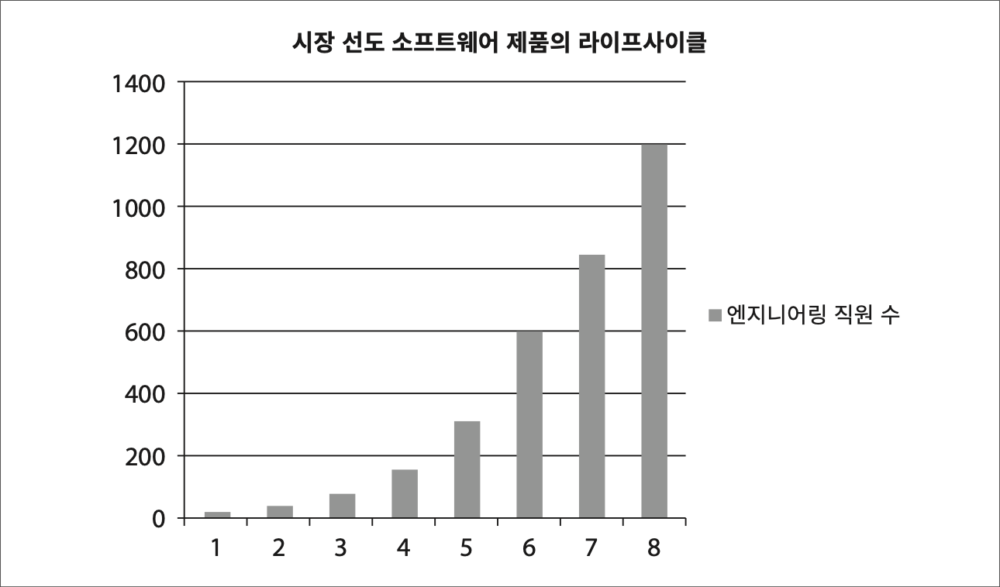
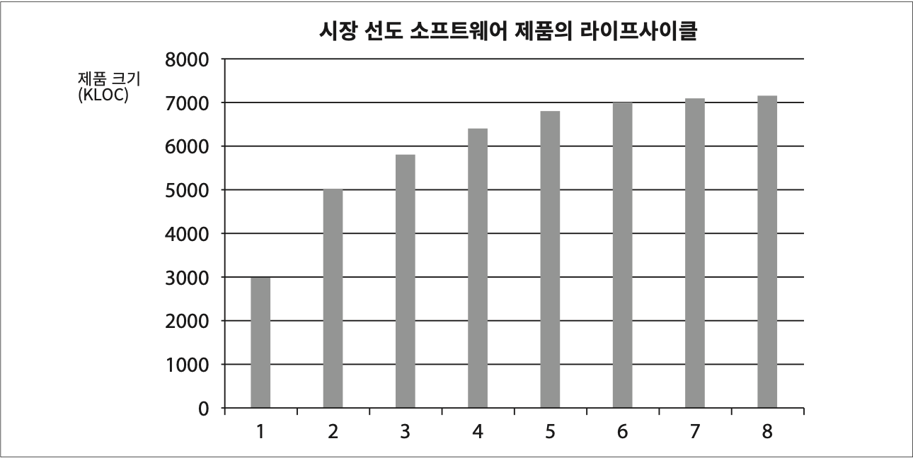
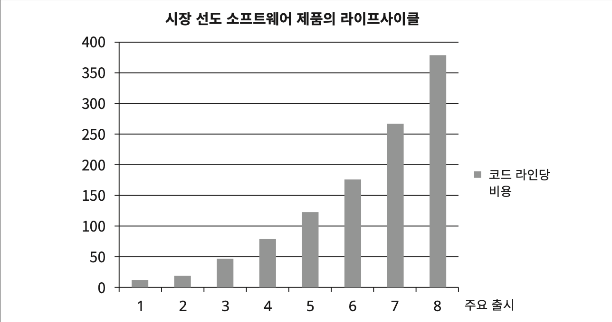
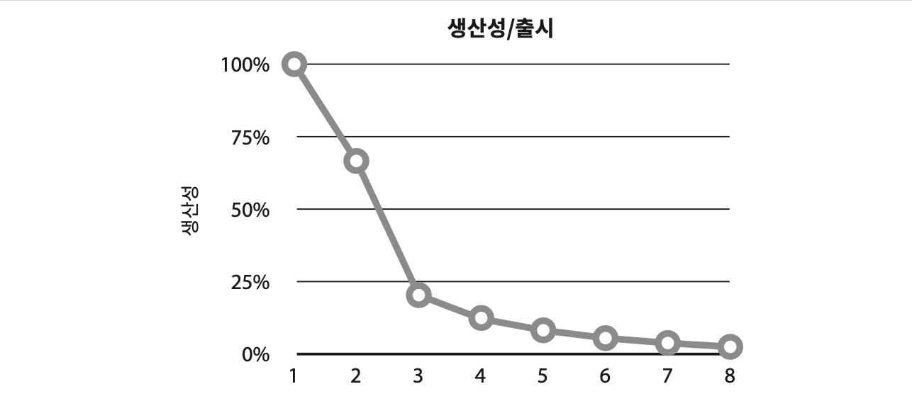
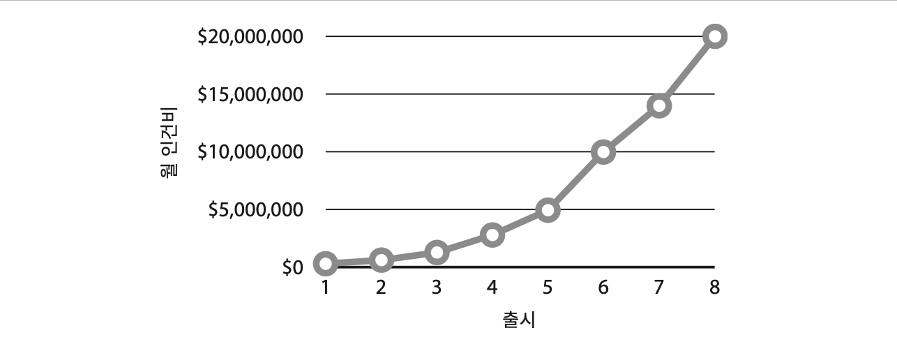
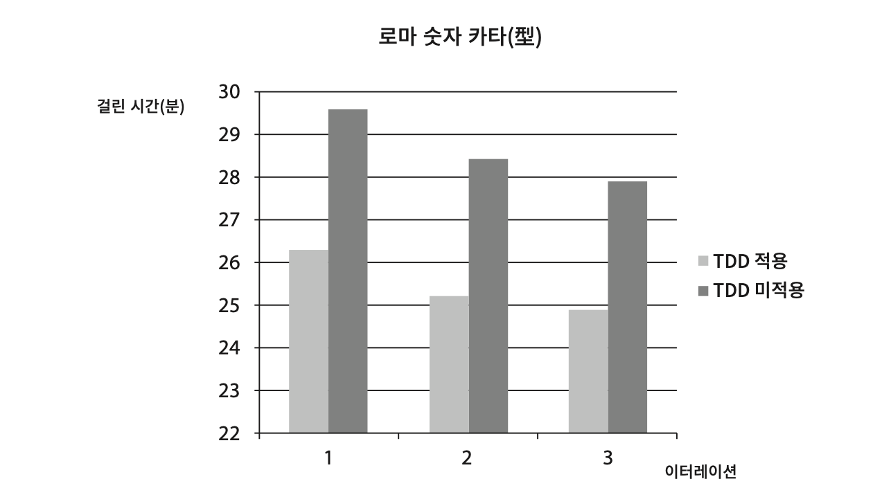

# Chapter 1: What Is Design and Architecture? (설계와 아키텍처란?)

## 핵심 질문

"설계(design)"와 "아키텍처(architecture)"는 다른 것인가? 소프트웨어 아키텍처의 궁극적인 목표는 무엇이며, 그 목표를 달성하지 못하면 어떤 일이 벌어지는가?

---

## 1. 설계와 아키텍처: 차이는 없다

### 1.1 흔한 오해

소프트웨어 업계에서 "아키텍처"와 "설계"라는 단어는 오랫동안 다른 의미로 사용되어 왔다.

| 용어 | 일반적 인식 | 예시 |
|------|------------|------|
| 아키텍처 | 고수준의 구조적 결정 | 마이크로서비스로 할 것인가, 모놀리스로 할 것인가 |
| 설계 | 저수준의 구현 세부사항 | 이 함수의 시그니처를 어떻게 할 것인가 |

### 1.2 Uncle Bob의 주장: 둘은 같다

Robert C. Martin은 이 책의 첫 페이지에서 명확히 선언한다 — **설계와 아키텍처 사이에는 아무런 차이가 없다.**

그 근거로 건축가의 비유를 든다. 새 집을 설계하는 건축가의 도면을 보면, 집의 형태, 외관, 방의 배치 같은 고수준의 결정사항뿐만 아니라 콘센트의 위치, 전등 스위치, 보일러의 배치, 배관의 크기 같은 저수준의 세부사항도 모두 하나의 통합된 도면에 포함되어 있다.

소프트웨어도 마찬가지다. 저수준의 세부사항과 고수준의 구조는 모두 소프트웨어 전체 설계의 구성요소다. 이 둘은 단절 없이 이어진 직물과 같으며, 개별로는 존재할 수 없고, 둘을 구분 짓는 경계는 뚜렷하지 않다. **고수준에서 저수준으로 향하는 의사결정의 연속성만이 있을 뿐이다.**

> **핵심 통찰**: 아키텍처와 설계를 구분하려는 시도 자체가 잘못이다. 시스템의 "큰 그림"과 "세부 구현"은 분리할 수 없는 하나의 연속체를 이루며, 둘 다 시스템의 품질을 결정한다.

---

## 2. 소프트웨어 아키텍처의 목표

설계와 아키텍처의 의사결정이 추구하는 목표는 무엇인가? Uncle Bob은 단 한 문장으로 정의한다:

> **소프트웨어 아키텍처의 목표는 필요한 시스템을 만들고 유지보수하는 데 투입되는 인력을 최소화하는 데 있다.**

설계 품질을 재는 척도는 곧 고객의 요구를 만족시키는 데 드는 **비용**을 재는 척도와 같다. 이 비용이 낮을 뿐만 아니라 시스템의 수명이 다할 때까지 낮게 유지할 수 있다면 좋은 설계다. 반대로, 새로운 기능을 출시할 때마다 비용이 증가한다면 나쁜 설계다.

---

## 3. 사례 연구: 엉망진창이 되어 가는 신호

Uncle Bob은 익명의 실제 회사 데이터를 바탕으로 아키텍처 실패의 결과를 보여준다. 이 사례는 책에서 네 개의 그래프로 제시되며, 각각이 같은 문제를 다른 관점에서 드러낸다.

### 3.1 엔지니어링 직원 수의 증가

첫 번째 그래프는 8차례 출시에 걸쳐 엔지니어링 직원 수가 꾸준히 증가하는 모습을 보여준다. 1차 출시 때 소수였던 팀은 8차 출시 때 약 1,200명까지 늘어난다. 이것만 보면 대단한 성공 사례처럼 보인다.

### 3.2 코드 생산성의 정체

두 번째 그래프는 같은 기간의 제품 크기(KLOC(*Kilo Lines of Code — 코드 1,000줄을 의미하는 단위. 소프트웨어 규모를 측정하는 전통적 지표이지만, 생산성의 정확한 척도로는 한계가 있다.*))를 보여준다. 인력이 폭발적으로 늘었음에도 불구하고, 코드 생산성은 마치 **한 곳으로 수렴하는 것처럼** 보인다. 무언가 명백히 잘못되었다.

### 3.3 코드 라인당 비용의 폭증

세 번째 그래프는 코드 한 라인당 비용이다. 이 추세는 명확한 재앙을 가리킨다 — **여덟 번째 출시의 코드는 처음 제품보다 약 40배나 더 많은 비용이 든다.** 이 추세로는 오래 갈 수 없다. 이러한 비용 곡선은 결국 사업 모델의 수익을 고갈시키며, 회사의 성장을 멈추게 하거나 완전히 망하게 만든다.

### 3.4 개발자 관점: 생산성의 추락

네 번째 그래프는 같은 기간의 출시별 개발자 생산성이다. 개발자의 생산성은 거의 100%로 시작했지만, 출시할 때마다 하락한다. 네 번째 출시에 다다르면 확실히 생산성은 거의 바닥을 치고 결국에는 0으로 수렴한다.

개발자 입장에서 이 현상은 지독한 절망감을 안겨준다. 모두가 열심히 일하고 있기 때문이다. 전력을 기울이지 않는 개발자는 없다. 초인적인 노력을 기울이고, 잔업을 하며, 헌신하지만 더 이상 진척이 없다. **개발자의 노력은 기능 개발보다는 엉망이 된 상황에 대처하는 데 소모되기 시작한다.** 사소한 기능을 추가하는 일조차 엉망이 된 코드를 이리저리 옮기는 반복 작업으로 변질된다.

### 3.5 경영자의 시각: 월 인건비의 폭증

다섯 번째 그래프는 같은 기간에 개발하는 데 쓰인 월별 인건비다. 첫 번째 출시에서는 매월 수십만 달러로 제품을 전달했지만, 여덟 번째 출시에 들어서면 월 인건비는 **2,000만 달러**가 되고 계속 증가하는 추세다. 초기에는 적은 비용으로 많은 기능을 탑재할 수 있었지만, 마지막 출시에서는 2,000만 달러를 들이고도 얻은 게 거의 없다.

---

## 4. 토끼와 거북이의 교훈

### 4.1 개발자의 과신

Uncle Bob은 이솝 우화의 토끼와 거북이를 현대 개발자에 비유한다. 토끼가 자신의 빠르기를 과신하여 낮잠을 잤듯이, 개발자도 자신의 생산성을 유지할 수 있다고 과신한다.

물론 개발자가 잠을 자는 것은 아니다 — 오히려 정반대로 뼈 빠지게 일한다. 하지만 **훌륭하고 깔끔하게 잘 설계된 코드가 중요하다는 사실을 알고 있는 바로 그 뇌가 잠자고 있다.**

### 4.2 두 가지 거짓말

개발자가 빠지는 함정에는 두 가지 거짓말이 있다:

**거짓말 1**: "코드는 나중에 정리하면 돼. 당장은 시장에 출시하는 게 먼저야!"

이 거짓말의 문제는 나중에 코드를 정리하는 일이 **절대 일어나지 않는다**는 것이다. 시장의 압박은 절대로 수그러들지 않기 때문이다. 바로 다음에 만들어야 할 새로운 기능이 기다리고 있고, 다음 기능, 또 다음 기능이 계속 기다리고 있다.

**거짓말 2**: "지저분한 코드를 작성하면 단기간에는 빠르게 갈 수 있고, 장기적으로 볼 때만 생산성이 낮아진다."

Uncle Bob은 이것이 진실의 오인이라고 단언한다. 진실은:

> **핵심 통찰**: **엉망으로 만들면 깔끔하게 유지할 때보다 항상 더 느리다.** 시간 척도를 어떻게 보든지 관계없이 말이다.

### 4.3 제이슨 고먼의 실험

이 주장은 제이슨 고먼(Jason Gorman)의 실험으로 뒷받침된다. 고먼은 6일에 걸쳐 매일 "정수를 로마 숫자로 변환하는 프로그램"을 완성하는 작업을 반복했다. TDD를 적용한 날(1, 3, 5일)과 적용하지 않은 날(2, 4, 6일)을 교차했다.

결과:
- TDD를 적용한 날이 적용하지 않은 날보다 **약 10% 빠르게** 작업이 완성되었다
- **TDD를 적용한 날 중 가장 느렸던 날**이 TDD를 적용하지 않고 **가장 빨리 작업한 날**보다도 더 빨랐다

이 결과는 단순한 진리를 확인해준다:

> **빨리 가는 유일한 방법은 제대로 가는 것이다.**

---

## 5. 재설계의 함정

개발자는 "처음부터 다시 시작하여 전체 시스템을 재설계하는 것이 해답"이라고 생각할 수 있다. 하지만 Uncle Bob은 이것도 토끼의 과신과 같다고 경고한다. **엉망으로 내몰았던 바로 그 과신이 "경주를 다시 시작한다면 더 나은 코드를 만들 수 있다"고 말하고 있는 것이다.** 자신을 과신한다면 재설계하더라도 원래의 프로젝트와 똑같이 엉망으로 내몰린다.

---

## 6. 결론

어떤 경우라도 개발 조직이 할 수 있는 최고의 선택지는:

1. **조직에 스며든 과신을 인지하여 방지**한다
2. **소프트웨어 아키텍처의 품질을 심각하게 고민**하기 시작한다
3. **좋은 소프트웨어 아키텍처가 무엇인지 이해**한다

이 책은 바로 이 내용을 다룬다. 비용은 최소화하고 생산성은 최대화할 수 있는 설계와 아키텍처를 가진 시스템을 만들기 위해, 아키텍처가 지녀야 할 속성들을 설명한다.

---

## 요약

- **설계와 아키텍처는 같은 것이다.** 고수준 구조와 저수준 세부사항은 하나의 연속체를 이루며, 둘을 구분 짓는 경계는 없다.
- **아키텍처의 목표는 인력 최소화다.** 시스템을 만들고 유지보수하는 데 투입되는 인력을 최소화하는 것이 좋은 아키텍처의 정의다.
- **엉망진창의 대가는 잔혹하다.** 실제 회사 사례에서, 인력은 수십 배 늘었지만 생산성은 0으로 수렴하고, 코드 라인당 비용은 40배 증가했다.
- **"나중에 정리하면 돼"는 거짓말이다.** 나중은 절대 오지 않으며, 시장 압박은 수그러들지 않는다.
- **엉망으로 만들면 항상 더 느리다.** 단기적으로도 장기적으로도, 깔끔한 코드가 더 빠르다. 제이슨 고먼의 실험이 이를 증명한다.
- **빨리 가는 유일한 방법은 제대로 가는 것이다.**
- **재설계도 답이 아니다.** 과신을 버리지 않으면 새로 시작해도 같은 결과를 낳는다.

---

## 다른 챕터와의 관계

- **Chapter 2 (두 가지 가치에 대한 이야기)**: 이 챕터에서 제기한 "아키텍처의 목표"가 왜 중요한지를 행위 vs 구조의 프레임으로 더 깊이 탐구한다. 아키텍처(구조)가 행위보다 더 높은 가치를 가진다는 논증을 제시한다.
- **Chapter 3~6 (프로그래밍 패러다임)**: 좋은 아키텍처의 토대가 되는 세 가지 패러다임(구조적, 객체지향, 함수형)을 다룬다. 이 챕터에서 말한 "좋은 아키텍처의 속성을 이해하라"의 첫 번째 단계다.
- **Chapter 7~11 (SOLID 원칙)**: 아키텍처의 벽돌인 설계 원칙들을 다룬다. 설계와 아키텍처가 같다는 이 챕터의 주장이 여기서 구체화된다.
- **Chapter 22 (클린 아키텍처)**: 이 책의 핵심인 클린 아키텍처 패턴을 제시한다. 이 챕터에서 정의한 "비용을 최소화하는 아키텍처"의 구체적인 모습이다.
- **Chapter 34 (빠져 있는 장)**: 아키텍처를 실제 코드로 구현할 때의 세부사항을 다루며, 고수준(아키텍처)과 저수준(설계)이 어떻게 연결되는지를 구체적으로 보여준다.
