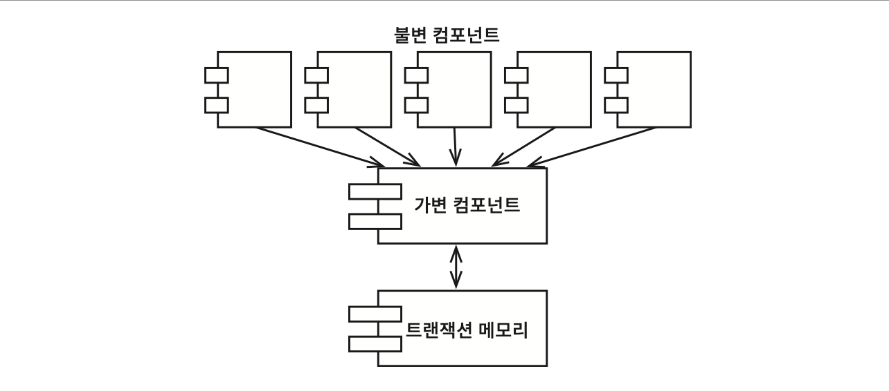

# Chapter 6: Functional Programming (함수형 프로그래밍)

## 핵심 질문

함수형 프로그래밍의 핵심 개념인 "불변성"이란 무엇이며, 아키텍트가 변수의 가변성을 염려해야 하는 이유는 무엇인가? 완전한 불변성은 실현 가능한가, 그리고 이를 위한 타협점은 무엇인가?

---

## 1. 함수형 프로그래밍의 기원

여러 가지 의미로, 함수형 프로그래밍이라는 개념은 프로그래밍 그 자체보다 앞서 등장했다. 이 패러다임에서 핵심이 되는 기반은 **람다(lambda) 계산법**으로, 알론조 처치(Alonzo Church)가 **1930년대**에 발명했다.

---

## 2. 정수를 제곱하기: 자바 vs 클로저

함수형 프로그래밍이 무엇인지 설명하기 위해, 25까지의 정수의 제곱을 출력하는 간단한 문제를 다뤄보자.

### 2.1 자바: 가변 변수를 사용하는 방식

```java
public class Squint {
    public static void main(String args[]) {
        for (int i = 0; i < 25; i++)
            System.out.println(i * i);
    }
}
```

자바 프로그램은 **가변 변수**(mutable variable)를 사용한다. 반복문을 제어하는 변수 `i`가 바로 가변 변수다 — 프로그램 실행 중에 상태가 변한다.

### 2.2 클로저: 가변 변수가 없는 방식

리스프에서 파생한 클로저(Clojure)는 함수형 언어로, 같은 프로그램을 다음과 같이 구현할 수 있다:

```clojure
(println (take 25 (map (fn [x] (* x x)) (range))))
```

이해를 돕기 위해 주석을 달아보면:

```clojure
(println               ; 출력한다
  (take 25             ; 처음부터 25까지
    (map (fn [x] (* x x))  ; 제곱을
      (range))))        ; 정수의
```

가장 안쪽의 함수 호출부터 살펴보면:

1. `range` 함수는 0부터 시작해서 **끝이 없는** 정수 리스트를 반환한다.
2. 반환된 정수 리스트는 `map` 함수로 전달되고, 각 정수에 대해 제곱을 계산하는 익명 함수를 호출하여, 모든 정수의 제곱에 대해 끝이 없는 리스트를 생성한다.
3. 제곱된 리스트는 `take` 함수로 전달되고, 이 함수는 앞의 25개까지의 항목으로 구성된 새로운 리스트를 반환한다.
4. `println` 함수는 입력 값(25개의 정수에 대한 제곱 값 리스트)을 출력한다.

끝이 없는 리스트라는 개념에 놀랄 수도 있지만, 실제로는 앞의 25개까지만 생성될 뿐이다. 끝이 없는 리스트의 어떤 항목도 **실제로 접근하기 전에는 평가가 이뤄지지 않기 때문**이다.

### 2.3 핵심 차이: 가변 변수의 유무

| 특성 | 자바 | 클로저 |
|------|------|--------|
| 가변 변수 | 있음 (`i`가 반복마다 변경) | **없음** (`x`는 한 번 초기화되면 절대 변하지 않음) |
| 상태 변경 | 반복문에서 `i++`로 상태 변경 | 함수 합성으로 새로운 값 생성 |
| 패러다임 | 명령형 (imperative) | 함수형 (functional) |

> **함수형 언어에서 변수는 변경되지 않는다.**

---

## 3. 불변성과 아키텍처

아키텍처를 고려할 때 이 내용이 왜 중요한가? 아키텍트는 왜 변수의 가변성을 염려하는가? 대답은 단순하다:

| 동시성 문제 | 원인 |
|------------|------|
| **경합 조건** (race condition) | 가변 변수 |
| **교착상태** (deadlock) | 가변 락(lock) |
| **동시 업데이트** (concurrent update) | 가변 변수 |

만약 어떠한 변수도 갱신되지 않는다면 경합 조건이나 동시 업데이트 문제가 일어나지 않는다. 락이 가변적이지 않다면 교착상태도 일어나지 않는다. **우리가 동시성 애플리케이션에서 마주치는 모든 문제는 가변 변수가 없다면 절대로 생기지 않는다.**

아키텍트라면 동시성(concurrency) 문제에 지대한 관심을 가져야만 한다. 스레드와 프로세스가 여러 개인 상황에서도 시스템이 여전히 강건하기를 바란다면, 불변성이 정말로 실현 가능한지를 스스로에게 반드시 물어봐야 한다.

이 질문에 대한 대답은 대체로 긍정적이다. 단, **저장 공간이 무한하고 프로세서의 속도가 무한히 빠르다고 전제한다면** 말이다. 자원이 무한대가 아니라면 대답은 조금 미묘하다 — 불변성은 실현 가능하겠지만 **일종의 타협**을 해야 한다.

> **핵심 통찰**: 동시성 애플리케이션에서 마주치는 모든 문제 — 경합 조건, 교착상태, 동시 업데이트 — 는 가변 변수가 없다면 절대로 생기지 않는다. 아키텍트는 이 사실에 지대한 관심을 가져야 한다.

---

## 4. 가변성의 분리

### 4.1 가변 컴포넌트와 불변 컴포넌트

불변성과 관련하여 가장 주요한 타협 중 하나는, 애플리케이션 내부의 서비스를 **가변 컴포넌트**와 **불변 컴포넌트**로 분리하는 일이다.

- **불변 컴포넌트**: 순수하게 함수형 방식으로만 작업이 처리되며, 어떤 가변 변수도 사용되지 않는다.
- **가변 컴포넌트**: 변수의 상태를 변경할 수 있는, 순수 함수형이 아닌 컴포넌트다.

불변 컴포넌트는 하나 이상의 가변 컴포넌트와 서로 통신한다.



상태 변경은 컴포넌트를 갖가지 동시성 문제에 노출하는 꼴이므로, 흔히 **트랜잭션 메모리**(transactional memory)와 같은 실천법을 사용하여 동시 업데이트와 경합 조건 문제로부터 가변 변수를 보호한다. 트랜잭션 메모리는 데이터베이스가 디스크의 레코드를 다루는 방식과 동일한 방식으로 메모리의 변수를 처리한다 — 트랜잭션을 사용하거나 재시도 기법을 통해 변수를 보호한다.

### 4.2 클로저의 atom: 트랜잭션 메모리의 예

```clojure
(def counter (atom 0))     ; counter를 0으로 초기화한다
(swap! counter inc)        ; counter를 안전하게 증가시킨다
```

`counter` 변수는 `atom`으로 정의되었다. 클로저에서 `atom`은 특수한 형태의 변수로, 값을 변경하려면 반드시 `swap!` 함수를 사용해야 한다는 매우 엄격한 제약이 걸려 있다.

`swap!` 함수는 **비교 및 스왑**(compare and swap) 알고리즘을 전략으로 사용한다:

1. `counter`의 값을 읽은 후 `inc` 함수로 전달한다.
2. `inc` 함수가 반환되면 `counter`의 값은 잠기게 되고, `inc` 함수로 전달했던 값과 비교한다.
3. 만약 값이 같다면 `inc` 함수가 반환한 값이 `counter`에 저장되고 잠금은 해제된다.
4. 값이 같지 않다면 잠금을 해제한 후 이 전략을 **처음부터 재시도**한다.

`atom` 기능은 간단한 애플리케이션에는 적합하지만, 여러 변수가 상호 의존하는 상황에서는 동시 업데이트와 교착상태 문제로부터 완벽히 보호해 주지 못한다. 이러한 상황에서는 더 정교한 장치를 사용해야 한다.

### 4.3 아키텍처 지침

애플리케이션을 제대로 구조화하려면 변수를 변경하는 컴포넌트와 변경하지 않는 컴포넌트를 **분리**해야 한다. 그리고 이렇게 분리하려면 가변 변수들을 보호하는 적절한 수단을 동원해 뒷받침해야 한다.

> 현명한 아키텍트라면 **가능한 한 많은 처리를 불변 컴포넌트로 옮겨야 하고**, 가변 컴포넌트에서는 가능한 한 많은 코드를 빼내야 한다.

---

## 5. 이벤트 소싱

### 5.1 은행 애플리케이션 사고 실험

저장 공간과 처리 능력의 한계는 우리의 시야에서 급격히 사라지고 있다. 프로세서가 초당 수십억 개의 명령을 수행하고 램(RAM) 용량은 수십억 바이트인 시대가 되었다. 더 많은 메모리를 확보할수록, 기계가 더 빨라질수록, 필요한 가변 상태는 더 적어진다.

고객의 계좌 잔고를 관리하는 은행 애플리케이션을 생각해 보자. 계좌 잔고를 변경하는 대신 **트랜잭션 자체를 저장**한다고 상상해보자. 누군가 잔고 조회를 요청할 때마다 계좌 개설 시점부터 발생한 모든 트랜잭션을 단순히 더한다. **이 전략에서는 가변 변수가 하나도 필요 없다.**

당연히 이 접근법은 시간이 지날수록 트랜잭션 수가 끝없이 증가하므로, 영원히 실현 가능하려면 무한한 저장 공간과 무한한 처리 능력이 필요하다. 하지만 **영원히 동작하도록 만들 필요는 없다** — 애플리케이션의 수명주기 동안만 문제없이 동작할 정도의 자원이면 충분할 것이다.

### 5.2 이벤트 소싱의 핵심

**이벤트 소싱**(event sourcing)에 깔려 있는 기본 발상이 바로 이것이다. 이벤트 소싱은 **상태가 아닌 트랜잭션을 저장하자**는 전략이다. 상태가 필요해지면 단순히 상태의 시작점부터 모든 트랜잭션을 처리한다.

물론 지름길을 택할 수도 있다. 예를 들어 매일 자정에 상태를 계산한 후 저장하고, 그 후 상태 정보가 필요해지면 자정 이후의 트랜잭션만을 처리하면 된다.

### 5.3 CRUD에서 CR로

더 중요한 점은 데이터 저장소에서 **삭제되거나 변경되는 것이 하나도 없다**는 사실이다:

| 전통적 방식 | 이벤트 소싱 방식 |
|------------|----------------|
| **CRUD** (Create, Read, Update, Delete) | **CR** (Create, Read) |
| 상태를 직접 변경 | 트랜잭션(이벤트)만 추가 |
| 동시 업데이트 문제 발생 가능 | 변경/삭제가 없으므로 동시 업데이트 문제 없음 |

저장 공간과 처리 능력이 충분하면 애플리케이션이 **완전한 불변성**을 갖도록 만들 수 있고, 따라서 완전한 함수형으로 만들 수 있다.

이 이야기가 여전히 터무니없게 들린다면, **소스 코드 버전 관리 시스템이 정확히 이 방식으로 동작한다**는 사실을 떠올려 보면 도움이 될 것이다.

---

## 6. 결론: 세 패러다임의 총정리

요약하면:

| 패러다임 | 부과하는 규율 |
|---------|-------------|
| 구조적 프로그래밍 | 제어흐름의 **직접적인 전환**에 부과되는 규율 |
| 객체 지향 프로그래밍 | 제어흐름의 **간접적인 전환**에 부과되는 규율 |
| 함수형 프로그래밍 | **변수 할당**에 부과되는 규율 |

이들 세 패러다임 모두 우리에게서 무언가를 앗아갔다. 각 패러다임은 우리가 코드를 작성하는 방식의 형태를 한정시킨다. **어떤 패러다임도 우리의 권한이나 능력에 무언가를 보태지는 않는다.**

지난 반세기 동안 우리가 배운 것은 **해서는 안 되는 것**에 대해서다.

이 사실을 깨닫는다면 우리는 환영받지 못할 사실, 즉 **소프트웨어는 급격히 발전하는 기술이 아니라는 진실**과 마주하게 된다. 1946년 앨런 튜링이 전자식 컴퓨터에서 실행할 거의 최초의 코드를 작성할 때 사용한 소프트웨어 규칙과 지금의 소프트웨어 규칙은 조금도 다르지 않다. 도구는 달라졌고 하드웨어도 변했지만, 소프트웨어의 핵심은 여전히 그대로다.

> **소프트웨어, 즉 컴퓨터 프로그램은 순차(sequence), 분기(selection), 반복(iteration), 참조(indirection)로 구성된다. 그 이상도 이하도 아니다.**

---

## 요약

- **함수형 프로그래밍**의 핵심은 **불변성**(immutability)이다 — 변수는 한 번 초기화되면 변경되지 않는다.
- 동시성 애플리케이션의 모든 문제(경합 조건, 교착상태, 동시 업데이트)는 **가변 변수가 없다면 발생하지 않는다.**
- 완전한 불변성은 자원이 무한해야 가능하므로, 현실에서는 **가변 컴포넌트와 불변 컴포넌트를 분리**하는 타협이 필요하다.
- 현명한 아키텍트는 **가능한 한 많은 처리를 불변 컴포넌트로** 옮긴다.
- **이벤트 소싱**은 상태 대신 트랜잭션을 저장하여 완전한 불변성을 달성하는 전략이다 (CRUD가 아닌 CR만 수행).
- 소프트웨어의 핵심은 1946년 이후 변하지 않았다 — **순차, 분기, 반복, 참조**가 전부다.
- 세 패러다임 모두 프로그래머에게서 무언가를 **빼앗을 뿐**, 새로운 능력을 부여하지 않는다.

---

## 다른 챕터와의 관계

- **Chapter 3 (패러다임 개요)**: 함수형 프로그래밍이 "할당문에 대해 규칙을 부과한다"는 요약을 이 챕터에서 상세히 풀어낸다.
- **Chapter 4 (구조적 프로그래밍)**: 구조적 프로그래밍이 제어흐름을 제한한다면, 함수형 프로그래밍은 **상태 변경을 제한**한다. 둘 다 프로그래머에게서 무언가를 빼앗는다는 공통점이 있다.
- **Chapter 5 (객체 지향 프로그래밍)**: OO의 다형성(의존성 역전)과 함수형의 불변성은 아키텍처에서 **상호 보완적**으로 작용한다. OO로 컴포넌트를 분리하고, 함수형으로 데이터 관리 규칙을 부과한다.
- **Chapter 7~11 (SOLID 원칙)**: 세 패러다임이 제공하는 토대 위에서 SOLID 원칙이 모듈 수준의 설계를 정의한다.
- **Chapter 15 (아키텍처란?)**: 아키텍처의 핵심 관심사 중 하나인 "데이터 관리"에 함수형 프로그래밍의 불변성 원칙이 직접 적용된다.
- **Chapter 16 (독립성)**: 가변 컴포넌트와 불변 컴포넌트의 분리는 독립적 배포와 개발의 기반이 된다.
