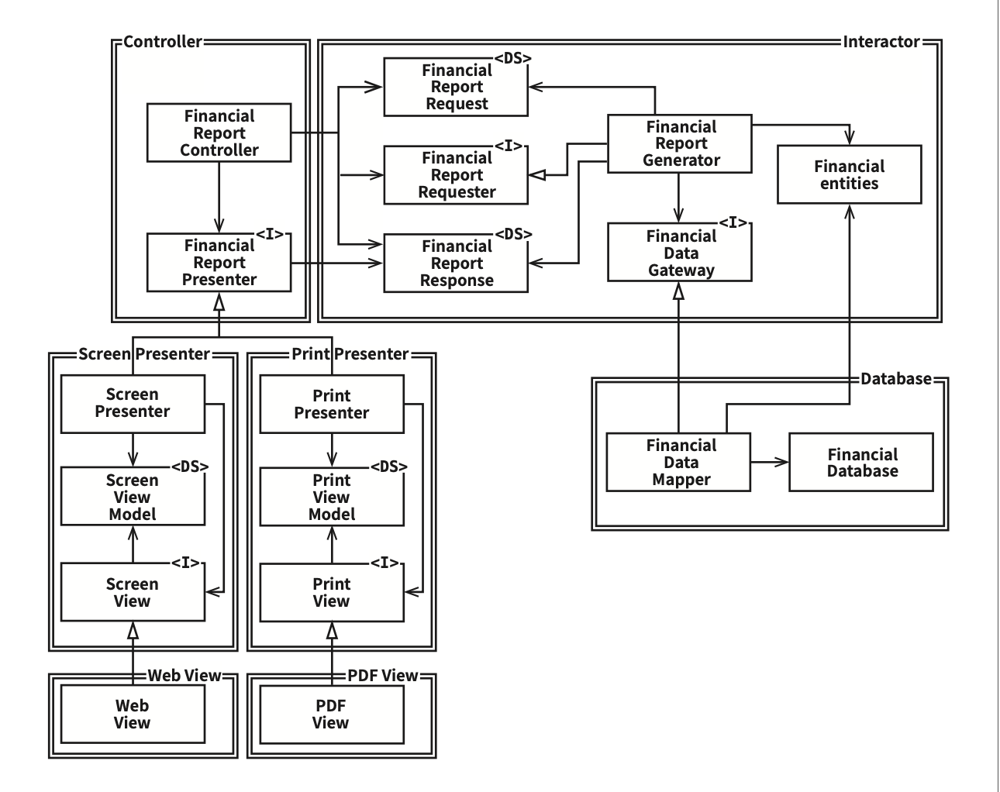
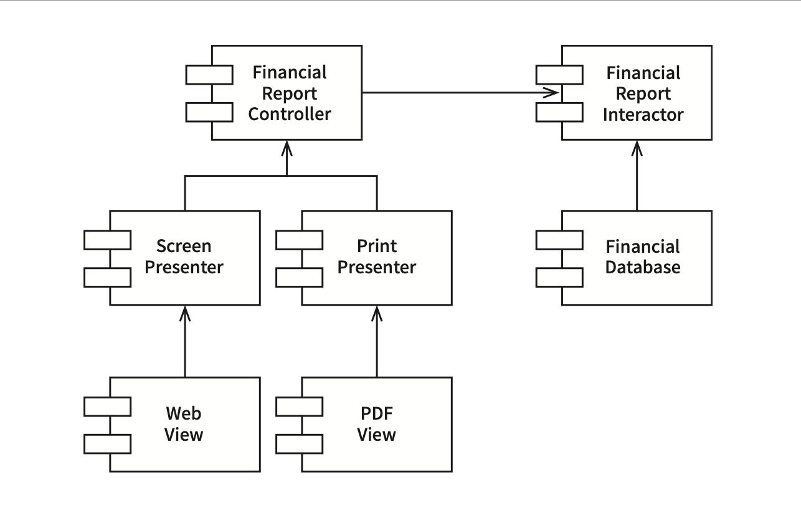

# Chapter 8: OCP: The Open-Closed Principle (개방-폐쇄 원칙)

## 핵심 질문

소프트웨어를 확장하기 쉬우면서도 변경의 영향을 최소화하려면 어떻게 해야 하는가? OCP는 클래스 수준의 원칙을 넘어 아키텍처 수준에서 어떻게 작동하는가?

---

## 1. OCP의 정의

개방-폐쇄 원칙(OCP)이라는 용어는 1988년에 버트란트 마이어(Bertrand Meyer)가 만들었다(*버트란트 마이어, 《Object Oriented Software Construction》(Prentice Hall, 1988), p. 23*).

> **소프트웨어 개체(artifact)는 확장에는 열려 있어야 하고, 변경에는 닫혀 있어야 한다.**

다시 말해 소프트웨어 개체의 행위는 확장할 수 있어야 하지만, 이때 개체를 변경해서는 안 된다.

소프트웨어 아키텍처를 공부하는 가장 근본적인 이유가 바로 이 때문이다. 만약 요구사항을 살짝 확장하는 데 소프트웨어를 엄청나게 수정해야 한다면, 그 소프트웨어 시스템을 설계한 아키텍트는 엄청난 실패에 맞닥뜨린 것이다.

소프트웨어 설계를 공부하기 시작한 사람들 대다수는 OCP를 클래스와 모듈을 설계할 때 도움되는 원칙이라고 알고 있다. 하지만 **아키텍처 컴포넌트 수준에서 OCP를 고려할 때 훨씬 중요한 의미를 가진다.**

---

## 2. 사고 실험(Thought Experiment)

### 2.1 시나리오 설정

재무제표를 웹 페이지로 보여주는 시스템이 있다고 가정해보자. 웹 페이지에 표시되는 데이터는 스크롤할 수 있으며, 음수는 빨간색으로 출력한다.

이제 이해관계자가 동일한 정보를 **보고서 형태로 변환해서 흑백 프린터로 출력해 달라**고 요청했다고 해보자. 이 보고서에는 페이지 번호가 제대로 매겨져 있어야 하고, 페이지마다 적절한 머리글과 바닥글이 있어야 하며, 표의 각 열에는 레이블이 있어야 한다. 또한 음수는 괄호로 감싸야 한다.

당연히 새로운 코드를 작성해야 한다. 그렇다면 **원래 코드는 얼마나 많이 수정해야 할까?**

소프트웨어 아키텍처가 훌륭하다면 변경되는 코드의 양이 가능한 한 최소화될 것이다. **이상적인 변경량은 0이다.**

### 2.2 SRP와 DIP 적용

어떻게 하면 될까? 서로 다른 목적으로 변경되는 요소를 적절하게 분리하고(단일 책임 원칙, SRP), 이들 요소 사이의 의존성을 체계화함으로써(의존성 역전 원칙, DIP) 변경량을 최소화할 수 있다.

단일 책임 원칙(SRP)을 적용하면 데이터 흐름을 아래와 같은 형태로 만들 수 있다.



*그림 8.1 — 재무 데이터를 검사한 후 보고서용 데이터를 생성한 다음, 필요에 따라 두 가지 보고서 생성 절차 중 하나를 거쳐 적절히 포매팅한다.*

여기서 얻을 수 있는 가장 중요한 영감은 보고서 생성이 **두 개의 책임**으로 분리된다는 사실이다:

| 책임 | 내용 |
|------|------|
| 책임 1 | 보고서용 데이터를 계산하는 책임 |
| 책임 2 | 데이터를 웹으로 보여주거나 종이로 프린트하기에 적합한 형태로 표현하는 책임 |

이처럼 책임을 분리했다면, 두 책임 중 하나에서 변경이 발생하더라도 다른 하나는 변경되지 않도록 **소스 코드 의존성도 확실히 조직화**해야 한다.

---

## 3. 컴포넌트 수준의 클래스 설계

### 3.1 클래스와 컴포넌트 분리

이러한 목적을 달성하려면 처리 과정을 클래스 단위로 분할하고, 이들 클래스를 컴포넌트 단위로 구분해야 한다.



*그림 8.2 — `<I>`로 표시된 클래스는 인터페이스이며, `<DS>`로 표시된 클래스는 데이터 구조다. 열린 화살표는 사용(using) 관계이며, 닫힌 화살표는 구현(implement) 또는 상속(inheritance) 관계다.*

이 다이어그램에는 다음과 같은 컴포넌트가 포함되어 있다:

| 컴포넌트 | 위치 | 주요 클래스 |
|---------|------|-----------|
| Controller | 좌측 상단 | `FinancialReportController` |
| Interactor | 우측 상단 | `FinancialReportGenerator`, `FinancialEntities` |
| Database | 우측 하단 | `FinancialDataMapper`, `FinancialDatabase` |
| Screen Presenter | 좌측 하단 | `ScreenPresenter`, `ScreenViewModel` |
| Print Presenter | 좌측 하단 | `PrintPresenter`, `PrintViewModel` |
| Web View | 좌측 최하단 | `WebView` |
| PDF View | 좌측 최하단 | `PDFView` |

### 3.2 의존성 방향의 핵심

여기에서 주목할 점은 **모든 의존성이 소스 코드 의존성**을 나타낸다는 사실이다. 화살표가 A 클래스에서 B 클래스로 향한다면, A 클래스에서는 B 클래스를 호출하지만 B 클래스에서는 A 클래스를 전혀 호출하지 않음을 뜻한다.

또 다른 핵심은 컴포넌트 경계(이중선)를 화살표가 **오직 한 방향으로만 교차**한다는 사실이다. 모든 컴포넌트 관계는 단방향으로 이루어진다.

### 3.3 컴포넌트 관계도

컴포넌트 수준에서의 의존성 방향은 다음과 같다:

```
                    ┌───────────────────┐
                    │ Financial Report  │
      ┌────────────▶│   Interactor      │◀─────────────┐
      │             └───────────────────┘               │
      │                                                 │
┌─────┴─────────────┐                          ┌────────┴────────┐
│ Financial Report  │                          │   Financial     │
│   Controller      │                          │   Database      │
└─────┬──────┬──────┘                          └─────────────────┘
      │      │
      ▼      ▼
┌──────────┐ ┌──────────┐
│  Screen  │ │  Print   │
│ Presenter│ │ Presenter│
└────┬─────┘ └────┬─────┘
     ▼             ▼
┌──────────┐ ┌──────────┐
│   Web    │ │   PDF    │
│   View   │ │   View   │
└──────────┘ └──────────┘
```
*그림 8.3 — 컴포넌트 관계는 단방향으로만 이루어진다. 화살표는 변경으로부터 보호하려는 컴포넌트를 향한다.*

A 컴포넌트에서 발생한 변경으로부터 B 컴포넌트를 보호하려면 반드시 **A 컴포넌트가 B 컴포넌트에 의존**해야 한다.

---

## 4. 보호의 계층구조

### 4.1 수준(Level)에 따른 보호

이 예제의 보호 관계를 정리하면 다음과 같다:

- **Presenter**에서 발생한 변경으로부터 **Controller**를 보호하고자 한다.
- **View**에서 발생한 변경으로부터 **Presenter**를 보호하고자 한다.
- **Interactor**는 다른 모든 것에서 발생한 변경으로부터 보호하고자 한다.

**Interactor**는 OCP를 가장 잘 준수할 수 있는 곳에 위치한다. Database, Controller, Presenter, View에서 발생한 어떤 변경도 Interactor에 영향을 주지 않는다.

### 4.2 왜 Interactor가 특별한가?

Interactor가 이처럼 특별한 위치를 차지하는 이유는 바로 **업무 규칙(business rules)**을 포함하기 때문이다. Interactor는 애플리케이션에서 **가장 높은 수준의 정책**을 포함한다. Interactor 이외의 컴포넌트는 모두 주변적인 문제를 처리한다.

| 컴포넌트 | 수준 | 보호 정도 |
|---------|------|----------|
| Interactor | 최고 (업무 규칙) | 최고의 보호 |
| Controller | 중간 | 중간 수준의 보호 |
| Presenter | 중하 | 중하 수준의 보호 |
| View | 최하 | 거의 보호받지 못함 |

> **핵심 통찰**: 아키텍트는 기능이 **어떻게(how)**, **왜(why)**, **언제(when)** 발생하는지에 따라서 기능을 분리하고, 분리한 기능을 컴포넌트의 계층구조로 조직화한다. 이를 통해 저수준 컴포넌트에서 발생한 변경으로부터 고수준 컴포넌트를 보호할 수 있다.

---

## 5. 방향성 제어

그림 8.2의 클래스 설계가 복잡해 보일 수 있다. 이 다이어그램이 일부러 다소 복잡하게 그려진 이유는 **컴포넌트 간 의존성이 제대로 된 방향으로 향하고 있음을 확실히 보여주기 위해서**다.

예를 들어 `FinancialDataGateway` 인터페이스는 `FinancialReportGenerator`와 `FinancialDataMapper` 사이에 위치한다. 이는 **의존성을 역전**시키기 위해서다. 이 인터페이스가 없었다면, 의존성이 Interactor 컴포넌트에서 Database 컴포넌트로 바로 향하게 된다.

마찬가지로 `FinancialReportPresenter` 인터페이스와 2개의 View 인터페이스도 같은 목적을 가진다.

---

## 6. 정보 은닉

`FinancialReportRequester` 인터페이스는 방향성 제어와는 다른 목적을 가진다. 이 인터페이스는 `FinancialReportController`가 **Interactor 내부에 대해 너무 많이 알지 못하도록** 막기 위해서 존재한다.

만약 이 인터페이스가 없었다면, Controller는 `FinancialEntities`에 대해 **추이 종속성(transitive dependency)**(*transitive dependency — 클래스 A가 클래스 B에 의존하고, 다시 클래스 B가 클래스 C에 의존한다면, 클래스 A는 클래스 C에 의존하게 된다. 이를 추이 종속성이라고 부르며, 클래스 이외의 소프트웨어 엔티티(패키지, 컴포넌트 등)에도 동일하게 적용된다.*)을 가지게 된다.

추이 종속성을 가지게 되면, 소프트웨어 엔티티는 **"자신이 직접 사용하지 않는 요소에는 절대로 의존해서는 안 된다"**는 소프트웨어 원칙을 위반하게 된다.

다시 말해서, Controller에서 발생한 변경으로부터 Interactor를 보호하는 일의 우선순위가 가장 높지만, 반대로 Interactor에서 발생한 변경으로부터 Controller도 보호되기를 바란다. 이를 위해 **Interactor 내부를 은닉**한다.

---

## 7. 결론

OCP는 시스템의 아키텍처를 떠받치는 원동력 중 하나다. OCP의 목표는 시스템을 확장하기 쉬운 동시에 변경으로 인해 시스템이 너무 많은 영향을 받지 않도록 하는 데 있다. 이러한 목표를 달성하려면 **시스템을 컴포넌트 단위로 분리**하고, **저수준 컴포넌트에서 발생한 변경으로부터 고수준 컴포넌트를 보호할 수 있는 형태의 의존성 계층구조**가 만들어지도록 해야 한다.

---

## 요약

- **OCP란** 소프트웨어 개체는 확장에는 열려 있어야 하고, 변경에는 닫혀 있어야 한다는 원칙이다.
- **아키텍처 수준에서 더 중요하다**: 클래스 수준의 OCP보다 컴포넌트 수준의 OCP가 훨씬 중요한 의미를 가진다.
- **SRP와 DIP를 결합하여 달성한다**: 서로 다른 목적의 변경을 분리(SRP)하고, 의존성 방향을 제어(DIP)하여 변경량을 최소화한다.
- **고수준 컴포넌트가 최고의 보호를 받는다**: 업무 규칙을 포함하는 Interactor가 가장 높은 수준이며, 다른 모든 변경으로부터 보호받는다.
- **방향성 제어**: 인터페이스를 사용하여 의존성을 역전시킴으로써 컴포넌트 간 의존성의 방향을 제어한다.
- **정보 은닉**: 인터페이스를 통해 내부 구현을 숨겨 추이 종속성을 방지한다.

---

## 다른 챕터와의 관계

- **Chapter 7 (SRP)**: OCP 달성의 첫 번째 단계. 서로 다른 목적으로 변경되는 요소를 분리하는 것이 OCP 적용의 전제 조건이다.
- **Chapter 11 (DIP)**: OCP 달성의 두 번째 단계. 의존성 역전을 통해 고수준 컴포넌트를 저수준 변경으로부터 보호한다.
- **Chapter 10 (ISP)**: 정보 은닉 부분에서 언급된 "자신이 직접 사용하지 않는 요소에 의존하지 말라"는 원칙이 ISP에서 상세히 다루어진다.
- **Chapter 13 (컴포넌트 응집도)**: 추이 종속성 방지를 위한 공통 재사용 원칙(CRP)이 ISP의 컴포넌트 수준 확장으로 설명된다.
- **Chapter 14 (컴포넌트 결합)**: 비순환 의존성 원칙(ADP)을 통해 컴포넌트 간 의존성이 순환하지 않도록 관리하는 방법을 다룬다.
- **Chapter 22 (클린 아키텍처)**: OCP가 아키텍처 전체에 걸쳐 적용된 최종 형태가 클린 아키텍처다.
