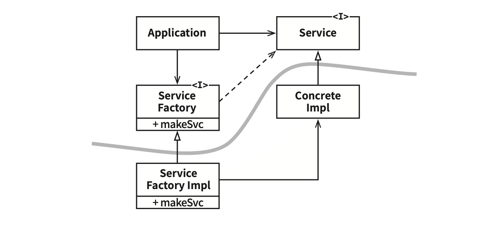

# Chapter 11: DIP: The Dependency Inversion Principle (의존성 역전 원칙)

## 핵심 질문

소스 코드 의존성이 항상 제어흐름의 방향을 따라야 하는가? "유연한 시스템"이란 소스 코드 의존성이 어떤 방향으로 향하는 시스템인가? 의존성 역전은 어떻게 아키텍처 경계를 만들어내는가?

---

## 1. DIP의 핵심 선언

의존성 역전 원칙(DIP)에서 말하는 **"유연성이 극대화된 시스템"**이란 소스 코드 의존성이 **추상(abstraction)에 의존하며 구체(concretion)에는 의존하지 않는 시스템**이다.

자바와 같은 정적 타입 언어에서 이 말은 `use`, `import`, `include` 구문은 오직 **인터페이스나 추상 클래스** 같은 추상적인 선언만을 참조해야 한다는 뜻이다. 구체적인 대상에는 절대로 의존해서는 안 된다.

루비나 파이썬과 같은 동적 타입 언어에도 동일한 규칙이 적용된다. 소스 코드 의존 관계에서 구체 모듈은 참조해서는 안 된다. 하지만 이들 언어의 경우 구체 모듈이 무엇인지를 정의하기가 다소 어렵다.

---

## 2. 현실적인 예외: 안정된 구체 클래스

이 아이디어를 규칙으로 보기는 확실히 비현실적이다. 소프트웨어 시스템이라면 구체적인 많은 장치에 반드시 의존하기 때문이다.

예를 들어 자바에서 `String`은 구체 클래스이며, 이를 애써 추상 클래스로 만들려는 시도는 현실성이 없다. `java.lang.String` 구체 클래스에 대한 소스 코드 의존성은 벗어날 수 없고, **벗어나서도 안 된다.**

반면 `String` 클래스는 **매우 안정적**이다. `String` 클래스가 변경되는 일은 거의 없으며, 있더라도 엄격하게 통제된다. 프로그래머와 아키텍트는 `String` 클래스에서 변덕스러운 변경이 자주 발생하리라고 염려할 필요가 없다.

이러한 이유로 DIP를 논할 때 **운영체제나 플랫폼 같이 안정성이 보장된 환경에 대해서는 무시하는 편**이다. 변경되지 않는다면 의존할 수 있다는 사실을 이미 알고 있기 때문이다.

> **핵심 통찰**: DIP에서 피하고자 하는 대상은 **변동성이 큰(volatile) 구체적인 요소**다. 이 구체적인 요소는 우리가 열심히 개발하는 중이라 자주 변경될 수밖에 없는 모듈들이다. `String`이나 `List` 같은 안정된 구체 클래스는 DIP 논의에서 제외된다.

---

## 3. 안정된 추상화

### 3.1 인터페이스 vs 구현체의 변동성

추상 인터페이스에 변경이 생기면 이를 구체화한 구현체들도 따라서 수정해야 한다. 반대로 구체적인 구현체에 변경이 생기더라도 그 구현체가 구현하는 인터페이스는 항상, 좀 더 정확히 말하면 대다수의 경우 **변경될 필요가 없다.** 따라서 인터페이스는 구현체보다 변동성이 낮다.

| 변경 방향 | 영향 |
|----------|------|
| 인터페이스 변경 → 구현체 | 구현체도 수정해야 한다 |
| 구현체 변경 → 인터페이스 | 대다수의 경우 인터페이스는 변경할 필요 없다 |

실제로 뛰어난 소프트웨어 설계자와 아키텍트라면 **인터페이스의 변동성을 낮추기 위해 애쓴다.** 인터페이스를 변경하지 않고도 구현체에 기능을 추가할 수 있는 방법을 찾기 위해 노력한다. 이는 소프트웨어 설계의 기본이다.

### 3.2 안정된 아키텍처의 정의

즉, **안정된 소프트웨어 아키텍처란 변동성이 큰 구현체에 의존하는 일은 지양하고, 안정된 추상 인터페이스를 선호하는 아키텍처**라는 뜻이다.

---

## 4. 구체적인 코딩 실천법

이 원칙에서 전달하려는 내용은 다음과 같이 매우 구체적인 코딩 실천법으로 요약할 수 있다.

### 4.1 변동성이 큰 구체 클래스를 참조하지 말라

대신 **추상 인터페이스를 참조**하라. 이 규칙은 언어가 정적 타입이든 동적 타입이든 관계없이 모두 적용된다. 또한 이 규칙은 객체 생성 방식을 강하게 제약하며, 일반적으로 **추상 팩토리(Abstract Factory)**를 사용하도록 강제한다.

### 4.2 변동성이 큰 구체 클래스로부터 파생하지 말라

이 규칙은 이전 규칙의 따름정리이지만, 별도로 언급할 만한 가치가 있다. 정적 타입 언어에서 **상속은 소스 코드에 존재하는 모든 관계 중에서 가장 강력한 동시에 뻣뻣해서 변경하기 어렵다.** 따라서 상속은 아주 신중하게 사용해야 한다. 동적 타입 언어라면 문제가 덜 되지만, 의존성을 가진다는 사실에는 변함이 없다.

### 4.3 구체 함수를 오버라이드 하지 말라

대체로 구체 함수는 소스 코드 의존성을 필요로 한다. 따라서 구체 함수를 오버라이드 하면 이러한 의존성을 제거할 수 없게 되며, 실제로는 그 **의존성을 상속**하게 된다. 이러한 의존성을 제거하려면, 차라리 **추상 함수로 선언하고 구현체들에서 각자의 용도에 맞게 구현**해야 한다.

### 4.4 구체적이며 변동성이 크다면 절대로 그 이름을 언급하지 말라

사실 이 실천법은 DIP 원칙을 다른 방식으로 풀어쓴 것이다.

| 실천법 | 요약 |
|--------|------|
| 구체 클래스를 참조하지 말라 | 추상 인터페이스를 참조하라 |
| 구체 클래스로부터 파생하지 말라 | 상속은 가장 강한 의존성이다 |
| 구체 함수를 오버라이드 하지 말라 | 추상 함수로 선언하고 각자 구현하라 |
| 변동성이 큰 구체적 이름을 언급하지 말라 | DIP의 다른 표현이다 |

---

## 5. 팩토리

### 5.1 객체 생성의 딜레마

이 규칙들을 준수하려면 변동성이 큰 구체적인 객체는 특별히 주의해서 생성해야 한다. 사실상 모든 언어에서 객체를 생성하려면 해당 객체를 구체적으로 정의한 코드에 대해 **소스 코드 의존성이 발생**하기 때문이다.

### 5.2 추상 팩토리(Abstract Factory) 패턴

자바 등 대다수의 객체 지향 언어에서 이처럼 바람직하지 못한 의존성을 처리할 때 **추상 팩토리**를 사용한다.



*그림 11.1 — 곡선은 아키텍처 경계를 뜻한다. 소스 코드 의존성은 해당 곡선과 교차할 때 모두 한 방향, 즉 추상적인 쪽으로 향한다.*

이 다이어그램의 구성요소를 정리하면 다음과 같다:

| 컴포넌트 | 구성 요소 | 성격 |
|---------|----------|------|
| **추상 컴포넌트** (곡선 위) | `Application`, `Service` <<I>>, `ServiceFactory` <<I>> | 고수준 업무 규칙 |
| **구체 컴포넌트** (곡선 아래) | `ConcreteImpl`, `ServiceFactoryImpl` | 세부사항 |

### 5.3 동작 방식

`Application`은 `Service` 인터페이스를 통해 `ConcreteImpl`을 사용한다. 하지만 `Application`에서는 어떤 식으로든 `ConcreteImpl`의 인스턴스를 생성해야 한다.

`ConcreteImpl`에 대해 소스 코드 의존성을 만들지 않으면서 이 목적을 이루기 위해 `Application`은 `ServiceFactory` 인터페이스의 `makeSvc` 메서드를 호출한다. 이 메서드는 `ServiceFactory`로부터 파생된 `ServiceFactoryImpl`에서 구현된다. 그리고 `ServiceFactoryImpl` 구현체가 `ConcreteImpl`의 인스턴스를 생성한 후 `Service` 타입으로 반환한다.

```
[Application] ──사용──▶ [<<I>> Service]
     │                        △
     │                        │
     │                  [ConcreteImpl]
     │
     └──호출──▶ [<<I>> ServiceFactory]
                    + makeSvc
                        △
                        │
               [ServiceFactoryImpl]
                    + makeSvc ──생성──▶ [ConcreteImpl]
```

### 5.4 아키텍처 경계와 의존성 방향

그림 11.1의 곡선은 **아키텍처 경계**를 뜻한다. 이 곡선은 구체적인 것들로부터 추상적인 것들을 분리한다. **소스 코드 의존성은 해당 곡선과 교차할 때 모두 한 방향, 즉 추상적인 쪽으로 향한다.**

곡선은 시스템을 두 가지 컴포넌트로 분리한다:

| 컴포넌트 | 포함하는 것 |
|---------|-----------|
| 추상 컴포넌트 | 애플리케이션의 모든 고수준 업무 규칙 |
| 구체 컴포넌트 | 업무 규칙을 다루기 위해 필요한 모든 세부사항 |

**제어흐름은 소스 코드 의존성과는 정반대 방향으로 곡선을 가로지른다**는 점에 주목하자. 다시 말해 소스 코드 의존성은 제어흐름과는 반대 방향으로 역전된다. 이러한 이유로 이 원칙을 **의존성 역전(Dependency Inversion)**이라고 부른다.

> **핵심 통찰**: 제어흐름은 `Application` → `ServiceFactoryImpl` → `ConcreteImpl` 방향으로 흐르지만, 소스 코드 의존성은 `ServiceFactoryImpl` → `ServiceFactory`(인터페이스), `ConcreteImpl` → `Service`(인터페이스) 방향으로 역전된다. 이것이 "의존성 역전"의 정체다.

---

## 6. 구체 컴포넌트

그림 11.1의 구체 컴포넌트에는 구체적인 의존성이 하나 있고(*ServiceFactoryImpl 구체 클래스가 ConcreteImpl 구체 클래스에 의존한다.*), 따라서 DIP에 위배된다. 이는 일반적인 일이다. **DIP 위배를 모두 없앨 수는 없다.** 하지만 DIP를 위배하는 클래스들은 적은 수의 구체 컴포넌트 내부로 모을 수 있고, 이를 통해 시스템의 나머지 부분과는 분리할 수 있다.

대다수의 시스템은 이러한 구체 컴포넌트를 최소한 하나는 포함할 것이다. 흔히 이 컴포넌트를 **메인(Main)**이라고 부르는데, `main`(*애플리케이션이 처음 구동될 때 운영체제가 호출하는 함수다.*) 함수를 포함하기 때문이다.

그림 11.1의 경우라면:
1. `main` 함수는 `ServiceFactoryImpl`의 인스턴스를 생성한다
2. 이 인스턴스를 `ServiceFactory` 타입으로 전역 변수에 저장한다
3. `Application`은 이 전역 변수를 이용해서 `ServiceFactoryImpl`의 인스턴스에 접근한다

---

## 7. 결론

이 책에서 앞으로 고수준의 아키텍처 원칙을 다루게 되면서 DIP는 몇 번이고 계속 등장할 것이다. 그리고 DIP는 **아키텍처 다이어그램에서 가장 눈에 드러나는 원칙**이 될 것이다.

그림 11.1의 곡선은 이후의 장에서는 **아키텍처 경계(Architectural Boundary)**가 될 것이다. 그리고 의존성은 이 곡선을 경계로, 더 추상적인 엔티티가 있는 쪽으로만 향한다. 추후 이 규칙은 **의존성 규칙(Dependency Rule)**이라 부를 것이다.

---

## 요약

- **DIP란** 소스 코드 의존성이 추상에 의존하며 구체에는 의존하지 않도록 하는 원칙이다.
- **안정된 구체 클래스는 예외다**: `String`처럼 변동성이 없는 구체 클래스에 대한 의존은 문제가 되지 않는다. 피해야 할 것은 **변동성이 큰** 구체적인 요소다.
- **인터페이스는 구현체보다 안정적이다**: 뛰어난 아키텍트는 인터페이스의 변동성을 낮추기 위해 애쓴다.
- **네 가지 코딩 실천법**: 변동성이 큰 구체 클래스를 참조하지 말라, 파생하지 말라, 구체 함수를 오버라이드 하지 말라, 이름을 언급하지 말라.
- **추상 팩토리 패턴**: 구체적인 객체 생성의 의존성을 관리하기 위해 사용한다.
- **의존성 역전의 정체**: 제어흐름과 소스 코드 의존성의 방향이 반대가 되는 것이다.
- **DIP 위배를 완전히 없앨 수는 없다**: 구체 컴포넌트(Main)에 모아서 시스템의 나머지와 분리한다.
- **의존성 규칙의 기초**: DIP의 곡선은 이후 아키텍처 경계가 되며, 의존성은 항상 추상적인 쪽으로만 향한다.

---

## 다른 챕터와의 관계

- **Chapter 7 (SRP)**: SRP로 분리된 책임들 사이의 의존성 방향을 제어하는 것이 DIP의 역할이다.
- **Chapter 8 (OCP)**: OCP 달성을 위해 인터페이스를 통한 의존성 역전이 필수적이다. Chapter 8의 방향성 제어 부분이 DIP의 직접적인 적용 사례다.
- **Chapter 9 (LSP)**: DIP로 추상 인터페이스에 의존하게 만들었을 때, 그 인터페이스의 구현체들이 LSP를 준수해야 치환 가능성이 보장된다.
- **Chapter 10 (ISP)**: 인터페이스를 적절히 분리(ISP)한 후 그 인터페이스에 의존(DIP)하는 것이 올바른 순서다.
- **Chapter 14 (컴포넌트 결합)**: 안정된 의존성 원칙(SDP)과 안정된 추상화 원칙(SAP)이 DIP를 컴포넌트 수준으로 확장한 것이다.
- **Chapter 22 (클린 아키텍처)**: 클린 아키텍처의 **의존성 규칙(Dependency Rule)** — "소스 코드 의존성은 반드시 안쪽으로, 고수준의 정책을 향해야 한다" — 이 DIP의 아키텍처 수준 적용이다.
- **Chapter 26 (메인 컴포넌트)**: 구체 컴포넌트(Main)의 역할과 위치를 상세히 다룬다. DIP를 위배하는 코드를 Main에 격리하는 전략이다.
