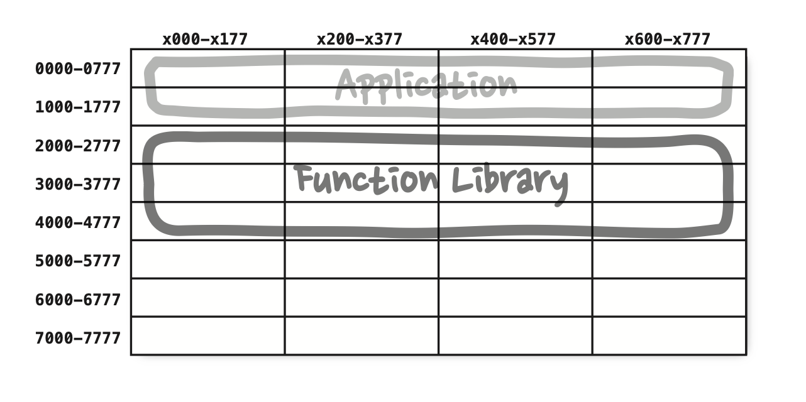
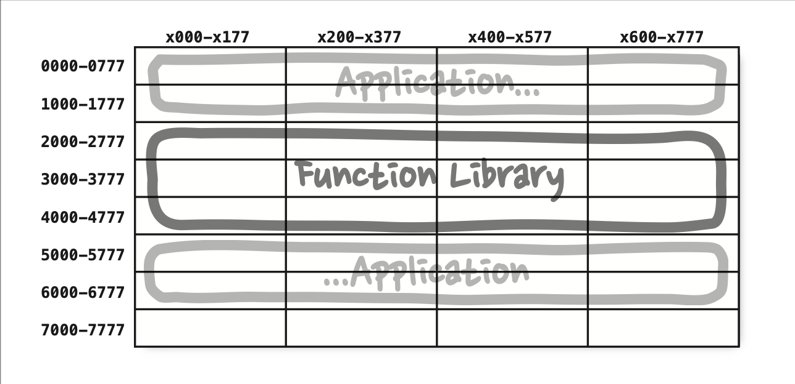

# Chapter 12: Components (컴포넌트)

## 핵심 질문

컴포넌트란 정확히 무엇이며, 소프트웨어 배포의 최소 단위로서 컴포넌트는 어떻게 진화해 왔는가? 오늘날의 컴포넌트 플러그인 아키텍처가 당연하게 여겨지기까지 어떤 역사적 과정을 거쳤는가?

---

## 1. 컴포넌트의 정의

컴포넌트는 **배포 단위**다. 시스템의 구성 요소로 배포할 수 있는 **가장 작은 단위**이며, 모든 언어에서 컴포넌트는 배포할 수 있는 단위 입자에 해당한다.

| 언어/플랫폼 | 컴포넌트 형태 |
|------------|-------------|
| Java | jar 파일 |
| Ruby | gem 파일 |
| .NET | DLL |
| 컴파일형 언어 | 바이너리 파일의 결합체 |
| 인터프리터형 언어 | 소스 파일의 결합체 |

컴포넌트를 활용하는 방식은 다양하다:

- 여러 컴포넌트를 서로 **링크**하여 실행 가능한 단일 파일로 생성할 수 있다.
- 여러 컴포넌트를 서로 **묶어서** `.war` 파일과 같은 단일 아카이브로 만들 수 있다.
- 컴포넌트 각각을 `.jar`나 `.dll` 같이 **동적으로 로드**할 수 있는 플러그인이나 `.exe` 파일로 만들어서 독립적으로 배포할 수 있다.

> **핵심 통찰**: 잘 설계된 컴포넌트라면 반드시 **독립적으로 배포 가능**한, 따라서 **독립적으로 개발 가능**한 능력을 갖춰야 한다.

---

## 2. 컴포넌트의 간략한 역사

### 2.1 초창기: 프로그래머가 직접 메모리를 제어하던 시대

소프트웨어 개발 초창기에는 메모리에서의 프로그램 위치와 레이아웃을 프로그래머가 직접 제어했다. 프로그램의 시작부에는 프로그램이 로드될 주소를 선언하는 **오리진(origin)** 구문이 나와야 했다.

다음의 간단한 PDP-8 프로그램을 살펴보자. 이 프로그램은 키보드로부터 문자열을 입력받아 버퍼에 저장하는 `GETSTR`이라는 서브루틴을 포함한다.

```
*200
TLS
START,  CLA
        TAD BUFR
        JMS GETSTR
        CLA
        TAD BUFR
        JMS PUTSTR
        JMP START
BUFR,   3000

GETSTR, 0
        DCA PTR
NXTCH,  KSF
        JMP -1
        KRB
        DCA I PTR
        TAD I PTR
        AND K177
        ISZ PTR
        TAD MCR
        SZA
        JMP NXTCH
K177,   177
MCR,    -15
```

프로그램 시작부에 있는 `*200` 명령어를 주목하자. 이 명령어는 메모리 주소 200(8진수)에 로드할 코드를 생성하라고 컴파일러에 알려준다.

이 시절에는 프로그램을 로드할 메모리의 위치를 정하는 일이 프로그래머가 **가장 먼저** 결정해야 하는 사항 중 하나였다. 프로그램의 위치가 한번 결정되면 **재배치가 불가능**했다.

### 2.2 라이브러리의 등장과 한계

이러한 시대에 라이브러리 함수를 사용하려면 프로그래머가 라이브러리 함수의 **소스 코드를 애플리케이션 코드에 직접 포함**시켜 단일 프로그램으로 컴파일해야 했다. 라이브러리는 바이너리가 아니라 소스 코드 형태로 유지되었다.

장치는 느리고 메모리는 너무 비싸서 자원이 한정적이었기에, 이러한 접근법에는 문제가 있었다. 컴파일러는 소스 코드 전체를 여러 번에 걸쳐서 읽어야 했지만, 메모리가 너무 작아서 소스 코드 전체를 메모리에 상주시킬 수가 없었다. 함수 라이브러리가 크면 클수록 컴파일은 더 오래 걸렸다.

### 2.3 함수 라이브러리의 분리

컴파일 시간을 단축시키기 위해 프로그래머는 함수 라이브러리의 소스 코드를 애플리케이션 코드로부터 분리했다. 함수 라이브러리를 개별적으로 컴파일하고, 컴파일된 바이너리를 메모리의 특정 위치(예를 들어 2000(8진수))에 로드했다.



애플리케이션이 메모리에서 0000과 1777(8진수) 사이의 주소 공간에 들어갈 수 있는 한, 이 방식은 잘 동작했다. 하지만 애플리케이션은 점점 커졌고, 결국 할당된 공간을 넘어서게 되었다. 이 시점이 되면 프로그래머는 애플리케이션을 **두 개의 주소 세그먼트**로 분리하여 함수 라이브러리 공간을 사이에 두고 오가며 동작하게 배치해야 했다.



프로그램과 라이브러리가 사용하는 메모리가 늘어날수록 이와 같은 **단편화(fragmentation)**는 계속될 수밖에 없었다. 무언가 조치를 취해야 하는 게 분명했다.

---

## 3. 재배치성(Relocatability)

해결책은 **재배치가 가능한 바이너리(relocatable binary)**였다. 이 해결책의 이면에 있는 발상은 아주 단순했다. 지능적인 로더를 사용해서 메모리에 재배치할 수 있는 형태의 바이너리를 생성하도록 컴파일러를 수정하는 것이었다.

이때 로더는 재배치 코드가 자리할 위치 정보를 전달받았다. 재배치 코드에는 로드한 데이터에서 어느 부분을 수정해야 정해진 주소에 로드할 수 있는지를 알려주는 **플래그**가 삽입되었다. 대개 이러한 플래그는 바이너리에서 참조하는 메모리의 시작 주소였다.

이를 통해 프로그래머는 오직 **필요한 함수만을 로드**할 수 있게 되었다.

또한 컴파일러는 재배치 가능한 바이너리 안의 함수 이름을 메타데이터 형태로 생성하도록 수정되었다.

| 상황 | 처리 방식 |
|------|---------|
| 프로그램이 라이브러리 함수를 호출할 때 | 라이브러리 함수 이름을 **외부 참조**(external reference)로 생성 |
| 라이브러리 함수를 정의하는 프로그램일 때 | 해당 이름을 **외부 정의**(external definition)로 생성 |

외부 정의를 로드할 위치가 정해지기만 하면 로더가 외부 참조를 외부 정의에 **링크**시킬 수 있게 된다. 이렇게 **링킹 로더(linking loader)**(*linking loader — 프로그램을 로드하는 동시에 링크까지 수행하는 로더*)가 탄생했다.

---

## 4. 링커(Linker)

링킹 로더의 등장으로 프로그래머는 프로그램을 개별적으로 컴파일하고 로드할 수 있는 단위로 분할할 수 있게 되었다. 하지만 1960년대 말과 1970년대 초가 되자 프로그램은 훨씬 커졌고, 링킹 로더가 **너무 느려서 참을 수 없는 지경**에 다다랐다.

마침내 **로드와 링크가 두 단계로 분리**되었다. 프로그래머가 느린 부분, 즉 링크 과정을 맡았는데, **링커(linker)**라는 별도의 애플리케이션으로 이 작업을 처리하도록 만들었다. 링커는 링크가 완료된 재배치 코드를 만들어 주었고, 그 덕분에 로더의 로딩 과정이 아주 빨라졌다.

### 4.1 다시 느려지다

1980년대가 되었다. 프로그래머는 C나 또 다른 고수준 언어를 사용하기 시작했고, 프로그램 코드가 수십만 라인을 넘어서는 게 별일도 아니게 되었다.

소스 모듈은 `.c` 파일에서 `.o` 파일로 컴파일된 후, 링커로 전달되어 빠르게 로드될 수 있는 형태의 실행 파일로 만들어졌다. 각 모듈을 컴파일하는 과정은 상대적으로 빨랐지만, 전체 모듈을 컴파일하는 일은 꽤 시간이 걸렸다. 링커에서는 더 많은 시간이 소요되었고, 전체 소요 시간은 한 시간 이상 걸리는 경우가 많아졌다.

프로그래밍 역사에서 이 시기는 마치 프로그래머가 하염없이 헛수고를 할 수밖에 없는 운명을 타고난 것처럼 보였다. 컴파일하고 링크하는 데 사용 가능한 시간을 모두 소모할 때까지 프로그램은 커졌다 -- **프로그램 크기와 관련된 머피의 법칙**이었다.

### 4.2 무어(Moore)의 승리

하지만 이 업계에는 머피에 필적하는 경쟁자가 있었다. **무어(Moore)**(*Moore's law — 컴퓨터 속도, 메모리, 집적도가 매 18개월마다 두 배로 증가한다는 주장이다. 이 법칙은 1950년대부터 2000년까지는 유효했지만, 이 이후엔 적어도 클록 속도 관점에서는 성장이 둔화되었다.*)가 등장했고, 1980년대 후반에 들어서자 전투가 벌어졌다. 승자는 무어였다.

- 디스크는 작아지기 시작했고, 놀랄 만큼 **빨라졌다**.
- 컴퓨터 메모리는 말도 안 될 정도로 **저렴**해져서 디스크에 저장된 많은 데이터를 모두 RAM에 캐싱할 수 있을 정도였다.
- 컴퓨터 클록 속도(clock rate)는 1MHz에서 100MHz까지 증가했다.

1990년대 후반이 되자, 프로그래머가 야심차게 프로그램을 성장시키는 속도보다 링크 시간이 줄어드는 속도가 **더 빨라지기** 시작했다. 많은 경우 링크 시간은 초(second) 단위 수준이 될 정도로 감소했다. 소규모 작업이라면 링킹 로더마저도 다시금 사용할 만하게 되었다.

---

## 5. 컴포넌트 플러그인 아키텍처의 탄생

이렇게 **액티브X(ActiveX)**와 **공유 라이브러리** 시대가 열렸고 `.jar` 파일도 등장하기 시작했다. 컴퓨터와 장치가 빨라져서 또다시 로드와 링크를 동시에 할 수 있게 되었다. 다수의 `.jar` 파일 또는 다수의 공유 라이브러리를 순식간에 서로 링크한 후, 링크가 끝난 프로그램을 실행할 수 있게 되었다. 이렇게 **컴포넌트 플러그인 아키텍처(component plugin architecture)**가 탄생했다.

오늘날에는 `.jar` 파일, DLL, 공유 라이브러리를 기존 애플리케이션에 플러그인 형태로 배포하는 것이 일상적인 일이 되었다.

| 사례 | 방법 |
|------|------|
| 마인크래프트(Minecraft)에 모드(mod) 생성 | 특정 폴더에 수정한 `.jar` 파일을 추가 |
| 비주얼 스튜디오에 ReSharper 플러그인 추가 | 적당한 DLL 파일을 추가 |

---

## 6. 결론

런타임에 플러그인 형태로 결합할 수 있는 **동적 링크 파일**이 이 책에서 말하는 소프트웨어 컴포넌트에 해당한다. 여기까지 오는 데 50년이 걸렸다. 과거에는 초인적인 노력을 들여야만 컴포넌트 플러그인 아키텍처를 적용할 수 있었지만, 이제는 기본으로 쉽게 사용할 수 있는 지점까지 다다랐다.

> **핵심 통찰**: 컴포넌트의 역사는 곧 "독립적인 배포와 개발"을 향한 끊임없는 진화의 역사다. 초창기의 메모리 직접 제어에서 링킹 로더, 링커를 거쳐 오늘날의 동적 링크와 플러그인 아키텍처에 이르기까지, 핵심 동기는 항상 같았다 -- 컴포넌트를 독립적으로 배포하고 독립적으로 개발할 수 있게 만드는 것이다.

---

## 요약

- **컴포넌트는 배포 단위**다. 시스템을 구성하는 배포 가능한 가장 작은 단위이며, 언어에 따라 jar, gem, DLL 등의 형태를 취한다.
- 소프트웨어 개발 초창기에는 프로그래머가 메모리 위치를 직접 제어하고, 라이브러리를 소스 코드 형태로 직접 포함시켰다.
- 프로그램이 커지면서 **함수 라이브러리를 분리**했으나, 메모리 단편화 문제가 발생했다.
- **재배치 가능한 바이너리**와 **링킹 로더**의 등장으로 프로그램을 개별 단위로 컴파일하고 로드할 수 있게 되었다.
- 프로그램 크기가 다시 커지면서 링킹 로더가 느려졌고, **로드와 링크를 분리**하여 링커라는 별도 도구가 탄생했다.
- 무어의 법칙에 따른 하드웨어 성능 향상으로 링크 시간이 극적으로 줄어들면서, 다시 로드와 링크를 동시에 수행할 수 있게 되었다.
- 이 과정을 통해 오늘날의 **컴포넌트 플러그인 아키텍처**가 탄생했다 -- 런타임에 동적으로 링크되는 `.jar`, DLL, 공유 라이브러리가 바로 현대적 의미의 컴포넌트다.

---

## 다른 챕터와의 관계

| 관련 챕터 | 연결 포인트 |
|----------|-----------|
| **Chapter 7: SRP** | 컴포넌트를 구성하는 원칙의 토대가 되는 SOLID 원칙 중 하나. 13장의 CCP는 SRP를 컴포넌트 수준으로 확대한 것이다. |
| **Chapter 13: 컴포넌트 응집도** | 이 장에서 정의한 "컴포넌트"에 어떤 클래스를 포함시킬지 결정하는 세 가지 원칙(REP, CCP, CRP)을 다룬다. |
| **Chapter 14: 컴포넌트 결합** | 컴포넌트 사이의 관계를 다루는 세 가지 원칙(ADP, SDP, SAP)을 다룬다. |
| **Chapter 11: DIP** | 14장에서 순환 의존성을 끊을 때 핵심적으로 활용되는 의존성 역전 원칙의 원리가 이 장에서 설명된다. |
