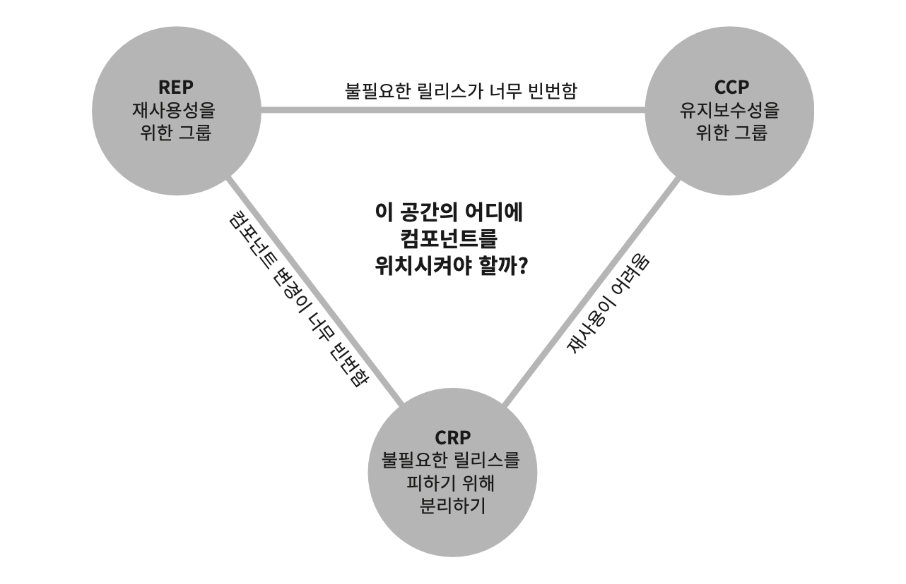

# Chapter 13: Component Cohesion (컴포넌트 응집도)

## 핵심 질문

어떤 클래스를 어느 컴포넌트에 포함시켜야 하는가? 컴포넌트 응집도를 결정하는 세 가지 원칙은 무엇이며, 이 원칙들은 서로 어떤 긴장 관계에 놓여 있는가?

---

## 1. 세 가지 컴포넌트 응집도 원칙 개관

어떤 클래스를 어느 컴포넌트에 포함시킬지는 중요한 결정이므로 제대로 된 소프트웨어 엔지니어링 원칙의 도움을 받아야 한다. 안타깝게도 수년 동안 우리는 거의 순전히 상황에 따라 임시방편적으로 결정을 내려왔다. 이 장에서는 컴포넌트 응집도와 관련된 세 가지 원칙을 논의한다.

| 원칙 | 정식 명칭 | 핵심 주장 |
|------|---------|---------|
| **REP** | 재사용/릴리스 등가 원칙 (Reuse/Release Equivalence Principle) | 재사용 단위는 릴리스 단위와 같다 |
| **CCP** | 공통 폐쇄 원칙 (Common Closure Principle) | 같은 이유로 변경되는 클래스를 같은 컴포넌트로 묶어라 |
| **CRP** | 공통 재사용 원칙 (Common Reuse Principle) | 사용자를 필요하지 않는 것에 의존하게 강요하지 말라 |

---

## 2. REP: 재사용/릴리스 등가 원칙

> **재사용 단위는 릴리스 단위와 같다.**

### 2.1 배경

지난 십 년은 메이븐(Maven), 라이닝언(Leiningen), RVM 같은 모듈 관리 도구가 우후죽순으로 등장한 시기였다. 재사용 가능한 컴포넌트나 컴포넌트 라이브러리가 엄청나게 많이 만들어졌기 때문이다. 우리는 이제 **소프트웨어 재사용의 시대**에 살고 있으며, 객체 지향 모델의 오랜 약속 중 하나가 실현되었다.

### 2.2 원칙의 의미

돌이켜 보면 REP는 너무 당연해 보인다. 소프트웨어 컴포넌트가 릴리스 절차를 통해 추적 관리되지 않거나 릴리스 번호가 부여되지 않는다면 해당 컴포넌트를 재사용하고 싶어도 할 수도 없고, 하지도 않을 것이다.

릴리스 번호가 없다면 재사용 컴포넌트들이 서로 호환되는지 보증할 방법이 전혀 없다. 하지만 이 단순한 이유 때문만은 아니다. 이보다는 새로운 버전이 **언제 출시되고 무엇이 변했는지**를 소프트웨어 개발자들이 알아야 하기 때문이다.

새로운 릴리스가 나온다는 소식을 접하면, 개발자는 새 릴리스의 변경 사항을 살펴보고 기존 버전을 계속 쓸지 여부를 결정하곤 한다. 따라서 릴리스 절차에는 **적절한 공지와 함께 릴리스 문서 작성**도 포함되어야 한다.

### 2.3 설계 관점에서의 함의

이 원칙을 소프트웨어 설계와 아키텍처 관점에서 보면 단일 컴포넌트는 **응집성 높은 클래스와 모듈들**로 구성되어야 함을 뜻한다. 단순히 뒤죽박죽 임의로 선택된 클래스와 모듈로 구성되어서는 안 된다. 컴포넌트를 구성하는 모든 모듈은 **서로 공유하는 중요한 테마나 목적**이 있어야 한다.

하나의 컴포넌트로 묶인 클래스와 모듈은 반드시 **함께 릴리스**할 수 있어야 한다. 하나의 컴포넌트로 묶인 클래스와 모듈은:

- 버전 번호가 같아야 하며
- 동일한 릴리스로 추적 관리되고
- 동일한 릴리스 문서에 포함되어야 한다

### 2.4 약점

이 조언은 "약하다". "이치에 맞다"라고 말하는 일은 그저 허공에 손을 흔들면서 권위 있는 척하는 것에 불과하다. 이 조언만으로는 클래스와 모듈을 단일 컴포넌트로 묶는 방법을 제대로 설명하기 힘들다. 그렇더라도 이 원칙 자체는 중요한데, **이 원칙을 어기면 쉽게 발견할 수 있기 때문**이다. 이 원칙의 약점은 다음에 다룰 두 원칙(CCP, CRP)이 지닌 강점을 통해 충분히 보완할 수 있다.

---

## 3. CCP: 공통 폐쇄 원칙

> **동일한 이유로 동일한 시점에 변경되는 클래스를 같은 컴포넌트로 묶어라. 서로 다른 시점에 다른 이유로 변경되는 클래스는 다른 컴포넌트로 분리하라.**

### 3.1 SRP의 컴포넌트 버전

이 원칙은 **단일 책임 원칙(SRP)**을 컴포넌트 관점에서 다시 쓴 것이다. SRP에서 단일 클래스는 변경의 이유가 여러 개 있어서는 안 된다고 말하듯이, CCP에서도 마찬가지로 **단일 컴포넌트는 변경의 이유가 여러 개 있어서는 안 된다**고 말한다.

| 수준 | 원칙 | 적용 단위 |
|------|------|---------|
| 클래스 수준 | SRP | 서로 다른 이유로 변경되는 **메서드**를 서로 다른 **클래스**로 분리 |
| 컴포넌트 수준 | CCP | 서로 다른 이유로 변경되는 **클래스**를 서로 다른 **컴포넌트**로 분리 |

### 3.2 유지보수성과 재사용성

대다수의 애플리케이션에서 **유지보수성(maintainability)**은 재사용성보다 훨씬 중요하다. 애플리케이션에서 코드가 반드시 변경되어야 한다면, 이러한 변경이 여러 컴포넌트 도처에 분산되어 발생하기보다는, 차라리 변경 모두가 **단일 컴포넌트에서** 발생하는 편이 낫다.

만약 변경을 단일 컴포넌트로 제한할 수 있다면:
- 해당 컴포넌트만 **재배포**하면 된다
- 변경된 컴포넌트에 의존하지 않는 다른 컴포넌트는 다시 **검증하거나 배포할 필요가 없다**

### 3.3 OCP와의 관계

이 원칙은 개방 폐쇄 원칙(OCP)과도 밀접하게 관련되어 있다. CCP에서 말하는 '폐쇄(closure)'는 OCP에서 말하는 '폐쇄(closure)'와 그 뜻이 같다. OCP에서는 클래스가 변경에는 닫혀 있고 확장에는 열려 있어야 한다고 말한다. 100% 완전한 폐쇄란 불가능하므로 **전략적으로 폐쇄**해야 한다.

CCP에서는 동일한 유형의 변경에 대해 닫혀 있는 클래스들을 하나의 컴포넌트로 묶음으로써 OCP에서 얻은 교훈을 **확대 적용**한다. 따라서 변경이 필요한 요구사항이 발생했을 때, 그 변경이 영향을 주는 컴포넌트들이 최소한으로 한정될 가능성이 확실히 높아진다.

> **핵심 통찰**: CCP는 컴포넌트 수준의 SRP이자 OCP의 확대 적용이다. 두 원칙의 교훈을 한 문장으로 요약하면 이렇다 -- "동일한 시점에 동일한 이유로 변경되는 것들을 한데 묶어라. 서로 다른 시점에 다른 이유로 변경되는 것들은 서로 분리하라."

---

## 4. CRP: 공통 재사용 원칙

> **컴포넌트 사용자들을 필요하지 않는 것에 의존하게 강요하지 말라.**

### 4.1 함께 재사용되는 것은 함께 묶어라

CRP에서는 같이 재사용되는 경향이 있는 클래스와 모듈들은 같은 컴포넌트에 포함해야 한다고 말한다. 개별 클래스가 단독으로 재사용되는 경우는 거의 없다. 대체로 재사용 가능한 클래스는 재사용 모듈의 일부로써 해당 모듈의 다른 클래스와 상호작용하는 경우가 많다.

간단한 사례로 **컨테이너(container)** 클래스와 해당 클래스의 **이터레이터(iterator)** 클래스를 들 수 있다. 이들 클래스는 서로 강하게 결합되어 있기 때문에 함께 재사용된다. 따라서 반드시 동일한 컴포넌트에 위치해야 한다.

### 4.2 한데 묶어서는 안 되는 것

CRP는 어떤 클래스를 한데 묶어도 되는지보다는, **어떤 클래스를 한데 묶어서는 안 되는지**에 대해서 훨씬 더 많은 것을 이야기한다.

어떤 컴포넌트가 다른 컴포넌트를 사용하면, 두 컴포넌트 사이에는 의존성이 생겨난다. 어쩌면 사용하는(using) 컴포넌트가 사용되는(used) 컴포넌트에서 단 하나의 클래스만 사용할 수도 있다. 그렇다고 해서 **의존성은 조금도 약해지지 않는다**.

이 같은 의존성으로 인해 사용되는 컴포넌트가 변경될 때마다 사용하는 컴포넌트도 변경해야 할 가능성이 높다. 또는 사용하는 컴포넌트를 변경하지 않더라도, **재컴파일, 재검증, 재배포**를 해야 하는 가능성은 여전히 남아 있다. 심지어 사용되는 컴포넌트에서 발생한 변경이 사용하는 컴포넌트와는 전혀 관련 없는 경우라도 말이다.

따라서 의존하는 컴포넌트가 있다면 해당 컴포넌트의 **모든 클래스에 대해 의존함**을 확실히 인지해야 한다. 한 컴포넌트에 속한 클래스들은 더 작게 그룹지을 수 없다.

> **핵심 통찰**: CRP는 강하게 결합되지 않은 클래스들을 동일한 컴포넌트에 위치시켜서는 안 된다고 말한다. 불필요한 의존성은 불필요한 재배포를 낳는다.

### 4.3 ISP와의 관계

CRP는 **인터페이스 분리 원칙(ISP)**의 포괄적인 버전이다.

| 원칙 | 수준 | 조언 |
|------|------|------|
| ISP | 클래스/인터페이스 수준 | 사용하지 않는 **메서드**가 있는 클래스에 의존하지 말라 |
| CRP | 컴포넌트 수준 | 사용하지 않는 **클래스**를 가진 컴포넌트에 의존하지 말라 |

이 두 조언은 다음의 한 문장으로 요약할 수 있다:

> **필요하지 않은 것에 의존하지 말라.**

---

## 5. 컴포넌트 응집도에 대한 균형 다이어그램

응집도에 관한 세 원칙은 **서로 상충**된다는 사실을 눈치챘을 것이다.

| 원칙 | 성격 | 컴포넌트 크기에 미치는 영향 |
|------|------|-------------------------|
| REP | 포함(inclusive) 원칙 | 컴포넌트를 **더욱 크게** 만든다 |
| CCP | 포함(inclusive) 원칙 | 컴포넌트를 **더욱 크게** 만든다 |
| CRP | 배제(exclusive) 원칙 | 컴포넌트를 **더욱 작게** 만든다 |

뛰어난 아키텍트라면 이 원칙들이 **균형을 이루는 방법**을 찾아야 한다.

그림 13.1은 균형(tension) 다이어그램으로, 응집도에 관한 세 원칙이 서로 어떻게 상호작용하는지 보여준다. 다이어그램의 각 변(edge)은 반대쪽 꼭지점에 있는 원칙을 포기했을 때 감수해야 할 비용을 나타낸다.



```
        REP ──────────────────── CCP
   (재사용성을 위한 그룹)    (유지보수성을 위한 그룹)
         \    불필요한 릴리스가    /
          \    너무 빈번함       /
           \                  /
  컴포넌트   \    이 공간의    / 재사용이
  변경이      \   어디에     /  어려움
  너무 빈번함   \ 컴포넌트를 /
                \ 위치시킬까? /
                 \        /
                  \      /
                   CRP
          (불필요한 릴리스를 피하기 위해 분리하기)
```

| 포기하는 원칙 | 집중하는 원칙 조합 | 감수해야 할 비용 |
|-------------|-----------------|-------------|
| CRP를 포기 | REP + CCP에만 집중 | **불필요한 릴리스**가 너무 빈번해진다 |
| REP를 포기 | CCP + CRP에만 집중 | **재사용**이 어려워진다 |
| CCP를 포기 | REP + CRP에만 집중 | **컴포넌트 변경**이 너무 빈번해진다 |

### 5.1 프로젝트 생명주기에 따른 변화

뛰어난 아키텍트라면 이 균형 삼각형에서 개발팀이 현재 관심을 기울이는 부분을 충족시키는 위치를 찾아야 하며, 또한 시간이 흐르면서 개발팀이 주의를 기울이는 부분 역시 변한다는 사실도 이해하고 있어야 한다.

- **프로젝트 초기**: CCP가 REP보다 훨씬 더 중요하다. 개발 가능성(developability)이 재사용성보다 더욱 중요하기 때문이다.
- **프로젝트 성숙기**: 프로젝트로부터 파생된 또 다른 프로젝트가 시작되면, 프로젝트는 삼각형에서 점차 왼쪽(REP 방향)으로 이동해 간다.

일반적으로 프로젝트는 삼각형의 **오른쪽**(CCP-CRP 변)에서 시작하는 편이며, 이때는 오직 재사용성만 희생하면 된다. 프로젝트가 성숙하면 점차 **왼쪽**(REP 방향)으로 이동해 간다.

> **핵심 통찰**: 프로젝트의 컴포넌트 구조는 시간과 성숙도에 따라 변한다. 프로젝트가 실제로 수행하는 일 자체보다는 프로젝트가 발전되고 사용되는 방법과 더 관련이 깊다.

---

## 6. SOLID 원칙과 컴포넌트 응집도 원칙의 대응 관계

세 가지 컴포넌트 응집도 원칙은 각각 SOLID 원칙의 컴포넌트 수준 확장에 해당한다.

| SOLID 원칙 | 컴포넌트 응집도 원칙 | 공통점 |
|-----------|------------------|-------|
| **SRP** (단일 책임 원칙) | **CCP** (공통 폐쇄 원칙) | 변경의 이유가 같은 것을 묶고, 다른 것을 분리한다 |
| **ISP** (인터페이스 분리 원칙) | **CRP** (공통 재사용 원칙) | 필요하지 않은 것에 의존하지 말라 |
| **OCP** (개방 폐쇄 원칙) | **CCP** (공통 폐쇄 원칙) | 동일한 유형의 변경에 대해 닫혀 있는 클래스를 한데 묶는다 |

---

## 요약

- **REP(재사용/릴리스 등가 원칙)**: 재사용 단위는 릴리스 단위와 같다. 컴포넌트를 구성하는 모든 클래스와 모듈은 공유하는 테마나 목적이 있어야 하며, 함께 릴리스할 수 있어야 한다.
- **CCP(공통 폐쇄 원칙)**: 동일한 이유로 동일한 시점에 변경되는 클래스를 같은 컴포넌트로 묶어라. 컴포넌트 수준의 SRP이며, 유지보수성을 극대화한다.
- **CRP(공통 재사용 원칙)**: 사용자를 불필요한 의존에 강요하지 말라. 강하게 결합되지 않은 클래스를 동일 컴포넌트에 넣지 마라. 컴포넌트 수준의 ISP다.
- 세 원칙은 **서로 상충하는 긴장 관계**에 있다. REP와 CCP는 포함 원칙(컴포넌트를 크게), CRP는 배제 원칙(컴포넌트를 작게)이다.
- 아키텍트는 프로젝트의 **현재 관심사**에 맞게 이 세 원칙의 균형점을 잡아야 하며, 이 균형점은 시간에 따라 변한다.
- 응집도가 가질 수 있는 복잡한 다양성을 이해하고, **재사용성과 개발 가능성**이라는 상충하는 힘 사이에서 균형을 잡는 일이 핵심이다.

---

## 다른 챕터와의 관계

| 관련 챕터 | 연결 포인트 |
|----------|-----------|
| **Chapter 7: SRP** | CCP는 SRP의 컴포넌트 수준 버전이다. SRP가 클래스의 변경 이유를 하나로 제한하듯, CCP는 컴포넌트의 변경 이유를 하나로 제한한다. |
| **Chapter 8: OCP** | CCP의 '폐쇄'는 OCP의 '폐쇄'와 동일한 개념이다. 동일한 유형의 변경에 닫혀 있는 클래스를 하나의 컴포넌트로 묶는다. |
| **Chapter 10: ISP** | CRP는 ISP의 포괄적 버전이다. "필요하지 않은 것에 의존하지 말라"는 공통 교훈을 공유한다. |
| **Chapter 12: 컴포넌트** | 이 장에서 다루는 원칙들은 12장에서 정의한 "컴포넌트"라는 배포 단위에 어떤 클래스를 포함시킬지 결정하는 기준이다. |
| **Chapter 14: 컴포넌트 결합** | 이 장이 컴포넌트 내부의 응집도를 다룬다면, 14장은 컴포넌트 사이의 결합 관계를 다룬다. 두 장은 함께 컴포넌트 설계의 완전한 그림을 제공한다. |
| **Chapter 27: 크고 작은 모든 서비스들** | CCP를 위반하여 변경이 여러 컴포넌트에 분산되는 문제의 실제 사례("야옹이 문제")가 27장에서 다뤄진다. |
