# Chapter 14: Component Coupling (컴포넌트 결합)

## 핵심 질문

컴포넌트 사이의 관계는 어떻게 설정해야 하는가? 의존성 그래프에 순환이 생기면 왜 위험하며, 안정성과 추상화 사이의 관계는 어떻게 정량적으로 측정할 수 있는가?

---

## 1. 세 가지 컴포넌트 결합 원칙 개관

이 장에서 다룰 세 가지 원칙은 컴포넌트 사이의 관계를 설명한다. 이 장에서도 마찬가지로 **개발 가능성과 논리적 설계 사이의 균형**을 다룬다. 컴포넌트 구조와 관련된 아키텍처를 침범하는 힘은 기술적이며, 정치적이고, 가변적이다.

| 원칙 | 정식 명칭 | 핵심 주장 |
|------|---------|---------|
| **ADP** | 의존성 비순환 원칙 (Acyclic Dependencies Principle) | 컴포넌트 의존성 그래프에 순환이 있어서는 안 된다 |
| **SDP** | 안정된 의존성 원칙 (Stable Dependencies Principle) | 안정성의 방향으로 의존하라 |
| **SAP** | 안정된 추상화 원칙 (Stable Abstractions Principle) | 컴포넌트는 안정된 정도만큼만 추상화되어야 한다 |

---

## 2. ADP: 의존성 비순환 원칙

> **컴포넌트 의존성 그래프에 순환(cycle)이 있어서는 안 된다.**

### 2.1 숙취 증후군(The Morning After Syndrome)

하루 종일 일해서 무언가를 작동하게 만들어 놓고 퇴근했는데, 이튿날 출근해 보면 전혀 돌아가지 않는 경험을 해본 적이 있지 않은가? 왜 작동하지 않게 되었나? 누군가 당신보다 더 늦게까지 일하면서 당신이 의존하고 있던 무언가를 수정했기 때문이다. 이러한 현상을 **'숙취 증후군(the morning after syndrome)'**이라고 부른다.

소수의 개발자로 구성된 상대적으로 작은 프로젝트에서는 이 증후군이 그다지 큰 문제가 되지 않는다. 하지만 프로젝트와 개발팀 규모가 커지면 숙취는 **지독한 악몽**이 될 수도 있다.

### 2.2 주 단위 빌드(Weekly Build)

주 단위 빌드는 중간 규모의 프로젝트에서 흔하게 사용된다.

| 단계 | 내용 |
|------|------|
| 월~목 (4일) | 모든 개발자는 서로를 신경 쓰지 않고, 코드를 개인적으로 복사하여 작업한다 |
| 금요일 | 변경된 코드를 모두 통합하여 시스템을 빌드한다 |

이 접근법의 장점은 5일 중 4일 동안 개발자를 고립된 세계에서 살 수 있게 보장해 주는 것이다. 단점은 금요일에 **통합과 관련된 막대한 업보**를 치러야 한다는 사실이다.

안타깝게도 프로젝트가 커지면 통합은 금요일 하루 만에 끝마치는 게 불가능해진다. 통합이라는 짐은 점점 커지고, 결국 토요일까지 넘어가기 시작한다. 통합을 시작하는 날이 한 주의 중반을 향해 슬금슬금 움직이게 되고, 개발보다 통합에 드는 시간이 늘어나면서 팀의 효율성도 서서히 나빠진다. 결국 빌드를 격주로 해야 한다고 말하게 되지만, 이것도 잠깐 동안의 해결책일 뿐이다. 이 같은 흐름은 마침내 **위기를 초래**한다.

### 2.3 순환 의존성 제거하기

이 문제의 해결책은 개발 환경을 **릴리스 가능한 컴포넌트 단위로 분리**하는 것이다. 이를 통해 컴포넌트는 개별 개발자 또는 단일 개발팀이 책임질 수 있는 작업 단위가 된다.

작업 절차는 다음과 같다:

1. 개발자가 해당 컴포넌트가 동작하도록 만든 후, **릴리스하여 다른 개발자가 사용할 수 있도록** 만든다
2. 담당 개발자는 이 컴포넌트에 **릴리스 번호를 부여**하고, 다른 팀에서 사용할 수 있는 디렉터리로 이동시킨다
3. 다른 팀에서는 새 릴리스를 당장 적용할지를 결정한다. 적용하지 않기로 했다면 **과거 버전**의 릴리스를 계속 사용한다

따라서 어떤 팀도 다른 팀에 의해 좌우되지 않는다. 통합은 **작고 점진적으로** 이뤄진다.

하지만 이 절차가 성공적으로 동작하려면 컴포넌트 사이의 의존성 구조를 반드시 관리해야 한다. **의존성 구조에 순환이 있어서는 안 된다.**

### 2.4 비순환 방향 그래프(DAG)의 예

그림 14.1의 컴포넌트 다이어그램에서는 컴포넌트를 조립하여 애플리케이션을 만드는 다소 전형적인 구조를 볼 수 있다.

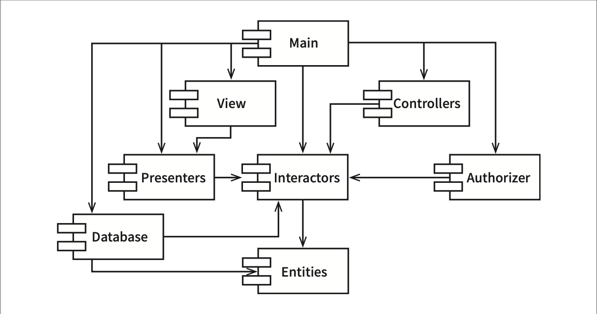

```
              Main
            /   |   \
           v    v    v
        View  Controllers
          \   /       |
           v v        v
       Presenters  Authorizer
          |    \      |
          v     v     v
       Database  Interactors
           \      /
            v    v
           Entities
```

이 구조에서 주목할 점:

- 이 구조는 **방향 그래프(directed graph)**다. 컴포넌트는 정점(vertex), 의존성 관계는 방향이 있는 간선(directed edge)에 해당한다.
- 어느 컴포넌트에서 시작하더라도, 의존성 관계를 따라가면서 **최초의 컴포넌트로 되돌아갈 수 없다**. 즉, 이 구조는 **비순환 방향 그래프(DAG, Directed Acyclic Graph)**다.

이 DAG 구조의 장점:

| 상황 | 결과 |
|------|------|
| Presenters의 새 릴리스 | View와 Main만 영향. 나머지는 무관 |
| Main의 새 릴리스 | 어떤 컴포넌트도 Main에 의존하지 않으므로 충격이 거의 없음 |
| Presenters 테스트 시 | Interactors와 Entities만 있으면 빌드 가능. 나머지 불필요 |
| 시스템 전체 릴리스 | **상향식**: Entities → Database, Interactors → Presenters, ... → Main |

---

## 3. 순환이 컴포넌트 의존성 그래프에 미치는 영향

새로운 요구사항이 발생해서 Entities에 포함된 `User` 클래스가 Authorizer의 `Permissions` 클래스를 사용하도록 변경해야 한다고 가정해 보자. 이렇게 되면 **순환 의존성(dependency cycle)**이 발생한다.

```
  Entities ──→ Authorizer ──→ Interactors ──→ Entities  (순환!)
```

이 순환은 즉각적인 문제를 일으킨다:

- Database 컴포넌트를 릴리스하려면 Entities뿐만 아니라 **Authorizer와 Interactors**와도 호환되어야 한다
- Entities, Authorizer, Interactors는 사실상 **하나의 거대한 컴포넌트**가 되어 버린다
- 개발자들은 모두 '숙취 증후군'에 떠는 경험을 하게 된다
- Entities를 테스트할 때 Authorizer와 Interactors까지도 반드시 빌드하고 통합해야 한다
- 컴포넌트를 **어떤 순서로 빌드해야 올바를지** 파악하기가 상당히 힘들어진다. 올바른 순서라는 것 자체가 없을 수 있다

---

## 4. 순환 끊기

컴포넌트 사이의 순환을 끊고 의존성을 다시 DAG로 원상복구하는 일은 언제라도 가능하다. 이를 위한 주요 메커니즘 두 가지를 살펴보자.

### 4.1 방법 1: 의존성 역전 원칙(DIP) 적용

`User`가 필요로 하는 메서드를 제공하는 **인터페이스**를 생성한다. 이 인터페이스는 Entities에 위치시키고, Authorizer에서는 이 인터페이스를 상속받는다. 이렇게 하면 Entities와 Authorizer 사이의 의존성을 **역전**시킬 수 있고, 순환을 끊을 수 있다.

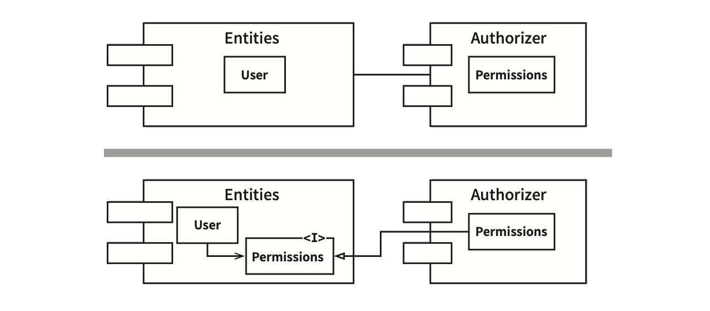

```
  [변경 전]
  Entities(User) ──────→ Authorizer(Permissions)

  [변경 후]
  Entities(User → <<I>>Permissions) ←── Authorizer(Permissions)
```

### 4.2 방법 2: 새로운 컴포넌트 생성

Entities와 Authorizer가 모두 의존하는 **새로운 컴포넌트**를 만든다. 그리고 두 컴포넌트가 모두 의존하는 클래스들을 새로운 컴포넌트로 이동시킨다.

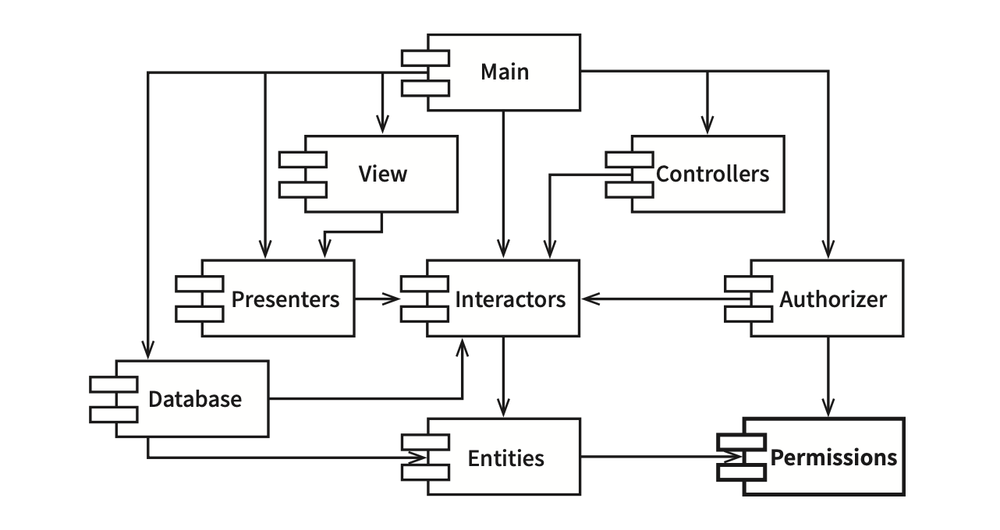

```
              Main
            /   |   \
           v    v    v
        View  Controllers
          \   /       |
           v v        v
       Presenters  Authorizer ──→ Permissions
          |    \      |              ↑
          v     v     v              |
       Database  Interactors         |
           \      /                  |
            v    v                   |
           Entities ────────────────┘
```

### 4.3 흐트러짐(Jitters)

두 번째 해결책에서 시사하는 바는 요구사항이 변경되면 **컴포넌트 구조도 변경될 수 있다**는 사실이다. 실제로 애플리케이션이 성장함에 따라 컴포넌트 의존성 구조는 서서히 흐트러지며 또 성장한다. 따라서 의존성 구조에 순환이 발생하는지를 **항상 관찰**해야 한다. 순환이 발생하면 어떤 식으로든 끊어야 하며, 이는 때론 새로운 컴포넌트를 생성하거나 의존성 구조가 더 커질 수도 있음을 의미한다.

---

## 5. 하향식(Top-down) 설계

지금까지의 논의로 우리는 피할 수 없는 결론에 다다르게 된다:

> **핵심 통찰**: 컴포넌트 구조는 하향식으로 설계될 수 없다. 컴포넌트는 시스템에서 가장 먼저 설계할 수 있는 대상이 아니며, 오히려 시스템이 성장하고 변경될 때 함께 진화한다.

이 결론이 직관에서 어긋난다고 생각할 수 있다. 컴포넌트와 같이 큰 단위로 분해된 구조는 고수준의 기능적(functional) 구조로 다시 분해할 수 있다고 기대하기 때문이다.

사실 컴포넌트 의존성 다이어그램은 애플리케이션의 **기능을 기술하는 일**과는 거의 관련이 없다. 오히려 컴포넌트 의존성 다이어그램은 애플리케이션의 **빌드 가능성(buildability)**과 **유지보수성(maintainability)**을 보여주는 **지도(map)**와 같다.

컴포넌트 의존성 구조가 시스템과 함께 진화하는 과정:

1. **프로젝트 초기**: 구현과 설계가 이뤄지면서 모듈들이 점차 쌓이기 시작하면, '숙취 증후군'을 겪지 않고 프로젝트를 개발하기 위해 **의존성 관리**에 대한 요구가 늘어난다
2. **SRP와 CCP 적용**: 함께 변경되는 클래스를 같은 위치에 배치
3. **변동성 격리**: 자주 변경되는 컴포넌트로부터 안정적이며 가치가 높은 컴포넌트를 보호
4. **CRP 적용**: 애플리케이션이 성장하면서 재사용 가능한 요소를 만드는 일에 관심을 기울인다
5. **ADP 적용**: 순환이 발생하면 끊는다

아직 아무런 클래스도 설계하지 않은 상태에서 컴포넌트 의존성 구조를 설계하려고 시도한다면 **상당히 큰 실패**를 맛볼 수 있다. 따라서 컴포넌트 의존성 구조는 시스템의 논리적 설계에 **발맞춰 성장하며 또 진화**해야 한다.

---

## 6. SDP: 안정된 의존성 원칙

> **안정성의 방향으로(더 안정된 쪽에) 의존하라.**

### 6.1 안정성의 의미

설계는 결코 정적일 수 없다. 공통 폐쇄 원칙을 준수함으로써, 컴포넌트가 다른 유형의 변경에는 영향받지 않으면서도 특정 유형의 변경에만 민감하게 만들 수 있다. 컴포넌트 중 일부는 **변동성을 지니도록 설계**된다.

변경이 쉽지 않은 컴포넌트가 변동이 예상되는 컴포넌트에 의존하게 만들어서는 **절대로 안 된다**. 한번 의존하게 되면 변동성이 큰 컴포넌트도 결국 변경이 어려워진다.

'안정성(stability)'은 변화가 발생하는 빈도와는 직접적인 관련이 없다. 안정성은 **변경을 만들기 위해 필요한 작업량**과 관련된다.

| 비유 | 안정성 | 이유 |
|------|--------|------|
| 옆면으로 선 동전 | 불안정 | 그다지 힘을 쓰지 않고도 넘어뜨릴 수 있다 |
| 탁자 | 안정 | 뒤집으려면 상당한 수고를 감수해야 한다 |

소프트웨어 컴포넌트를 변경하기 어렵게 만드는 확실한 방법 하나는 **수많은 다른 컴포넌트가 해당 컴포넌트에 의존하게** 만드는 것이다.

### 6.2 안정된 컴포넌트 vs 불안정한 컴포넌트

**안정된 컴포넌트 X** (그림 14.5):

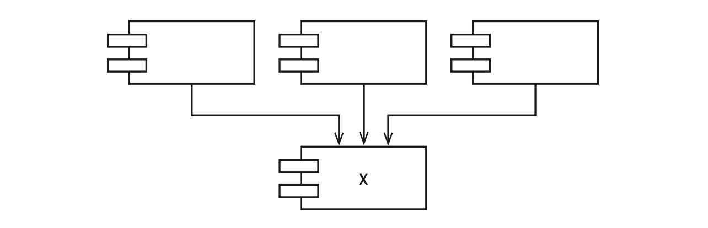

```
     [A]   [B]   [C]
      \     |     /
       v    v    v
          [X]
```

- 세 컴포넌트가 X에 의존하므로, X는 변경하지 말아야 할 이유가 세 가지 -- X는 **책임진다(responsible)**
- X는 어디에도 의존하지 않으므로 변경을 유발하는 외적 영향이 없다 -- X는 **독립적이다(independent)**

**불안정한 컴포넌트 Y** (그림 14.6):

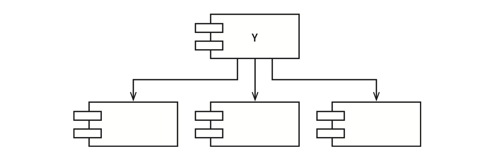

```
          [Y]
      /    |    \
     v     v     v
    [A]   [B]   [C]
```

- 어떤 컴포넌트도 Y에 의존하지 않으므로 -- Y는 **책임성이 없다**
- Y는 세 개의 컴포넌트에 의존하므로 변경이 발생할 수 있는 외부 요인이 세 가지 -- Y는 **의존적이다**

### 6.3 안정성 지표

컴포넌트로 들어오고 나가는 의존성의 개수를 세어 안정성을 측정할 수 있다.

| 지표 | 의미 | 계산 방법 |
|------|------|---------|
| **Fan-in** | 안으로 들어오는 의존성 | 컴포넌트 내부 클래스에 의존하는 외부 클래스 개수 |
| **Fan-out** | 바깥으로 나가는 의존성 | 컴포넌트 외부 클래스에 의존하는 내부 클래스 개수 |
| **I (불안정성)** | 불안정성 지표 | **I = Fan-out / (Fan-in + Fan-out)** |

I 지표는 [0, 1] 범위의 값을 갖는다.

| I 값 | 의미 | 상태 |
|------|------|------|
| **I = 0** | Fan-in > 0, Fan-out = 0 | **최고로 안정** -- 다른 컴포넌트를 책임지며 독립적 |
| **I = 1** | Fan-in = 0, Fan-out > 0 | **최고로 불안정** -- 책임성 없으며 의존적 |

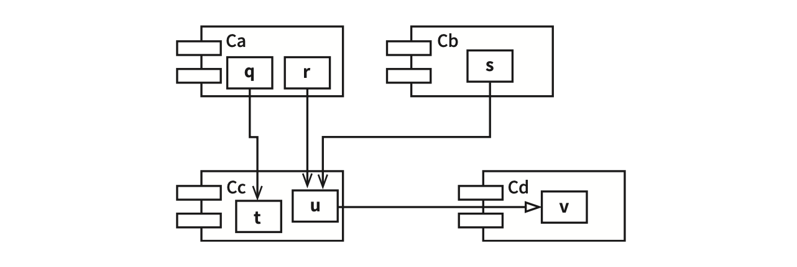

```
      [Ca]        [Cb]
     q   r          s
      \   \       /
       v   v     v
          [Cc]       [Cd]
           t    u ──→ v
```

Cc 컴포넌트의 안정성 계산:
- Cc 내부의 클래스에 의존하며 Cc 외부에 있는 클래스: q, r, s → **Fan-in = 3**
- Cc 내부의 클래스가 의존하는 Cc 외부에 위치한 클래스: v → **Fan-out = 1**
- **I = 1/4**

SDP에서 컴포넌트의 I 지표는 그 컴포넌트가 의존하는 다른 컴포넌트들의 I보다 **커야 한다**고 말한다. 즉, 의존성 방향으로 갈수록 **I 지표 값이 감소**해야 한다.

### 6.4 모든 컴포넌트가 안정적이어야 하는 것은 아니다

모든 컴포넌트가 최고로 안정적인 시스템이라면 **변경이 불가능**하다. 우리가 기대하는 것은 불안정한 컴포넌트도 있고 안정된 컴포넌트도 존재하는 상태다.

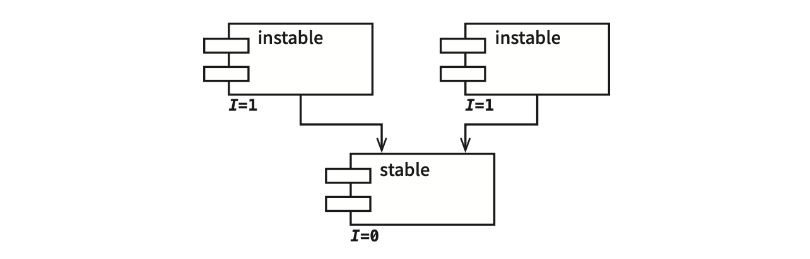

```
  [instable]     [instable]
    I = 1           I = 1
       \            /
        v          v
       [stable]
        I = 0
```

위쪽에는 변경 가능한(불안정한) 컴포넌트가 보이고, 아래의 안정된 컴포넌트에 의존한다. 불안정한 컴포넌트를 관례적으로 위쪽에 두면 상당히 유용한데, **위로 향하는 화살표**가 있으면 SDP(그리고 ADP도)를 위배하는 상태가 되기 때문이다.

### 6.5 SDP 위배 사례와 해결

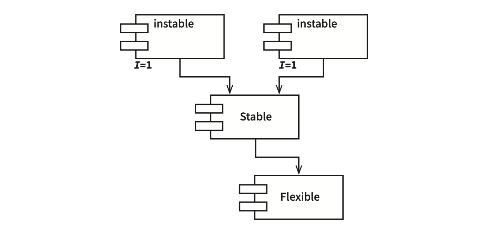

```
  [instable]     [instable]
    I = 1           I = 1
       \            /
        v          v
       [Stable]
          |
          v
      [Flexible]
```

Flexible은 변경하기 쉽도록 설계한 컴포넌트다. 하지만 Stable 컴포넌트에서 작업하던 개발자가 Flexible에 의존성을 걸게 되었다. SDP를 위배하게 되며, Flexible은 변경하기가 어렵게 된다.

**문제**: Stable 내부의 클래스 U가 Flexible 내부의 클래스 C를 사용한다.


**해결**: DIP를 도입한다. `US`라는 인터페이스를 생성한 후 `UServer` 컴포넌트에 넣는다. US 인터페이스에는 U가 사용하는 모든 메서드가 선언되어 있어야 한다. 그러고 나서 C가 해당 인터페이스를 구현하도록 만든다.

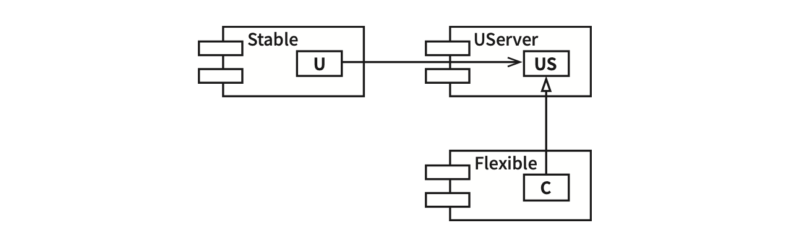

```
  [Stable]          [UServer]
    U ─────────→       US
                        ↑
                        |
                   [Flexible]
                      C
```

이를 통해 Stable의 Flexible에 대한 의존성을 끊을 수 있고, 두 컴포넌트는 모두 UServer에 의존하도록 강제한다. UServer는 매우 안정된 상태이며(I=0), Flexible은 자신에게 맞는 불안정성(I=1)을 그대로 유지할 수 있다. 이제 모든 의존성은 **I가 감소하는 방향**으로 향한다.

### 6.6 추상 컴포넌트

오로지 인터페이스만을 포함하는 컴포넌트(이 예제의 경우 UServer)를 생성하는 방식이 이상하게 보일 수 있다. 이러한 컴포넌트에는 실행 가능한 코드가 전혀 없지만, 자바나 C# 같은 **정적 타입 언어**를 사용할 때 이 방식은 상당히 흔할 뿐만 아니라 꼭 필요한 전략으로 알려져 있다. 이러한 추상 컴포넌트는 상당히 안정적이며, 따라서 덜 안정적인 컴포넌트가 의존할 수 있는 이상적인 대상이다.

루비나 파이썬 같은 **동적 타입 언어**를 사용할 때는 이러한 추상 컴포넌트가 전혀 존재하지 않을 뿐만 아니라, 추상 컴포넌트로 향하는 의존성 같은 것도 전혀 없다. 이들 언어에서 의존성 구조는 훨씬 단순한데, 의존성을 역전시킬 때 인터페이스를 선언하거나 상속받는 일이 전혀 필요하지 않기 때문이다.

---

## 7. SAP: 안정된 추상화 원칙

> **컴포넌트는 안정된 정도만큼만 추상화되어야 한다.**

### 7.1 고수준 정책을 어디에 위치시켜야 하는가?

시스템에는 자주 변경해서는 절대로 안 되는 소프트웨어도 있다. 고수준 아키텍처나 정책 결정과 관련된 소프트웨어가 그 예다. 따라서 시스템에서 고수준 정책을 캡슐화하는 소프트웨어는 반드시 **안정된 컴포넌트(I=0)**에 위치해야 한다. 불안정한 컴포넌트(I=1)는 반드시 변동성이 큰 소프트웨어, 즉 쉽고 빠르게 변경할 수 있는 소프트웨어만을 포함해야 한다.

하지만 고수준 정책을 안정된 컴포넌트에 위치시키면, 그 정책을 포함하는 소스 코드는 **수정하기가 어려워진다**. 이로 인해 시스템 전체 아키텍처가 유연성을 잃는다.

해답은 **개방 폐쇄 원칙(OCP)**에서 찾을 수 있다. 클래스를 수정하지 않고도 확장이 충분히 가능할 정도로 클래스를 유연하게 만들 수 있다. 어떤 클래스가 이 원칙을 준수하는가? 바로 **추상(abstract) 클래스**다.

### 7.2 안정된 추상화 원칙의 핵심

SAP은 안정성(stability)과 추상화 정도(abstractness) 사이의 관계를 정의한다.

| 컴포넌트 유형 | 요구사항 |
|-------------|---------|
| **안정된 컴포넌트** | 추상 컴포넌트여야 한다 → 안정성이 확장을 방해해서는 안 된다 |
| **불안정한 컴포넌트** | 구체 컴포넌트여야 한다 → 내부 구체적 코드를 쉽게 변경할 수 있어야 한다 |

안정적인 컴포넌트라면 반드시 **인터페이스와 추상 클래스**로 구성되어 쉽게 확장할 수 있어야 한다.

### 7.3 SDP + SAP = 컴포넌트에 대한 DIP

SAP와 SDP를 결합하면 **컴포넌트에 대한 DIP**나 마찬가지가 된다.

| 원칙 | 주장 |
|------|------|
| SDP | 의존성이 반드시 **안정성의 방향**으로 향해야 한다 |
| SAP | 안정성이 결국 **추상화**를 의미한다 |
| 결론 | 의존성은 **추상화의 방향**으로 향하게 된다 |

하지만 DIP는 클래스에 대한 원칙이며, 클래스의 경우 중간은 존재하지 않는다(추상적이거나 아니거나, 둘 중 하나). SDP와 SAP의 조합은 **컴포넌트에 대한 원칙**이며, 컴포넌트는 어떤 부분은 추상적이면서 다른 부분은 안정적일 수 있다.

---

## 8. 추상화 정도 측정하기

A 지표는 컴포넌트의 추상화 정도를 측정한 값이다.

| 지표 | 의미 |
|------|------|
| **Nc** | 컴포넌트의 클래스 개수 |
| **Na** | 컴포넌트의 추상 클래스와 인터페이스의 개수 |
| **A** | 추상화 정도. **A = Na / Nc** |

A 지표는 0과 1 사이의 값을 갖는다.

| A 값 | 의미 |
|------|------|
| **A = 0** | 추상 클래스가 하나도 없다 (완전히 구체적) |
| **A = 1** | 오로지 추상 클래스만 포함한다 (완전히 추상적) |

---

## 9. 주계열(Main Sequence)

### 9.1 A/I 그래프

안정성(I)과 추상화 정도(A) 사이의 관계를 그래프로 나타낸다. 수직축에는 A를, 수평축에는 I를 배치한다.

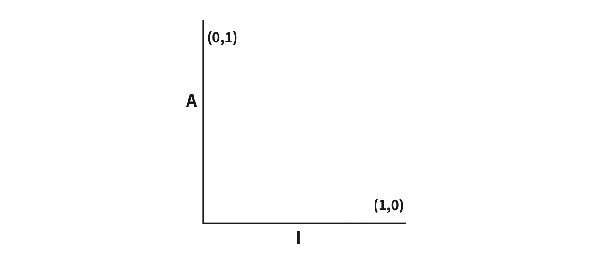

```
  A
  (0,1) ·─────────────────────
        |
        |
        |
        |
        |
        └───────────────── (1,0)
                          I
```

- 최고로 안정적이며 추상화된 컴포넌트: 좌측 상단 **(0, 1)**
- 최고로 불안정하며 구체화된 컴포넌트: 우측 하단 **(1, 0)**

### 9.2 배제 구역(Zone of Exclusion)

모든 컴포넌트가 (0, 1) 또는 (1, 0)에 위치할 수는 없다. 컴포넌트가 **절대로 위치해서는 안 되는 영역**, 즉 배제할 구역(Zone of Exclusion)이 존재한다.

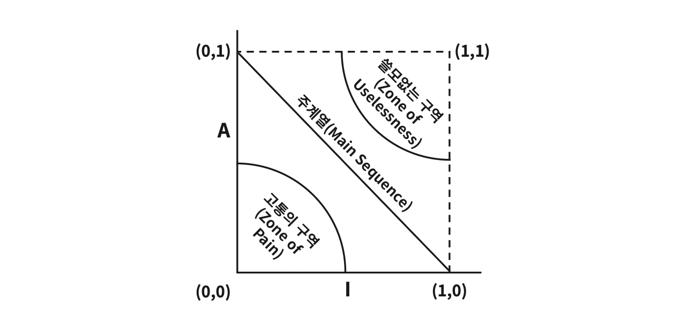

#### 고통의 구역(Zone of Pain) -- (0, 0) 주변

(0, 0) 주변에 위치한 컴포넌트는 매우 안정적이며 구체적이다. 이러한 컴포넌트는 바람직한 상태가 아닌데, **뻣뻣한 상태**이기 때문이다. 추상적이지 않으므로 확장할 수 없고, 안정적이므로 변경하기도 상당히 어렵다.

| 고통의 구역에 위치하는 것 | 상태 |
|------------------------|------|
| **데이터베이스 스키마** | 변동성이 높고, 극단적으로 구체적이며, 많은 컴포넌트가 의존한다 → 고통스럽다 |
| **String 같은 구체적 유틸리티 라이브러리** | I=0이지만 **변동성이 거의 없다** → 해롭지 않다 |

> **핵심 통찰**: 변동성이 없는 컴포넌트는 고통의 구역에 위치했더라도 해롭지 않다. 고통의 구역에서 문제가 되는 경우는 **변동성이 있는** 소프트웨어 컴포넌트다.

#### 쓸모없는 구역(Zone of Uselessness) -- (1, 1) 주변

(1, 1) 주변의 컴포넌트는 최고로 추상적이지만, **누구도 그 컴포넌트에 의존하지 않는다**. 이러한 컴포넌트는 쓸모가 없다. 이 영역에 존재하는 소프트웨어 엔티티는 폐기물과도 같다. 누구도 구현하지 않은 채 남겨진 추상 클래스인 경우가 많다.

### 9.3 주계열의 정의

변동성이 큰 컴포넌트 대부분은 두 배제 구역으로부터 가능한 한 멀리 떨어뜨려야 한다. 각 배제 구역으로부터 최대한 멀리 떨어진 점의 궤적은 **(1, 0)**과 **(0, 1)**을 잇는 선분이다. 이 선분을 **주계열(Main Sequence)**(*Main Sequence — 천문학 용어에서 차용한 개념으로, 관측된 모든 별 중의 90%가 표시되어 있는 좁은 띠를 말한다.*)이라고 부른다.

주계열에 위치한 컴포넌트는:
- 자신의 안정성에 비해 '너무 추상적'이지도 않다
- 추상화 정도에 비해 '너무 불안정'하지도 않다
- 쓸모없지 않으면서도 심각한 고통을 안겨 주지도 않는다

컴포넌트가 위치할 수 있는 **가장 바람직한 지점**은 주계열의 두 종점이다. 뛰어난 아키텍트라면 대다수의 컴포넌트가 두 종점에 위치하도록 만들기 위해 매진한다.

---

## 10. 주계열과의 거리(Distance)

컴포넌트가 주계열 바로 위에, 또는 가까이 있는 것이 바람직하다면, 이 이상적인 상태로부터 컴포넌트가 얼마나 멀리 떨어져 있는지 측정하는 지표를 만들 수 있다.

| 지표 | 계산 | 의미 |
|------|------|------|
| **D (거리)** | **D = \|A + I - 1\|** | [0, 1] 범위. D=0이면 주계열 바로 위, D=1이면 주계열로부터 가장 멀리 위치 |

### 10.1 통계적 분석

설계에 포함된 모든 컴포넌트에 대해 D 지표의 **평균과 분산**을 구한다. 주계열에 일치하도록 설계되었다면 평균과 분산은 0에 가까워진다. 분산은 **관리 한계(control limit)**를 결정하기 위한 목적으로 사용할 수 있는데, 분산을 통해 다른 컴포넌트에 비해 '극히 예외적인' 컴포넌트를 식별할 수 있기 때문이다.

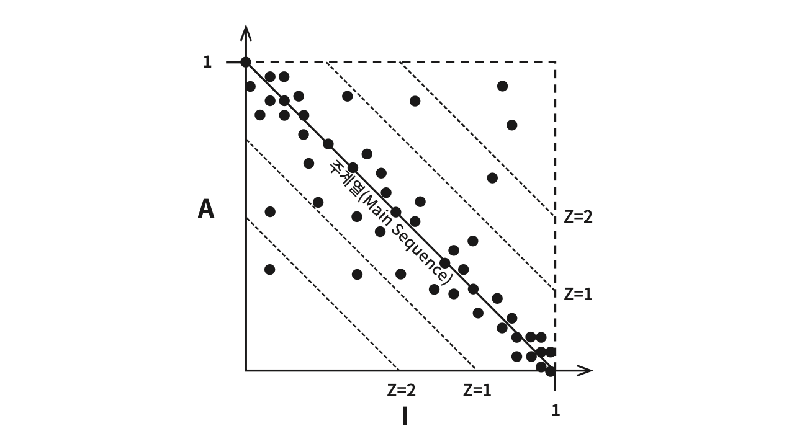

그림 14.14의 산점도에서 보듯이, 대부분의 컴포넌트는 주계열을 따라 위치하지만 일부 컴포넌트는 표준편차가 1(Z=1)인 영역을 벗어나 있다. 이처럼 이상한 컴포넌트는 좀 더 면밀히 검토해 볼 가치가 있다.

### 10.2 시간에 따른 D 값 추적

각 컴포넌트의 D 값을 시간에 따라 그려볼 수도 있다.

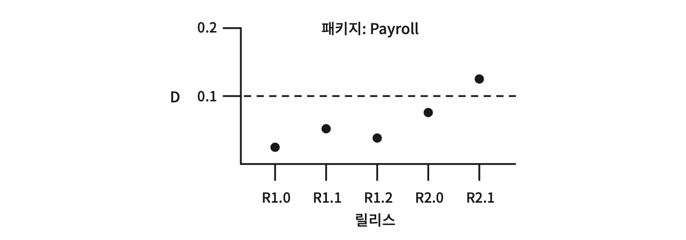

그림 14.15에서 보듯이, 마지막 몇 개의 릴리스에서 Payroll 컴포넌트에 이상한 의존성이 조금씩 스며들어왔다는 사실을 알 수 있다. 관리 한계는 D=0.1인 지점이며, R2.1 지점에서 이 관리 한계를 초과했으므로 이 컴포넌트가 주계열에서 이렇게 멀리 벗어난 원인을 조사해 볼 가치가 있어 보인다.

---

## 11. 결론

이 장에서 설명한 의존성 관리 지표는 설계의 의존성과 추상화 정도가 '훌륭한' 패턴이라고 생각하는 수준에 얼마나 잘 부합하는지를 측정한다. 하지만 **지표는 신이 아니다**. 지표는 그저 임의로 결정된 표준을 기초로 한 측정값에 지나지 않는다. 이러한 지표는 아무리 해도 불완전하다. 하지만 이들 지표로부터 무언가 유용한 것을 찾을 수 있기를 바란다.

---

## 요약

- **ADP(의존성 비순환 원칙)**: 컴포넌트 의존성 그래프에 순환이 있어서는 안 된다. 순환이 생기면 컴포넌트 분리, 테스트, 릴리스 모두 어려워진다. DIP 적용 또는 새 컴포넌트 생성으로 순환을 끊을 수 있다.
- **컴포넌트 구조는 하향식으로 설계할 수 없다**. 시스템이 성장하고 변경될 때 함께 진화한다. 컴포넌트 의존성 다이어그램은 기능이 아니라 빌드 가능성과 유지보수성의 지도다.
- **SDP(안정된 의존성 원칙)**: 의존성의 방향으로 갈수록 안정성이 커져야 한다. I 지표(불안정성)를 통해 정량적으로 측정할 수 있다.
- **SAP(안정된 추상화 원칙)**: 안정된 컴포넌트는 추상적이어야 하고, 불안정한 컴포넌트는 구체적이어야 한다. SDP와 결합하면 컴포넌트에 대한 DIP가 된다.
- **주계열(Main Sequence)**: A/I 그래프에서 (0,1)과 (1,0)을 잇는 선분. 컴포넌트는 이 주계열 위 또는 가까이 위치해야 한다.
- **고통의 구역**(0,0): 안정적이지만 구체적 -- 변동성이 있으면 고통스럽다. **쓸모없는 구역**(1,1): 추상적이지만 아무도 의존하지 않는다.
- **D 지표**(주계열과의 거리)를 통해 컴포넌트가 이상적 상태에서 얼마나 벗어나 있는지 정량적으로 추적할 수 있다.

---

## 다른 챕터와의 관계

| 관련 챕터 | 연결 포인트 |
|----------|-----------|
| **Chapter 7: SRP** | CCP(13장)를 통해 SRP가 컴포넌트 수준으로 확대되며, ADP에서 컴포넌트를 분리하는 동기가 된다. |
| **Chapter 8: OCP** | SAP는 OCP의 "수정 없이 확장 가능"이라는 개념을 안정된 컴포넌트에 적용한다. 추상 클래스와 인터페이스가 그 수단이다. |
| **Chapter 11: DIP** | SDP + SAP의 결합은 컴포넌트 수준의 DIP다. 순환 끊기에서도 DIP가 핵심 메커니즘으로 사용된다. |
| **Chapter 12: 컴포넌트** | 이 장에서 정의한 "컴포넌트"라는 배포 단위를 기반으로, 본 장은 컴포넌트 간의 결합 관계를 다룬다. |
| **Chapter 13: 컴포넌트 응집도** | 13장이 컴포넌트 내부의 응집도를 다룬다면, 이 장은 컴포넌트 간의 결합을 다룬다. 두 장은 컴포넌트 설계의 양면이다. |
| **Chapter 15~16: 아키텍처, 독립성** | 이 장의 원칙들은 5부(아키텍처)에서 다루는 경계 설정과 계층 분리의 이론적 기반이 된다. |
