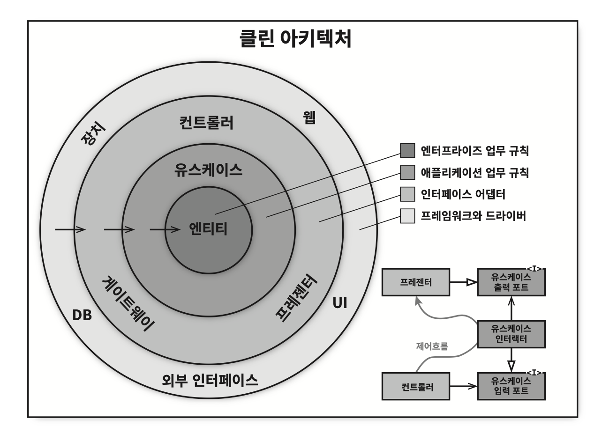
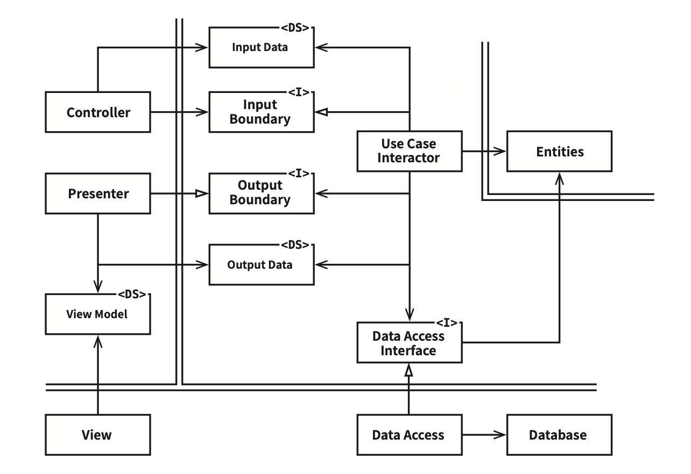

# Chapter 22: The Clean Architecture (클린 아키텍처)

## 핵심 질문

지난 수십 년간 제안된 여러 아키텍처 아이디어(육각형 아키텍처, DCI, BCE 등)의 공통 목표는 무엇이며, 이들을 하나의 실행 가능한 아이디어로 통합하면 어떤 형태가 되는가? 소스 코드 의존성은 어떤 방향으로 흘러야 하는가?

---

## 1. 선행 아키텍처 아이디어들

지난 수십 년간 시스템 아키텍처와 관련된 여러 가지 아이디어가 제안되어 왔다.

| 아키텍처 | 제안자 | 별칭/비고 |
|----------|--------|----------|
| **육각형 아키텍처** | 앨리스터 코오번(Alistair Cockburn) | 포트와 어댑터(Ports and Adapters)라고도 알려짐 |
| **DCI** | 제임스 코플리언(James Coplien), 트리그베 린스쿠주(Trygve Reenskaug) | Data, Context and Interaction |
| **BCE** | 이바 야콥슨(Ivar Jacobson) | Boundary-Control-Entity(*BCE — 순서를 바꿔 ECB(Entity-Control-Boundary)라고도 많이 쓰인다.*) |

이들 아키텍처는 세부적인 면에서는 다소 차이가 있더라도 그 내용은 상당히 비슷하다. 이들의 목표는 모두 같은데, 바로 **관심사의 분리(separation of concerns)**다. 이들은 모두 소프트웨어를 **계층으로 분리**함으로써 관심사의 분리라는 목표를 달성할 수 있었다. 각 아키텍처는 최소한 업무 규칙을 위한 계층 하나와, 사용자와 시스템 인터페이스를 위한 또 다른 계층 하나를 반드시 포함한다.

---

## 2. 공통 특징

이들 아키텍처는 모두 시스템이 다음과 같은 특징을 지니도록 만든다:

- **프레임워크 독립성**: 아키텍처는 다양한 기능의 라이브러리를 제공하는 소프트웨어, 즉 프레임워크의 존재 여부에 의존하지 않는다. 프레임워크를 도구로 사용할 수 있으며, 프레임워크가 지닌 제약사항 안으로 시스템을 욱여 넣도록 강제하지 않는다.
- **테스트 용이성**: 업무 규칙은 UI, 데이터베이스, 웹 서버, 또는 여타 외부 요소가 없이도 테스트할 수 있다.
- **UI 독립성**: 시스템의 나머지 부분을 변경하지 않고도 UI를 쉽게 변경할 수 있다. 예를 들어 업무 규칙을 변경하지 않은 채 웹 UI를 콘솔 UI로 대체할 수 있다.
- **데이터베이스 독립성**: 오라클이나 MS SQL 서버를 몽고DB, 빅테이블, 카우치DB 등으로 교체할 수 있다. 업무 규칙은 데이터베이스에 결합되지 않는다.
- **모든 외부 에이전시에 대한 독립성**: 실제로 업무 규칙은 외부 세계와의 인터페이스에 대해 전혀 알지 못한다.

---

## 3. 클린 아키텍처의 동심원 모델

다음 다이어그램은 이들 아키텍처 전부를 **실행 가능한 하나의 아이디어로 통합**하려는 시도다.



클린 아키텍처는 네 개의 동심원으로 구성된다. 안쪽으로 들어갈수록 고수준의 소프트웨어가 된다:

| 계층 (바깥 → 안쪽) | 포함 요소 | 수준 |
|-------------------|----------|------|
| **프레임워크와 드라이버** | 웹, DB, 장치, UI, 외부 인터페이스 | 최저수준 (세부사항) |
| **인터페이스 어댑터** | 컨트롤러, 게이트웨이, 프레젠터 | 중간 수준 |
| **유스케이스** | 애플리케이션 업무 규칙 | 고수준 |
| **엔티티** | 엔터프라이즈 업무 규칙 | 최고수준 (정책) |

---

## 4. 의존성 규칙 (Dependency Rule)

이 아키텍처가 동작하도록 하는 **가장 중요한 규칙**이 의존성 규칙이다.

> **핵심 통찰**: 소스 코드 의존성은 반드시 **안쪽으로**, 고수준의 정책을 향해야 한다.

의존성 규칙의 구체적인 내용:

- 내부의 원에 속한 요소는 외부의 원에 속한 어떤 것도 **알지 못한다**
- 내부의 원에 속한 코드는 외부의 원에 선언된 어떤 것에 대해서도 그 이름을 **언급해서는 절대 안 된다** (함수, 클래스, 변수, 그리고 소프트웨어 엔티티로 명명되는 모든 것)
- 외부의 원에 선언된 **데이터 형식**도 내부의 원에서 절대로 사용해서는 안 된다 (특히 그 데이터 형식이 외부의 원에 있는 프레임워크가 생성한 것이라면 더더욱)
- 외부 원에 위치한 어떤 것도 내부의 원에 **영향을 주지 않아야** 한다

원은 네 개보다 더 많을 수도 있다. 항상 네 개만 사용해야 한다는 규칙은 없다. 하지만 어떤 경우에도 의존성 규칙은 적용된다.

- 안쪽으로 이동할수록 **추상화와 정책의 수준은 높아진다**
- 가장 바깥쪽 원은 **저수준의 구체적인 세부사항**으로 구성된다
- 가장 안쪽 원은 가장 **범용적이며 높은 수준**을 가진다

---

## 5. 각 계층의 역할

### 5.1 엔티티

엔티티는 **전사적인 핵심 업무 규칙**을 캡슐화한다. 엔티티는 메서드를 가지는 객체이거나 일련의 데이터 구조와 함수의 집합일 수도 있다. 기업의 다양한 애플리케이션에서 엔티티를 재사용할 수만 있다면, 그 형태는 그다지 중요하지 않다.

전사적이지 않은 단순한 단일 애플리케이션을 작성하고 있다면 엔티티는 해당 애플리케이션의 업무 객체가 된다. 이 경우 엔티티는 **가장 일반적이며 고수준인 규칙**을 캡슐화한다.

- 페이지 네비게이션이나 보안과 관련된 변경이 발생하더라도 업무 객체가 영향을 받지는 않을 것이다
- 운영 관점에서 특정 애플리케이션에 무언가 변경이 필요하더라도 엔티티 계층에는 절대로 영향을 주어서는 안 된다

### 5.2 유스케이스

유스케이스 계층의 소프트웨어는 **애플리케이션에 특화된 업무 규칙**을 포함한다. 유스케이스 계층은 시스템의 모든 유스케이스를 캡슐화하고 구현한다.

- 유스케이스는 엔티티로 들어오고 나가는 **데이터 흐름을 조정**하며, 엔티티가 자신의 핵심 업무 규칙을 사용해서 유스케이스의 목적을 달성하도록 이끈다
- 이 계층에서 발생한 변경이 엔티티에 영향을 줘서는 안 된다
- 데이터베이스, UI, 또는 여타 공통 프레임워크와 같은 외부 요소에서 발생한 변경이 이 계층에 영향을 줘서도 안 된다
- 하지만 운영 관점에서 애플리케이션이 변경된다면 유스케이스가 영향을 받을 수 있다

### 5.3 인터페이스 어댑터

인터페이스 어댑터(Interface Adaptor) 계층은 **일련의 어댑터들**로 구성된다. 어댑터는 데이터를 유스케이스와 엔티티에게 가장 편리한 형식에서 데이터베이스나 웹 같은 외부 에이전시에게 가장 편리한 형식으로 변환한다.

이 계층에는 다음이 포함된다:

- **GUI의 MVC 아키텍처** 전체 — 프레젠터(Presenter), 뷰(View), 컨트롤러(Controller) 모두
- 모델은 그저 데이터 구조 정도에 지나지 않으며, 컨트롤러에서 유스케이스로 전달되고, 다시 유스케이스에서 프레젠터와 뷰로 되돌아 간다
- 데이터를 엔티티와 유스케이스에게 가장 편리한 형식에서 **영속성 프레임워크(데이터베이스)**가 이용하기에 가장 편리한 형식으로 변환하는 어댑터

SQL 기반의 데이터베이스를 사용한다면 **모든 SQL은 이 계층을 벗어나서는 안 된다.** 특히 이 계층에서도 데이터베이스를 담당하는 부분으로 제한되어야 한다.

또한 이 계층에는 데이터를 **외부 서비스와 같은 외부적인 형식에서 유스케이스나 엔티티에서 사용되는 내부적인 형식으로 변환**하는 또 다른 어댑터가 필요하다.

### 5.4 프레임워크와 드라이버

가장 바깥쪽 계층은 일반적으로 데이터베이스나 웹 프레임워크 같은 프레임워크나 도구들로 구성된다. 일반적으로 이 계층에서는 안쪽 원과 통신하기 위한 **접합 코드** 외에는 특별히 더 작성해야 할 코드가 그다지 많지 않다.

프레임워크와 드라이버 계층은 **모든 세부사항이 위치하는 곳**이다:

- 웹은 세부사항이다
- 데이터베이스는 세부사항이다
- 이러한 것들을 모두 외부에 위치시켜서 피해를 최소화한다

---

## 6. 경계 횡단하기

그림 22.1의 우측 하단 다이어그램에 원의 경계를 횡단하는 방법을 보여주는 예시가 있다. 컨트롤러와 프레젠터가 다음 계층에 속한 유스케이스와 통신하는 모습을 확인할 수 있다.

**제어흐름**: 컨트롤러 → 유스케이스 → 프레젠터

**소스 코드 의존성**: 각 의존성은 유스케이스를 향해 **안쪽을** 가리킨다.

제어흐름과 의존성의 방향이 명백히 반대여야 하는 경우, 대체로 **의존성 역전 원칙(DIP)**을 사용하여 해결한다. 예를 들어 자바 같은 언어에서는 인터페이스와 상속 관계를 적절하게 배치함으로써, 제어흐름이 경계를 가로지르는 바로 그 지점에서 소스 코드 의존성을 제어흐름과는 반대가 되게 만들 수 있다.(*별다른 조치 없이 제어흐름을 따라 구현하면 안쪽 원의 코드가 바깥쪽 원의 코드를 호출하게 된다. 바로 이 지점에서 소스 코드 의존성을 역전시켜서, (제어흐름과는 반대로) 바깥쪽 원의 코드가 안쪽 원의 코드에 의존하게 만든다는 뜻이다.*)

예를 들어 유스케이스에서 프레젠터를 호출해야 한다고 가정해 보자. 이때 직접 호출해서는 안 되는데, 직접 호출해 버리면 의존성 규칙(내부의 원에서는 외부 원에 있는 어떤 이름도 언급해서는 안 된다)을 위배하기 때문이다. 따라서:

1. 유스케이스가 **내부 원의 인터페이스**(유스케이스 출력 포트)를 호출하도록 한다
2. **외부 원의 프레젠터**가 그 인터페이스를 구현하도록 만든다

아키텍처 경계를 횡단할 때 언제라도 동일한 기법을 사용할 수 있다. **동적 다형성**을 이용하여 소스 코드 의존성을 제어흐름과는 반대로 만들 수 있고, 이를 통해 제어흐름이 어느 방향으로 흐르더라도 의존성 규칙을 준수할 수 있다.

---

## 7. 경계를 횡단하는 데이터

경계를 가로지르는 데이터는 흔히 **간단한 데이터 구조**로 이루어져 있다. 기본적인 구조체나 간단한 데이터 전송 객체(Data Transfer Object, DTO) 등 원하는 대로 고를 수 있다. 또는 함수를 호출할 때 간단한 인자를 사용해서 데이터를 전달할 수도 있고, 데이터를 해시맵으로 묶거나 객체로 구성할 수도 있다.

중요한 점:

- **격리되어 있는 간단한 데이터 구조**가 경계를 가로질러 전달되어야 한다
- 엔티티 객체나 데이터베이스의 행(row)을 전달하는 일은 원치 않는다
- 데이터 구조가 어떤 의존성을 가져 **의존성 규칙을 위배하게 되는 일**은 바라지 않는다
- 데이터베이스 프레임워크의 행(row) 구조가 경계를 넘어 내부로 그대로 전달되어서는 안 된다

> **핵심 통찰**: 경계를 가로질러 데이터를 전달할 때, 데이터는 항상 **내부의 원에서 사용하기에 가장 편리한 형태**를 가져야만 한다.

---

## 8. 전형적인 시나리오

다음 다이어그램은 데이터베이스를 사용하는 웹 기반 자바 시스템의 전형적인 시나리오를 보여준다.



데이터 흐름을 단계별로 추적하면 다음과 같다:

```
1. 웹 서버 → 입력 데이터를 모아서 Controller로 전달
2. Controller → 데이터를 POJO로 묶은 후, InputBoundary 인터페이스를 통해
   UseCaseInteractor로 전달
3. UseCaseInteractor → 데이터를 해석하여 Entities가 어떻게 동작할지를 제어
4. UseCaseInteractor → DataAccessInterface를 사용하여 DB에서 데이터를 로드
5. Entities 완성 → UseCaseInteractor가 OutputData(POJO)를 구성
6. OutputData → OutputBoundary 인터페이스를 통해 Presenter로 전달
7. Presenter → OutputData를 ViewModel(문자열, 플래그)으로 변환
8. View → ViewModel 데이터를 HTML 페이지로 출력
```

Presenter가 맡은 역할은 OutputData를 **ViewModel과 같이 화면에 출력할 수 있는 형식**으로 재구성하는 일이다. ViewModel은 주로 **문자열과 플래그**로 구성되며, View에서는 이 데이터를 화면에 출력한다.

- OutputData에서는 Date 객체를 포함할 수 있는 반면, Presenter는 ViewModel을 로드할 때 Date 객체를 **사용자가 보기에 적절한 형식의 문자열**로 변환한다
- Button과 MenuItem의 이름은 ViewModel에 위치하며, 비활성화 여부를 알려주는 플래그 또한 ViewModel에 위치한다
- ViewModel에서 HTML 페이지로 데이터를 옮기는 일을 빼면, View에서 해야 할 일은 거의 남아 있지 않다

**의존성의 방향에 주목하라.** 모든 의존성은 경계선을 안쪽으로 가로지르며, 따라서 의존성 규칙을 준수한다.

---

## 9. 결론

이상의 간단한 규칙들을 준수하는 일은 어렵지 않으며, 향후에 겪을 수많은 고통거리를 덜어줄 것이다. 소프트웨어를 계층으로 분리하고 의존성 규칙을 준수한다면:

- 본질적으로 **테스트하기 쉬운 시스템**을 만들게 될 것이며, 그에 따른 이점을 누릴 수 있다
- 데이터베이스나 웹 프레임워크와 같은 시스템의 외부 요소가 구식이 되더라도, 이들 요소를 **야단스럽지 않게 교체**할 수 있다

---

## 요약

- **관심사의 분리가 핵심 목표다.** 육각형 아키텍처, DCI, BCE 등 선행 아키텍처 아이디어들의 공통 목표는 소프트웨어를 계층으로 분리하여 관심사를 분리하는 것이다.
- **클린 아키텍처는 네 개의 동심원으로 구성된다.** 안쪽부터 엔티티, 유스케이스, 인터페이스 어댑터, 프레임워크와 드라이버 순이다.
- **의존성 규칙이 가장 중요하다.** 소스 코드 의존성은 반드시 안쪽으로, 고수준의 정책을 향해야 한다.
- **의존성 역전 원칙으로 경계를 횡단한다.** 제어흐름과 의존성의 방향이 반대여야 할 때 인터페이스를 사용하여 의존성을 역전시킨다.
- **경계를 넘는 데이터는 간단한 구조체여야 한다.** 내부의 원에서 사용하기에 가장 편리한 형태를 가져야 한다.
- **시스템의 외부 요소는 쉽게 교체할 수 있어야 한다.** 의존성 규칙을 준수하면 프레임워크, 데이터베이스 등을 야단스럽지 않게 교체할 수 있다.

---

## 다른 챕터와의 관계

- **Chapter 8 (OCP: 개방-폐쇄 원칙)**: 클린 아키텍처의 동심원 모델은 OCP의 대규모 적용이다. 안쪽 원은 변경에 닫혀 있고, 바깥쪽 원의 변경은 안쪽에 영향을 주지 않는다.
- **Chapter 11 (DIP: 의존성 역전 원칙)**: 경계를 횡단할 때 사용하는 핵심 기법이 바로 의존성 역전이다. 이 챕터는 DIP를 아키텍처 수준에서 적용하는 모습을 보여준다.
- **Chapter 21 (소리치는 아키텍처)**: 아키텍처가 유스케이스에 대해 소리쳐야 한다는 원칙의 구체적인 구현이 바로 클린 아키텍처의 유스케이스 계층이다.
- **Chapter 23 (프레젠터와 험블 객체)**: 클린 아키텍처 다이어그램에 등장하는 프레젠터의 개념을 험블 객체 패턴과 함께 깊이 있게 다룬다.
- **Chapter 24 (부분적 경계)**: 클린 아키텍처의 완벽한 경계를 구현하기에 비용이 너무 클 때 사용할 수 있는 대안을 제시한다.
- **Chapter 25 (계층과 경계)**: 클린 아키텍처의 경계가 어디에 존재해야 하는지, 그리고 시스템이 복잡해질수록 어떻게 더 많은 경계가 필요해지는지를 탐구한다.
