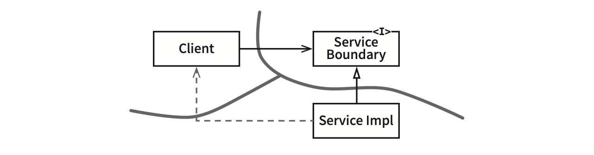

# Chapter 24: Partial Boundaries (부분적 경계)

## 핵심 질문

아키텍처 경계를 완벽하게 만드는 데 비용이 너무 클 때, 그러나 나중에 경계가 필요할 수도 있다고 판단될 때, 어떤 대안적 전략을 사용할 수 있는가?

---

## 1. 완벽한 경계의 비용

아키텍처 경계를 완벽하게 만드는 데는 비용이 많이 든다. 완벽한 경계를 만들기 위해서는:

- 쌍방향(*쌍방향 — 다형적 인터페이스를 완벽하게 만들려면 그림 22.2에서 보듯이 InputBoundary와 OutputBoundary 같은 쌍방향 인터페이스가 필요하다.*)의 다형적 Boundary 인터페이스를 만들어야 한다
- Input과 Output을 위한 데이터 구조를 만들어야 한다
- 두 영역을 독립적으로 컴파일하고 배포할 수 있는 컴포넌트로 격리하는 데 필요한 모든 의존성을 관리해야 한다
- 이렇게 만들려면 엄청난 노력을 기울여야 하고, 유지하는 데도 또 엄청난 노력이 든다

뛰어난 아키텍트라면 이러한 경계를 만드는 비용이 너무 크다고 판단하면서도, 한편으로는 나중에 필요할 수도 있으므로 이러한 경계에 필요한 공간을 확보하기 원할 수도 있다.

애자일 커뮤니티에서는 이러한 종류의 선행적인 설계를 탐탁치 않게 여기는 경우가 많은데, **YAGNI(You Aren't Going to Need It)**(*YAGNI — "너는 그게 필요하지 않아"라는 뜻으로, 풀어 쓰면 "필요한 작업만 해라"라는 뜻이다. 익스트림 프로그래밍(XP) 원칙 중 하나다.*) 원칙을 위배하기 때문이다. 하지만 아키텍트라면 "그래, 하지만 어쩌면 필요할지도."라는 생각이 들 수도 있다. 만약 그렇다면 **부분적 경계(partial boundary)**를 구현해볼 수 있다.

---

## 2. 전략 1: 마지막 단계를 건너뛰기

### 2.1 개념

부분적 경계를 생성하는 첫 번째 방법은 **독립적으로 컴파일하고 배포할 수 있는 컴포넌트를 만들기 위한 작업은 모두 수행한 후, 단일 컴포넌트에 그대로 모아만 두는 것**이다.

- 쌍방향 인터페이스도 그 컴포넌트에 있다
- 입력/출력 데이터 구조도 거기에 있다
- 모든 것이 완전히 준비되어 있다
- **하지만 이 모두를 단일 컴포넌트로 컴파일해서 배포한다**

이 접근법은 완벽한 경계를 만들 때 만큼의 **코드량과 사전 설계**가 필요하다. 하지만 다수의 컴포넌트를 관리하는 작업은 하지 않아도 된다.

| 완벽한 경계 | 마지막 단계를 건너뛴 경계 |
|-----------|----------------------|
| 독립 컴파일/배포 가능한 다수의 컴포넌트 | 단일 컴포넌트에 모두 포함 |
| 추적을 위한 버전 번호 필요 | 버전 번호 불필요 |
| 배포 관리 부담 있음 | 배포 관리 부담 없음 |
| 코드량과 설계 비용 높음 | 코드량과 설계 비용 **동일** |

### 2.2 FitNesse 사례

이 전략은 FitNesse를 뒷받침했던 초기 전략이었다. FitNesse의 웹 서버 컴포넌트는 위키나 테스트 영역과는 분리되도록 설계되었다. 새로운 웹 기반 애플리케이션을 만들 때 해당 웹 컴포넌트를 재사용할 수도 있다고 생각했기 때문이었다.

컴포넌트를 두 개로 분리했지만, 사용자가 두 번 다운로드하도록 만들고 싶지는 않았다. 설계 목표 중 하나가 "다운로드 후 바로 실행"이었기 때문에, 하나의 jar 파일을 다운로드하면 또 다른 jar 파일을 찾아다니거나 버전 호환성을 해결하는 등의 작업을 하지 않고도 실행할 수 있게 만들고자 했다.

### 2.3 이 접근법의 위험

FitNesse 이야기는 마지막 단계를 건너뛰는 접근법이 지닌 **위험** 역시 지적한다:

- 시간이 흐르면서, 별도로 분리한 웹 컴포넌트가 **재사용될 가능성은 전혀 없을 것**임이 명백해졌다
- 웹 컴포넌트와 위키 컴포넌트 사이의 **구분도 약화**되기 시작했다
- **의존성은 잘못된 방향으로** 선을 넘기 시작했다
- 이 둘을 다시 분리하는 작업은 **따분한 일**이 될 것이다

> **핵심 통찰**: 단일 컴포넌트에 모아 두면 배포 관리 부담은 줄지만, 시간이 흐르면서 경계가 약화되고 의존성이 잘못된 방향으로 흐를 위험이 크다.

---

## 3. 전략 2: 일차원 경계

### 3.1 개념

완벽한 형태의 아키텍처 경계는 양방향으로 격리된 상태를 유지해야 하므로 쌍방향 Boundary 인터페이스를 사용한다. 양방향으로 격리된 상태를 유지하려면 초기 설정할 때나 지속적으로 유지할 때도 비용이 많이 든다.

추후 완벽한 형태의 경계로 확장할 수 있는 공간을 확보하고자 할 때 활용할 수 있는 더 간단한 구조가 있다. 이는 전통적인 **전략(Strategy) 패턴**을 사용한 전형적인 사례다.



```
[Client] ──→ [<<I>> ServiceBoundary] ←── [ServiceImpl]
                                              ⇡
                                        (점선: 비밀 통로 위험)
```

ServiceBoundary 인터페이스는 클라이언트가 사용하며 ServiceImpl 클래스가 구현한다.

### 3.2 장점과 위험

**장점**: Client를 ServiceImpl로부터 격리시키는 데 필요한 **의존성 역전이 이미 적용**되었기 때문에, 미래에 필요할 아키텍처 경계를 위한 무대를 마련한다.

**위험**: 쌍방향 인터페이스가 없고 개발자와 아키텍트가 근면 성실하고 제대로 훈련되어 있지 않다면, 다이어그램의 **점선 화살표와 같은 비밀 통로**가 생기는 일을 막을 방법이 없다. ServiceImpl에서 Client로의 직접적인 의존성이 만들어질 수 있다.

---

## 4. 전략 3: 퍼사드

### 4.1 개념

이보다 훨씬 더 단순한 경계는 **퍼사드(Facade) 패턴**이다. 이 경우에는 심지어 **의존성 역전까지도 희생**한다.


```
[Client] ──→ [Facade] ──→ [Service]
                      ──→ [Service]
                      ──→ [Service]
```

- 경계는 Facade 클래스로만 간단히 정의된다
- Facade 클래스에는 모든 서비스 클래스를 메서드 형태로 정의하고, 서비스 호출이 발생하면 해당 서비스 클래스로 호출을 전달한다
- 클라이언트는 이들 서비스 클래스에 직접 접근할 수 없다

### 4.2 한계

- Client가 이 모든 서비스 클래스에 대해 **추이 종속성(transitive dependency)**을 가지게 된다
- 정적 언어였다면 서비스 클래스 중 하나에서 소스 코드가 변경되면 Client도 **무조건 재컴파일**해야 할 것이다
- **비밀 통로 또한 정말 쉽게** 만들 수 있다

---

## 5. 세 가지 전략 비교

| 전략 | 설계 비용 | 유지보수 비용 | 의존성 역전 | 경계 약화 위험 | 분리 수준 |
|------|---------|------------|----------|-------------|---------|
| **마지막 단계 건너뛰기** | 높음 (완벽한 경계 수준) | 낮음 (배포 관리 없음) | 적용됨 | 중간 | 코드 수준 분리 |
| **일차원 경계 (Strategy)** | 중간 | 중간 | 한 방향만 적용 | 높음 (비밀 통로) | 인터페이스 수준 분리 |
| **퍼사드** | 낮음 | 낮음 | 미적용 (희생됨) | 매우 높음 | 클래스 수준 분리 |

---

## 6. 결론

아키텍처 경계를 부분적으로 구현하는 간단한 방법 세 가지를 살펴봤다. 물론 이 외에도 방법은 많다. 세 전략은 순전히 예로써 제시했다.

이러한 접근법 각각은 나름의 비용과 장점을 지닌다. 각 접근법은 완벽한 형태의 경계를 담기 위한 공간으로써, 적절하게 사용할 수 있는 상황이 서로 다르다. 또한 각 접근법은 해당 경계가 실제로 구체화되지 않으면 가치가 떨어질 수 있다.

> **핵심 통찰**: 아키텍처 경계가 언제, 어디에 존재해야 할지, 그리고 그 경계를 **완벽하게** 구현할지 아니면 **부분적으로** 구현할지를 결정하는 일 또한 아키텍트의 역할이다.

---

## 요약

- **완벽한 아키텍처 경계는 비용이 많이 든다.** 쌍방향 인터페이스, 데이터 구조, 독립적 컴파일/배포를 위한 의존성 관리가 필요하다.
- **마지막 단계를 건너뛰기**: 경계를 위한 모든 코드를 작성하되 단일 컴포넌트에 모아 두는 전략이다. 배포 관리 부담은 줄지만 시간이 지나면 경계가 약화될 수 있다.
- **일차원 경계 (Strategy 패턴)**: 한 방향의 의존성 역전만 적용하는 전략이다. 미래의 경계를 위한 무대를 마련하지만, 비밀 통로가 생기기 쉽다.
- **퍼사드 패턴**: 가장 단순한 경계로, 의존성 역전까지 희생한다. 추이 종속성이 생기고 비밀 통로도 쉽게 만들 수 있다.
- **각 전략은 나름의 비용과 장점을 가진다.** 경계를 완벽하게 구현할지, 부분적으로 구현할지를 결정하는 것은 아키텍트의 역할이다.

---

## 다른 챕터와의 관계

- **Chapter 22 (클린 아키텍처)**: 이 챕터에서 보여주는 완벽한 형태의 아키텍처 경계(쌍방향 Boundary 인터페이스, InputBoundary/OutputBoundary 등)가 비용이 너무 클 때의 대안을 이 챕터에서 다룬다.
- **Chapter 11 (DIP: 의존성 역전 원칙)**: Strategy 패턴을 사용한 일차원 경계는 의존성 역전 원칙의 단순화된 적용이며, 퍼사드 패턴은 의존성 역전까지 희생하는 극단적 단순화다.
- **Chapter 14 (컴포넌트 결합)**: "마지막 단계를 건너뛰기" 전략은 컴포넌트 분리의 이점(독립 배포, 독립 개발)을 포기하는 대신 관리 비용을 줄이는 트레이드오프다.
- **Chapter 25 (계층과 경계)**: 이 챕터에서 제시한 부분적 경계 전략이 실제로 필요한 상황, 즉 시스템의 복잡도가 증가하면서 새로운 경계가 필요해지는 과정을 구체적인 예제로 보여준다.
- **Chapter 16 (독립성)**: 아키텍처의 독립성(프레임워크, UI, DB로부터의 독립)을 달성하기 위한 경계의 필요성을 설명하며, 이 챕터는 그 경계를 비용 대비 어느 수준까지 구현할 것인지의 판단 기준을 제공한다.
