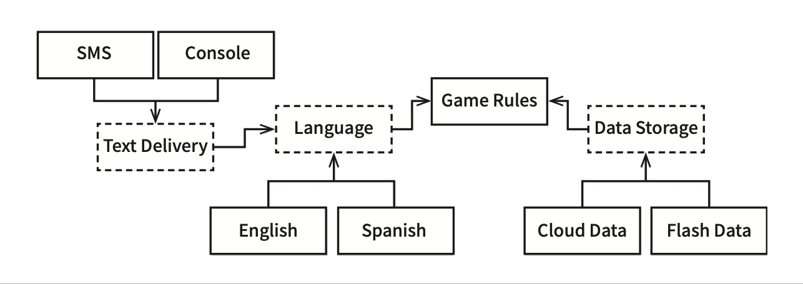
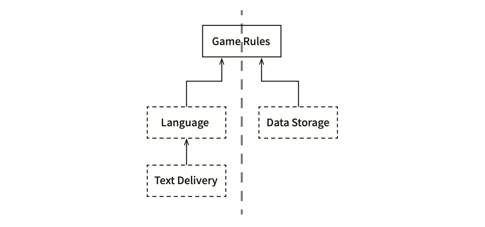
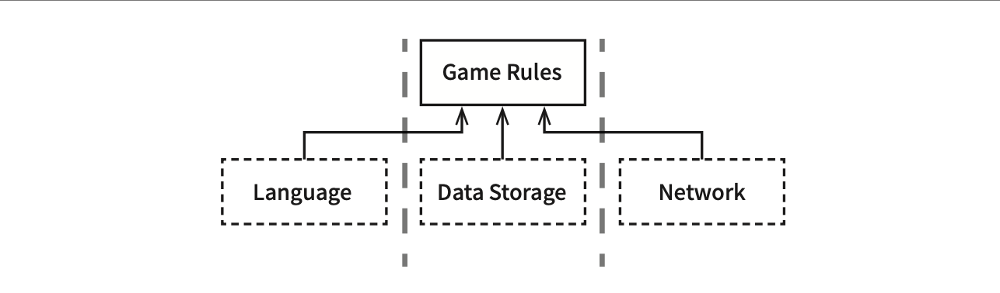
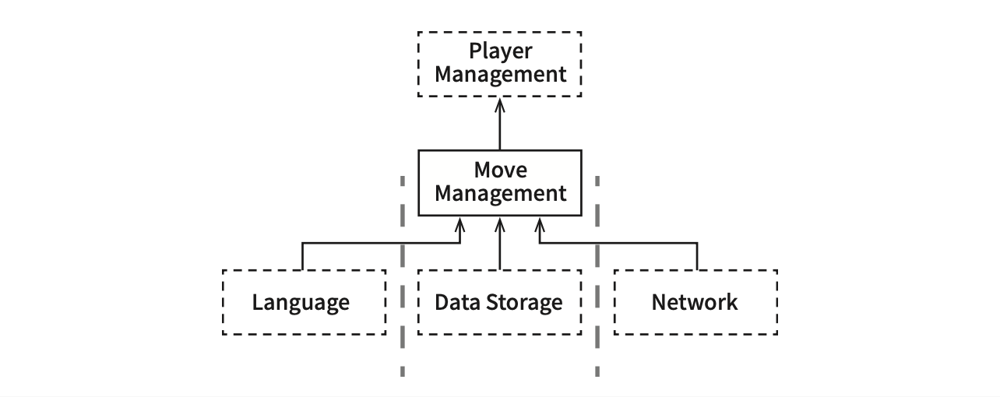
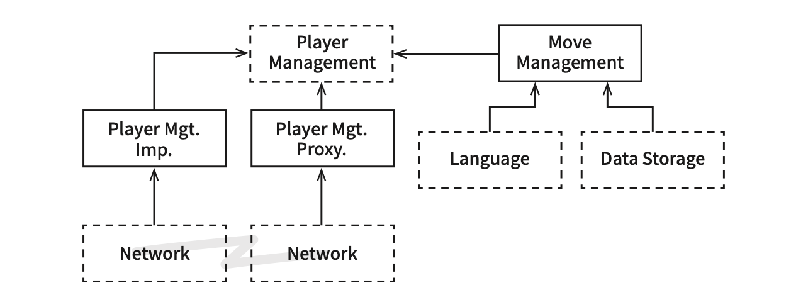

# Chapter 25: Layers and Boundaries (계층과 경계)

## 핵심 질문

시스템이 정말로 UI, 업무 규칙, 데이터베이스라는 세 가지 컴포넌트로만 구성되는가? 아키텍처 경계는 어디에 존재하며, 그 경계를 구현할지 말지를 어떻게 결정해야 하는가?

---

## 1. 세 가지 컴포넌트의 함정

시스템이 세 가지 컴포넌트(UI, 업무 규칙, 데이터베이스)로만 구성된다고 생각하기 쉽다. 몇몇 단순한 시스템에서는 이 정도로 충분하다. **하지만 대다수의 시스템에서 컴포넌트의 개수는 이보다 훨씬 많다.**

이 챕터에서는 간단한 컴퓨터 게임을 예제로 삼아, 표면적으로는 단순해 보이는 시스템에도 얼마나 많은 아키텍처 경계가 잠재해 있는지를 보여준다.

---

## 2. 움퍼스 사냥 게임(*분명히 해 두고 싶은 점은 이 게임처럼 단순한 시스템에는 클린 아키텍처 접근법을 적용하지 않는다는 사실이다. 이 프로그램 전체라 해도 200줄 안팎의 코드면 충분히 만들 수 있다. 여기에서 이 간단한 프로그램을 사용한 이유는 주요 아키텍처 경계를 포함하는 훨씬 큰 규모의 시스템을 대신하기 위해서다.*)

### 2.1 게임 소개

움퍼스 사냥(Hunt the Wumpus)은 1972년에 발매된 인기있는 텍스트 기반 모험 게임이다. `GO EAST`와 `SHOOT WEST` 같은 매우 단순한 명령어를 사용한다. 플레이어는 명령어를 입력하며, 컴퓨터는 플레이어가 보고, 냄새 맡고, 듣고, 경험할 것들로 응답한다. 플레이어는 동굴로 된 시스템 안에서 움퍼스를 사냥하며, 함정이나 구덩이 그리고 숨어서 기다리는 나머지 위험들을 피해야만 한다.

### 2.2 기본 구성: UI와 게임 규칙의 분리

텍스트 기반 UI는 그대로 유지하되, 게임 규칙과 UI를 분리해서 여러 시장에서 **다양한 언어로 발매**할 수 있게 만든다고 가정해 보자.

- 게임 규칙은 **언어 독립적인 API**를 사용해서 UI 컴포넌트와 통신한다
- UI는 API를 **사람이 이해할 수 있는 언어**로 변환한다


소스 코드 의존성을 적절히 관리하면, UI 컴포넌트가 어떤 언어를 사용하더라도 게임 규칙을 재사용할 수 있다. 게임 규칙은 어떤 종류의 인간 언어가 사용되는지 알지도 못할 뿐만 아니라 신경 쓸 이유도 없다.

---

## 3. 데이터 저장소의 분리

게임의 상태를 영속적인 저장소에 유지한다고 가정해 보자. 그게 플래시 메모리나 클라우드, 혹은 단순히 RAM일 수도 있다. 어떤 경우라도 게임 규칙이 이러한 세부사항을 알지 않기를 바란다.

따라서 API를 생성하여, 게임 규칙이 데이터 저장소 컴포넌트와 통신할 때 사용하도록 만든다. 의존성 규칙을 준수할 수 있도록 **의존성이 적절한 방향을 가리키게** 만들어야 한다.


```
[English UI] ──→              ←── [Flash Data]
                [Game Rules]
[Spanish UI] ──→              ←── [Cloud Data]
```

UI 컴포넌트와 데이터 저장소 컴포넌트 모두 Game Rules를 향해 의존한다.

---

## 4. 변경의 축과 잠재적 경계

### 4.1 UI의 또 다른 변경 축

클린 아키텍처 접근법을 적용해서 유스케이스, 경계, 엔티티, 그리고 관련된 데이터 구조를 모두 만드는 일도 쉬운 일이다. 그런데 **중요한 아키텍처 경계를 정말로 모두 발견한 것일까?**

UI에서 언어가 유일한 변경의 축은 아니다. 이 밖에도 텍스트를 주고받는 **메커니즘**을 다양하게 만들고 싶을 수도 있다:

- 일반적인 셸(shell) 창
- 텍스트 메시지
- 채팅 애플리케이션

따라서 이 **변경의 축에 의해 정의되는 아키텍처 경계**가 잠재되어 있을 수도 있다. 해당 경계를 가로지르는, 언어를 통신 메커니즘으로부터 격리하는 API를 생성해야 할 수도 있다.

### 4.2 개선된 구조



이 다이어그램에서 점선으로 된 테두리는 **API를 정의하는 추상 컴포넌트**를 가리키며, 해당 API는 추상 컴포넌트 위나 아래의 컴포넌트가 구현한다.

| 추상 컴포넌트 | 정의하는 API | 구현하는 컴포넌트 |
|-------------|-----------|---------------|
| **Language** | 언어 변환 API | English, Spanish |
| **Text Delivery** | 텍스트 전달 API | SMS, Console |
| **Data Storage** | 데이터 저장 API | Cloud Data, Flash Data |

**API의 소속 규칙**: API는 구현하는 쪽이 아닌 **사용하는 쪽에 정의되고 소속**된다.

구체적으로 살펴보면:

- **GameRules → Language**: GameRules가 정의하고 Language가 구현하는 API를 이용해 통신
- **Language → TextDelivery**: Language가 정의하고 TextDelivery가 구현하는 API를 이용해 통신

GameRules를 들여다 보면:
- GameRules 내부 코드에서 사용하고 **Language 내부 코드에서 구현**하는 다형적 Boundary 인터페이스
- Language에서 사용하고 **GameRules 내부 코드에서 구현**하는 다형적 Boundary 인터페이스

이 모든 경우에 해당 Boundary 인터페이스가 정의하는 API는 **의존성 흐름의 상위에 위치한 컴포넌트에 속한다.**

---

## 5. 단순화된 다이어그램

변형들(English, SMS, CloudData 등)을 모두 제거하고 순전히 API 컴포넌트만 집중하면 다이어그램을 단순화할 수 있다.



```
         [Game Rules]
          ↑        ↑
    [Language]    [Data Storage]
        ↑
  [Text Delivery]
```

모든 화살표가 **위를 향하도록** 맞춰졌다는 점에 주목하자. GameRules는 최상위에 놓인다. GameRules는 최상위 수준의 정책을 가지는 컴포넌트이므로 이치에 맞는 배치이다.

### 5.1 데이터 흐름

정보가 흐르는 방향을 생각해 보자:

1. 모든 입력은 사용자로부터 전달받아 좌측 하단의 **TextDelivery** 컴포넌트로 전달된다
2. 이 정보는 **Language** 컴포넌트를 거쳐서 위로 올라가며, GameRules에 적합한 명령어로 번역된다
3. **GameRules**는 사용자 입력을 처리하고, 우측 하단의 **DataStorage**로 적절한 데이터를 내려 보낸다
4. 그런 후 GameRules는 **Language**로 출력을 되돌려 보내고, Language는 API를 다시 적절한 언어로 번역한 후 번역된 언어를 **TextDelivery**를 통해 사용자에게 전달한다

이 구성은 데이터 흐름을 **두 개의 흐름**으로 효과적으로 분리한다:

| 흐름 | 관여하는 대상 | 방향 |
|------|-----------|------|
| **왼쪽 흐름** | 사용자와의 통신 | TextDelivery ↔ Language ↔ GameRules |
| **오른쪽 흐름** | 데이터 영속성 | GameRules ↔ DataStorage |

두 흐름은 상단(*오래전에 우리는 상단에 위치한 이 컴포넌트를 중앙 변환(Central Transform)이라고 부르곤 했다.*)의 **GameRules에서 서로 만나며**, GameRules는 두 흐름이 모두 거치게 되는 데이터에 대한 최종적인 처리기가 된다.

---

## 6. 흐름 횡단하기

데이터 흐름은 항상 두 가지일까? **절대로 아니다.**

움퍼스 사냥 게임을 네트워크상에서 여러 사람이 함께 플레이할 수 있게 만든다고 해보자. 이 경우 **네트워크(Network) 컴포넌트**를 추가해야 한다.



```
          [Game Rules]
         ↑    ↑     ↑
  [Language] [Data] [Network]
              Storage
```

이 구성은 데이터 흐름을 **세 개의 흐름**으로 분리하며, 이들 흐름은 모두 GameRules가 제어한다. 따라서 **시스템이 복잡해질수록 컴포넌트 구조는 더 많은 흐름으로 분리**될 것이다.

---

## 7. 흐름 분리하기

모든 흐름이 결국에는 상단의 단일 컴포넌트에서 서로 만난다고 생각할 수도 있다. 하지만 **현실은 훨씬 복잡하다.**

### 7.1 게임 규칙의 분리

움퍼스 사냥 게임의 GameRules 컴포넌트를 생각해 보자. 게임 규칙 중 일부는 **지도와 관련된 메커니즘**을 처리한다:

- 동굴이 서로 어떻게 연결될지
- 각 동굴에 어떤 물체가 위치할지
- 플레이어가 동굴에서 동굴로 이동하는 방법
- 플레이어가 반드시 처리해야 하는 사건을 결정하는 방법

하지만 이보다 **더 높은 수준**에는 또 다른 정책 집합이 존재한다:

- 플레이어의 생명력
- 특정 사건을 해결하는 비용과 얻게 될 소득
- 플레이어의 생명력이 지속적으로 줄어들게 하거나, 식량을 발견하면 생명력이 늘어나도록 하는 규칙

| 정책 수준 | 컴포넌트 | 담당 | 사건 예시 |
|---------|---------|------|---------|
| **저수준** (메커니즘) | MoveManagement | 지도, 이동, 사건 발생 | FoundFood, FellInPit |
| **고수준** (정책) | PlayerManagement | 플레이어 상태, 승리 판정 | 생명력 증감, 게임 종료 |

저수준 메커니즘과 관련된 정책에서는 고수준 정책에게 `FoundFood`(식량 발견)나 `FellInPit`(구덩이에 빠짐)과 같은 사건이 발생했음을 알린다. 그러면 고수준 정책에서는 플레이어의 상태를 관리한다. 게임이 끝났을 때 플레이어의 승리 여부도 해당 정책에서 결정한다.



```
      [Player Management]
              ↑
      [Move Management]
       ↑      ↑      ↑
[Language] [Data  ] [Network]
           Storage
```

### 7.2 마이크로서비스까지 확장

이것이 아키텍처 경계일까? MoveManagement와 PlayerManagement를 분리하는 API가 필요할까?

대규모의 플레이어가 동시에 플레이할 수 있는 버전의 움퍼스 사냥 게임이 있다고 가정해 보자:

- **MoveManagement**는 플레이어의 컴퓨터에서 직접 처리된다
- **PlayerManagement**는 서버에서 처리된다
- PlayerManagement는 접속된 모든 MoveManagement 컴포넌트에 마이크로서비스 API를 제공한다



```
[Player Management] ←── [Move Management]
    ↑         ↑                ↑       ↑
[Player   [Player         [Language] [Data
 Mgt.      Mgt.                       Storage]
 Imp.]     Proxy.]
    ↑         ↑
[Network] [Network]
```

MoveManagement와 PlayerManagement 사이에는 **완벽한 형태의 아키텍처 경계**가 존재한다. PlayerManagement의 실제 구현체(Player Mgt. Imp.)는 서버 측 Network를 통해 접근되고, 클라이언트 측에서는 Player Mgt. Proxy가 이 경계를 넘어 서버와 통신한다.

---

## 8. 결론: 아키텍트의 딜레마

이 모든 것이 의미하는 바는 무엇일까? 콘 셸(Korn shell)에서 단 200줄이면 구현할 수 있는 터무니없이 간단한 프로그램을 가져와서, 이처럼 정신없는 아키텍처 경계를 모두 추론해 내는 이유는 무엇일까?

이 예제를 가져온 이유는 **아키텍처 경계가 어디에나 존재한다**는 사실을 보여주기 위함이다.

아키텍트로서 우리가 직면하는 딜레마:

| 한쪽 | 다른 한쪽 |
|------|---------|
| 경계를 제대로 구현하려면 **비용이 많이 든다** | 경계를 무시하면 **나중에 추가하는 비용이 크다** |
| **오버 엔지니어링**은 **언더 엔지니어링**보다 나쁠 때가 훨씬 많다 | 경계가 없는 상황에서 경계가 정말 필요하면 **큰 위험**을 감수해야 한다 |
| YAGNI: 추상화가 필요하리라고 **미리 예측하지 마라** | 하지만 나중에 경계를 추가하려면 **포괄적인 테스트 스위트**가 있더라도 어렵다 |

> **핵심 통찰**: 오! 소프트웨어 아키텍트여, 당신은 **미래를 내다봐야만** 한다. 당신은 **현명하게 추측**해야만 한다. 비용을 산정하고, 어디에 아키텍처 경계를 둬야 할지, 그리고 완벽하게 구현할 경계는 무엇인지와 부분적으로 구현할 경계와 무시할 경계는 무엇인지를 결정해야만 한다.

### 8.1 지속적인 관찰

하지만 이는 **일회성 결정은 아니다.** 프로젝트 초반에는 구현할 경계가 무엇인지와 무시할 경계가 무엇인지를 쉽게 결정할 수 없다. 대신 **지켜봐야** 한다.

1. 시스템이 발전함에 따라 **주의를 기울여야** 한다
2. 경계가 필요할 수도 있는 부분에 **주목**한다
3. 경계가 존재하지 않아 생기는 마찰의 **어렴풋한 첫 조짐을 신중하게 관찰**해야 한다
4. 첫 조짐이 보이는 시점이 되면, 해당 경계를 **구현하는 비용**과 **무시할 때 감수할 비용**을 가늠해 본다
5. 결정된 사항을 **자주 검토**한다

우리의 목표는 **경계의 구현 비용이 그걸 무시해서 생기는 비용보다 적어지는 바로 그 변곡점에서 경계를 구현하는 것**이다.

목표를 달성하려면 **빈틈없이 지켜봐야** 한다.

---

## 요약

- **시스템은 세 가지 컴포넌트로만 이루어지지 않는다.** 대다수의 시스템에서 컴포넌트의 개수는 UI, 업무 규칙, 데이터베이스보다 훨씬 많다.
- **아키텍처 경계는 어디에나 존재한다.** 단순한 게임에서도 언어, 전달 메커니즘, 데이터 저장소, 네트워크, 정책 수준 등 다양한 경계를 발견할 수 있다.
- **데이터 흐름은 여러 갈래로 분리된다.** 시스템이 복잡해질수록 더 많은 흐름으로 분리되며, 이들은 최상위 정책 컴포넌트에서 만난다.
- **고수준 정책 내부에서도 경계가 존재할 수 있다.** GameRules 안에서도 MoveManagement와 PlayerManagement라는 다른 수준의 정책이 분리될 수 있다.
- **경계를 만드는 비용과 무시하는 비용 사이의 균형이 핵심이다.** 오버 엔지니어링이 언더 엔지니어링보다 나쁠 때가 많지만, 나중에 경계를 추가하는 것도 매우 어렵다.
- **경계에 대한 결정은 일회성이 아니다.** 시스템이 발전함에 따라 지속적으로 관찰하고, 마찰의 첫 조짐이 보이면 비용을 가늠하여 변곡점에서 경계를 구현해야 한다.

---

## 다른 챕터와의 관계

- **Chapter 22 (클린 아키텍처)**: 이 챕터에서 제시한 동심원 모델의 "경계"가 실제 시스템에서 어디에 존재해야 하는지를 구체적인 예제로 탐구한다. 단순한 시스템에서도 예상보다 많은 경계가 잠재해 있음을 보여준다.
- **Chapter 24 (부분적 경계)**: 이 챕터에서 경계를 발견했을 때, 그 경계를 완벽하게 구현하지 않고 부분적으로 구현하는 전략을 Chapter 24에서 다룬다. 두 챕터는 "경계를 어디에 둘 것인가"와 "어느 수준까지 구현할 것인가"라는 보완적 질문에 답한다.
- **Chapter 16 (독립성)**: 컴포넌트의 독립성이 왜 중요한지를 다루며, 이 챕터에서 분리하는 다양한 흐름(Language, DataStorage, Network)은 Chapter 16에서 주장하는 독립성의 구체적 적용이다.
- **Chapter 19 (정책과 수준)**: MoveManagement(저수준 메커니즘)와 PlayerManagement(고수준 정책)의 분리는 Chapter 19에서 다루는 정책과 수준 개념의 직접적인 적용 사례다.
- **Chapter 26 (메인 컴포넌트)**: 이 챕터에서 분리한 다양한 컴포넌트들을 실제로 조합하고 초기화하는 책임을 메인(Main) 컴포넌트가 담당한다. 경계가 많아질수록 메인 컴포넌트의 역할이 중요해진다.
