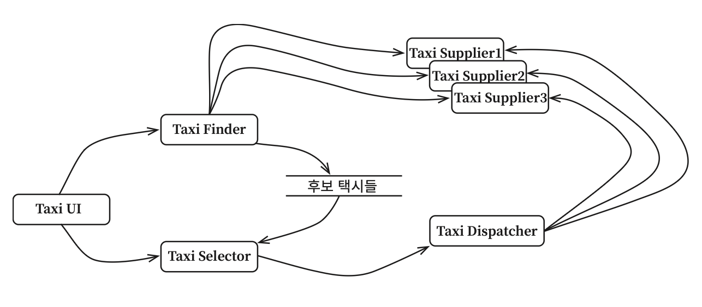
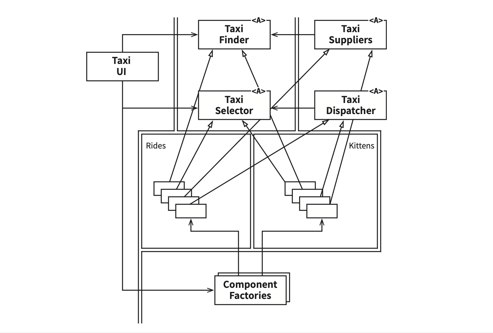
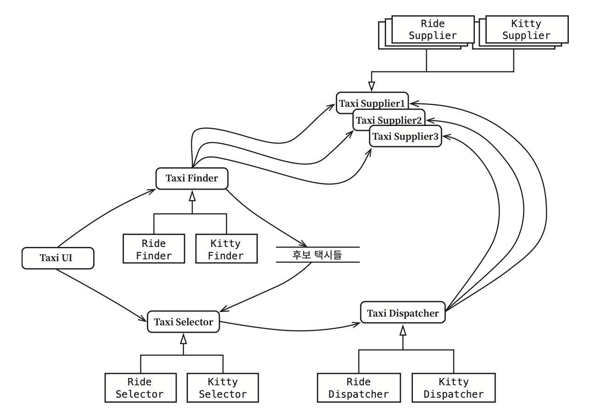
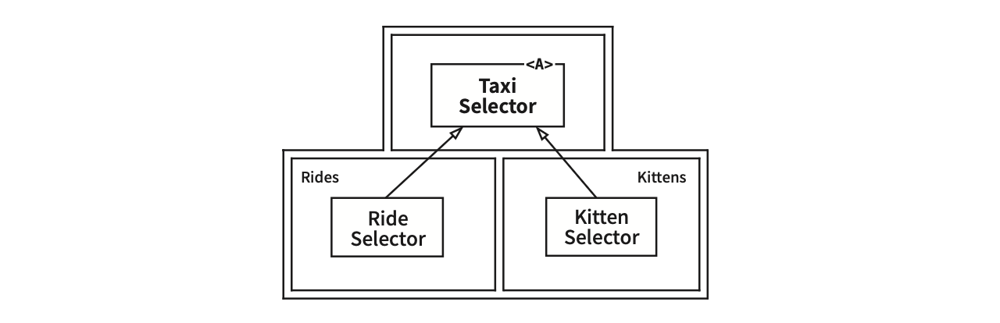

# Chapter 27: Services: Great and Small ('크고 작은 모든' 서비스들)

## 핵심 질문

서비스 지향 아키텍처(SOA)와 마이크로서비스 아키텍처는 그 자체로 "아키텍처"인가? 서비스를 사용하면 정말로 결합이 분리되고 개발/배포 독립성이 보장되는가? 횡단 관심사(cross-cutting concern) 앞에서 서비스는 어떻게 무력해지며, 이를 어떻게 극복할 수 있는가?

---

## 1. 서비스 아키텍처?

서비스 지향 '아키텍처'와 마이크로서비스 '아키텍처'는 큰 인기를 끌고 있다. 그 이유는 두 가지다:

- 서비스를 사용하면 **상호 결합이 철저하게 분리**되는 것처럼 보인다
- 서비스를 사용하면 **개발과 배포 독립성**을 지원하는 것처럼 보인다

하지만 이 두 가지 모두 **일부만 맞는 말**이다.

서비스를 사용한다는 것이 본질적으로 아키텍처에 해당하는가? 이 개념은 **명백히 사실이 아니다**. 시스템의 아키텍처는 **의존성 규칙을 준수하며 고수준의 정책을 저수준의 세부사항으로부터 분리하는 경계**에 의해 정의된다. 단순히 애플리케이션의 행위를 분리할 뿐인 서비스라면 **값비싼 함수 호출**에 불과하며, 아키텍처 관점에서 꼭 중요하다고 볼 수는 없다.

모노리틱 시스템이나 컴포넌트 기반 시스템에서 아키텍처를 정의하는 요소는 **의존성 규칙을 따르며 아키텍처 경계를 넘나드는 함수 호출들**이다. 시스템의 나머지 많은 함수들은 행위를 서로 분리할 뿐이며, 아키텍처적으로는 전혀 중요하지 않다.

> **핵심 통찰**: 서비스도 마찬가지다. 결국 서비스는 프로세스나 플랫폼 경계를 가로지르는 함수 호출에 지나지 않는다. 아키텍처적으로 중요한 서비스도 있지만, 중요하지 않은 서비스도 존재한다.

---

## 2. 서비스의 이점?

현재 인기를 끄는 서비스 아키텍처라는 통설에 대해 이의를 제기해 보자.

### 2.1 결합 분리의 오류

시스템을 서비스들로 분리하면 서비스 사이의 결합이 확실히 분리된다고 예상한다. 각 서비스는 서로 다른 프로세스에서, 심지어는 서로 다른 프로세서에서 실행된다. 따라서 서비스는 다른 서비스의 변수에 직접 접근할 수 없으며, 모든 서비스의 인터페이스는 반드시 잘 정의되어 있어야 한다.

이 말에는 어느 정도 일리가 있지만, **꼭 그런 것만은 아니다**:

| 결합 유형 | 분리 여부 | 설명 |
|----------|----------|------|
| 개별 변수 수준 | 분리됨 | 다른 서비스의 변수에 직접 접근할 수 없다 |
| 공유 자원 | 결합 가능 | 프로세서 내의 또는 네트워크 상의 공유 자원 때문에 결합될 수 있다 |
| 공유 데이터 | **강하게 결합** | 서로 공유하는 데이터에 의해 강력하게 결합된다 |

예를 들어 서비스 사이를 오가는 데이터 레코드에 **새로운 필드를 추가**한다면, 이 필드를 사용해 동작하는 **모든 서비스는 반드시 변경**되어야 한다. 또한 이 서비스들은 이 필드에 담긴 데이터를 해석하는 방식을 사전에 완벽하게 조율해야 한다. 따라서 서비스들은 이 데이터 레코드에 강하게 결합되고, 서비스들 사이는 서로 **간접적으로 결합**되어 버린다.

인터페이스가 잘 정의되어 있어야 한다는 이점은 명백히 사실이다. 하지만 함수의 경우에도 전혀 다르지 않다. 서비스 인터페이스가 함수 인터페이스보다 더 엄밀하거나, 더 엄격하고, 더 잘 정의되는 것은 아니다.

### 2.2 개발 및 배포 독립성의 오류

서비스를 사용함에 따라서 예측되는 또 다른 이점은 전담팀이 서비스를 소유하고 운영한다는 점이다. 데브옵스(dev-ops) 전략의 일환으로 전담팀에서 각 서비스를 작성하고, 유지보수하며, 운영하는 책임을 진다. 이러한 개발 및 배포 독립성은 확장 가능한(scalable) 것으로 간주된다.

이 믿음에도 어느 정도 일리가 있지만, 극히 일부일 뿐이다:

1. **대규모 엔터프라이즈 시스템은 서비스 기반 시스템 이외에도, 모노리틱 시스템이나 컴포넌트 기반 시스템으로도 구축할 수 있다는 사실은 역사적으로 증명**되어 왔다. 서비스는 확장 가능한 시스템을 구축하는 유일한 선택지가 아니다.
2. '결합 분리의 오류'에 따르면 **서비스라고 해서 항상 독립적으로 개발하고, 배포하며, 운영할 수 있는 것은 아니다**. 데이터나 행위에서 어느 정도 결합되어 있다면 결합된 정도에 맞게 개발, 배포, 운영을 조정해야만 한다.

---

## 3. 야옹이 문제

### 3.1 택시 통합 시스템

9장에서 예를 들었던 택시 통합 시스템을 다시 살펴보자. 이 시스템은 해당 도시에서 운영되는 많은 택시 업체를 알고 있고, 고객은 승차 요청을 할 수 있다. 고객은 승차 시간, 비용, 고급 택시 여부, 운전사 경력 등 다양한 기준에 따라 택시를 선택할 수 있다.

확장 가능한 시스템을 구축하고 싶었기에, 수많은 작은 마이크로서비스를 기반으로 구축하기로 결정했다. 개발팀 직원을 많은 소규모 팀으로 세분화했고, 각 팀이 팀 규모에 맞게 적당한 수의 서비스를 개발하고, 유지보수하며, 운영하는 책임을 지도록 했다.(*따라서 마이크로서비스의 개수는 프로그래머의 수와 거의 같아진다.*)

그림 27.1의 다이어그램은 서비스 배치 구조를 보여준다:

- **TaxiUI**: 고객을 담당하며, 고객은 모바일 기기를 이용해서 택시를 호출한다
- **TaxiFinder**: 여러 TaxiSupplier의 현황을 검토하여 적합한 택시 후보들을 선별한다. 해당 사용자에 할당된 단기 데이터 레코드에 후보 택시들의 정보를 저장한다
- **TaxiSelector**: 사용자가 지정한 비용, 시간, 고급 여부 등의 조건을 기초로 후보 택시 중에서 적합한 택시를 선택한다
- **TaxiDispatcher**: 선택된 택시에 배차 지시를 한다

### 3.2 야옹이 배달 서비스의 등장

이 시스템을 일 년 이상 운영해 왔다고 가정하자. 화창하고 기분 좋은 어느 날, 마케팅 부서에서 도시에 **야옹이를 배달하는 서비스**를 제공하겠다는 계획을 발표한다. 사용자는 자신의 집이나 사무실로 야옹이를 배달해달라고 주문할 수 있다.

새로운 요구사항의 세부 내용:
- 도시 전역에 야옹이를 태울 다수의 승차 지점을 설정해야 한다
- 야옹이 배달 주문이 오면, 근처의 택시가 선택되고, 승차 지점에서 야옹이를 태운 후, 올바른 주소로 배달해야 한다
- 택시 업체 한 곳이 이 프로그램에 참여하기로 협의했다 (다른 업체는 뒤따르거나 거부할 수 있다)
- 어떤 운전자는 **고양이 알러지**가 있을 수 있으므로 제외되어야 한다
- 일반 택시 승객도 알러지를 일으킬 수 있으므로, 알러지가 있다고 밝힌 고객에게는 **지난 3일 사이에 야옹이를 배달했던 차량은 배차되지 않아야** 한다

### 3.3 결과: 모든 서비스를 변경해야 한다

서비스 다이어그램을 살펴보자. 이 기능을 구현하려면 이들 서비스 중 어디를 변경해야 할까? **전부다.** 의심의 여지없이 야옹이 배달 기능을 추가하려면 개발과 배포 전략을 매우 신중하게 조정해야 한다.

다시 말해 이 서비스들은 모두 결합되어 있어서 **독립적으로 개발하고, 배포하거나, 유지될 수 없다**.

이것이 바로 **횡단 관심사(cross-cutting concern)**가 지닌 문제다. 모든 소프트웨어 시스템은 서비스 지향이든 아니든 이 문제에 직면하게 마련이다. 그림 27.1의 서비스 다이어그램에서 묘사된 것과 같은 종류의 **기능적 분해(functional decomposition)**는 새로운 기능이 기능적 행위를 횡단하는 상황에 매우 취약하다.

---

## 4. 객체가 구출하다

컴포넌트 기반 아키텍처에서는 이 문제를 어떻게 해결했을까? SOLID 설계 원칙을 잘 들여다보면, **다형적으로 확장할 수 있는 클래스 집합**을 생성해 새로운 기능을 처리하도록 함을 알 수 있다.

그림 27.2의 다이어그램은 이 전략을 보여준다. 이 다이어그램의 클래스들은 그림 27.1에서 보여준 서비스들과 거의 일치한다. 하지만 **경계**를 주목하라. 또한 의존성들이 **의존성 규칙을 준수**한다는 점도 주목하라.

핵심적인 구조 변화:

- 원래 서비스의 로직 중 대다수가 객체 모델의 **기반 클래스들** 내부로 녹아들었다
- 배차에 특화된 로직 부분은 **Rides 컴포넌트**로 추출되었다
- 야옹이에 대한 신규 기능은 **Kittens 컴포넌트**에 들어갔다
- 이 두 컴포넌트는 기존 컴포넌트들에 있는 추상 기반 클래스를 **템플릿 메서드(Template Method)**나 **전략(Strategy)** 패턴 등을 이용해서 오버라이드한다
- 이 기능들을 구현하는 클래스들은 UI의 제어 하에 **팩토리(Factories)**가 생성한다

이 전략을 따르더라도 야옹이 기능을 구현하려면 **TaxiUI는 어쩔 수 없이 변경**해야만 한다. 하지만 그 외의 것들은 변경할 필요가 없다. 대신 야옹이 기능을 구현한 **새로운 jar 파일이나 젬(Gem), DLL을 시스템에 추가**하고, 런타임에 동적으로 로드하면 된다.

따라서 야옹이 기능은 **결합이 분리되며, 독립적으로 개발하여 배포**할 수 있다.

---

## 5. 컴포넌트 기반 서비스

"서비스에도 이렇게 할 수 있을까?" 물론 **할 수 있다**. 서비스가 반드시 소규모 단일체(monolith)여야 할 이유는 없다. 서비스는 SOLID 원칙대로 설계할 수 있으며 **컴포넌트 구조**를 갖출 수도 있다. 이를 통해 서비스 내의 기존 컴포넌트들을 변경하지 않고도 새로운 컴포넌트를 추가할 수 있다.

자바의 경우를 예로 들면:

1. 서비스를 **하나 이상의 jar 파일에 포함되는 추상 클래스들의 집합**이라고 생각한다
2. 새로운 기능 추가 혹은 기능 확장은 **새로운 jar 파일**로 만든다
3. 새로운 jar 파일을 구성하는 클래스들은 **기존 jar 파일에 정의된 추상 클래스들을 확장**해서 만들어진다
4. 새로운 기능 배포는 서비스를 재배포하는 문제가 아니라, 서비스를 로드하는 경로에 단순히 **새로운 jar 파일을 추가하는 문제**가 된다

다시 말해 새로운 기능을 추가하는 행위가 **개방 폐쇄 원칙(OCP)**을 준수하게 된다.

그림 27.3은 이 구조를 보여준다. 서비스들의 존재는 이전과 달라진 게 없지만, 각 서비스의 내부는 자신만의 컴포넌트 설계로 되어 있어서 **파생 클래스를 만드는 방식으로 신규 기능을 추가**할 수 있다.

---

## 6. 횡단 관심사

지금까지 배운 것은 **아키텍처 경계가 서비스 사이에 있지 않다**는 사실이다. 오히려 서비스를 **관통**하며, 서비스를 **컴포넌트 단위로 분할**한다.

모든 주요 시스템이 직면하는 횡단 관심사를 처리하려면, 서비스 내부는 **의존성 규칙도 준수하는 컴포넌트 아키텍처로 설계**해야 한다.

그림 27.4는 TaxiSelector 서비스 내부의 구조를 보여준다. 추상 인터페이스(`<A>`)가 있는 Taxi Selector 컴포넌트를 Rides 컴포넌트의 Ride Selector와 Kittens 컴포넌트의 Kitten Selector가 의존성 규칙을 따르며 오버라이드한다.

이 서비스들은 시스템의 아키텍처 경계를 정의하지 않는다. **아키텍처 경계를 정의하는 것은 서비스 내에 위치한 컴포넌트**다.

---

## 요약

- **서비스 자체로는 아키텍처를 정의하지 않는다.** 서비스는 프로세스나 플랫폼 경계를 가로지르는 함수 호출에 지나지 않으며, 아키텍처적으로 중요한 서비스도 있지만 그렇지 않은 서비스도 존재한다.
- **결합 분리는 환상이다.** 서비스 간에 공유하는 데이터 레코드가 변경되면 관련된 모든 서비스가 변경되어야 한다.
- **개발/배포 독립성도 보장되지 않는다.** 서비스 간 결합이 존재하면, 개발과 배포를 결합된 정도에 맞게 조정해야 한다.
- **횡단 관심사에 취약하다.** 기능적 분해 방식의 서비스 구조는 새로운 기능이 여러 서비스를 횡단하는 상황에 매우 취약하다 (야옹이 문제).
- **객체 지향과 SOLID가 해결책이다.** 다형적으로 확장 가능한 클래스 집합을 통해 기존 코드를 변경하지 않고 새로운 기능을 추가할 수 있다.
- **서비스 내부에도 컴포넌트 아키텍처를 적용하라.** 서비스가 단일체일 필요는 없으며, 내부에 의존성 규칙을 준수하는 컴포넌트 구조를 갖출 수 있다.
- **아키텍처 경계는 서비스 사이가 아니라 서비스를 관통한다.** 경계를 정의하는 것은 서비스가 아니라 서비스 내의 컴포넌트다.

---

## 다른 챕터와의 관계

- **Chapter 9 (LSP)**: 야옹이 문제의 택시 통합 시스템은 9장에서 처음 등장한 예제다. 리스코프 치환 원칙이 REST 서비스 인터페이스에도 적용됨을 보여준다.
- **Chapter 8 (OCP)**: 컴포넌트 기반 서비스의 핵심은 개방 폐쇄 원칙이다. 새로운 jar 파일을 추가하는 방식으로 기능을 확장하면, 기존 코드를 수정하지 않고도 행위를 변경할 수 있다.
- **Chapter 22 (클린 아키텍처)**: 서비스 내부의 컴포넌트 아키텍처는 클린 아키텍처의 의존성 규칙을 따라야 한다. 서비스는 단지 물리적 메커니즘일 뿐, 아키텍처를 결정하는 것은 경계와 의존성이다.
- **Chapter 16 (독립성)**: 서비스의 개발/배포 독립성이라는 약속이 실제로는 보장되지 않음을 이 장에서 입증한다. 16장에서 논의한 독립성의 조건이 여기서 서비스 맥락으로 재검증된다.
- **Chapter 26 (메인 컴포넌트)**: 각 서비스는 자체적인 메인 컴포넌트를 가질 수 있으며, 컴포넌트 기반 서비스에서 팩토리가 생성을 담당하는 구조는 26장의 메인-플러그인 패턴과 일맥상통한다.
