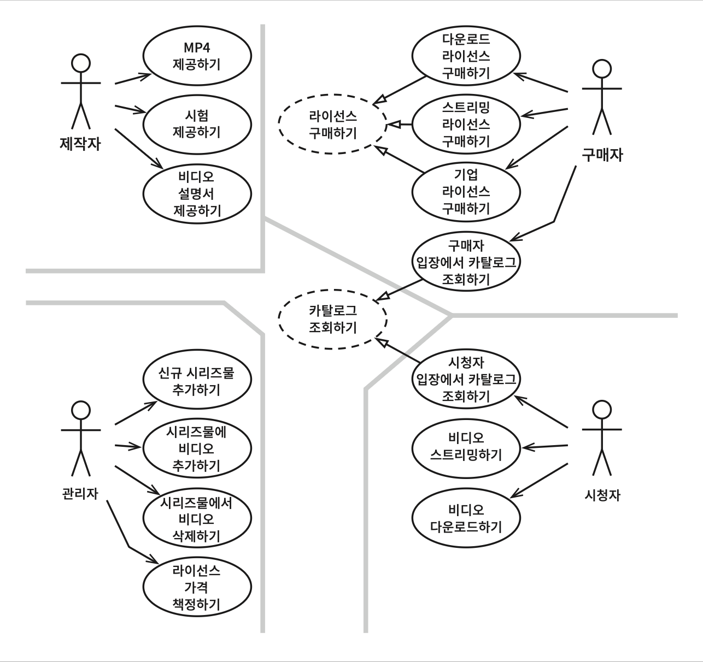
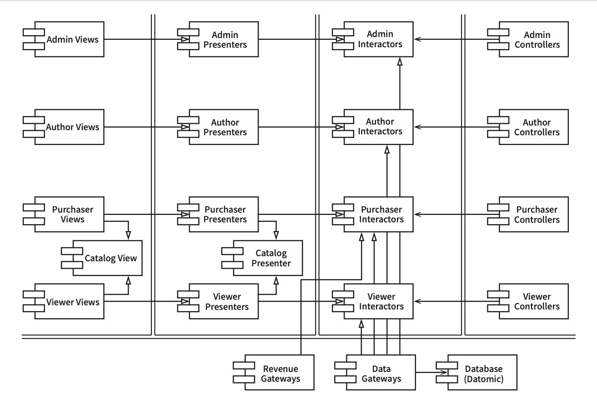

# Chapter 33: Case Study: Video Sales (사례 연구: 비디오 판매)

## 핵심 질문

지금까지 살펴본 아키텍처 규칙과 원칙을 실제 제품에 적용하면 어떤 모습이 되는가? 액터와 유스케이스를 식별하고, 컴포넌트 아키텍처를 구성하고, 의존성을 관리하는 과정은 어떻게 진행되는가?

---

## 1. 제품 개요

이번 사례 연구의 제품은 **웹 사이트에서 비디오를 판매하는 소프트웨어**다. 이 소프트웨어는 Uncle Bob이 소프트웨어 튜토리얼 비디오를 판매하는 cleancoders.com 사이트를 연상케 한다.

### 1.1 기본 발상

- 판매하길 원하는 비디오들이 있고, 그것을 **개인과 기업**에게 웹을 통해 판매한다
- **개인**: 단품 가격을 지불해 스트리밍으로 보거나, 더 높은 가격을 내고 다운로드해서 영구 소장할 수 있다
- **기업용 라이선스**: 스트리밍 전용이며, 대량 구매 시 할인을 받을 수 있다

### 1.2 네 가지 액터

| 액터 | 역할 |
|------|------|
| **시청자(Viewer)** | 비디오를 시청하는 사람 (개인의 경우 구매자인 동시에 시청자) |
| **구매자(Purchaser)** | 비디오를 구매하는 사람 (기업의 경우 다른 사람들이 시청할 비디오를 구매) |
| **제작자(Author)** | 비디오 파일, 설명서, 부속 파일(시험, 문제, 해법, 소스 코드 등)을 제공 |
| **관리자(Admin)** | 신규 비디오 시리즈물 추가/삭제, 가격 책정 |

시스템의 초기 아키텍처를 결정하는 첫 단계는 **액터와 유스케이스를 식별**하는 일이다.

---

## 2. 유스케이스 분석

그림 33.1은 전형적인 유스케이스 분석을 보여준다.



### 2.1 액터별 유스케이스

네 개의 주요 액터는 분명하다. **단일 책임 원칙**에 따르면 이들 네 액터가 시스템이 변경되어야 할 네 가지 주요 근원이 된다.

| 액터 | 유스케이스 |
|------|-----------|
| **제작자** | MP4 제공하기, 시험 제공하기, 비디오 설명서 제공하기 |
| **관리자** | 신규 시리즈물 추가하기, 시리즈물에 비디오 추가하기, 시리즈물에서 비디오 삭제하기, 라이선스 가격 책정하기 |
| **구매자** | 다운로드 라이선스 구매하기, 스트리밍 라이선스 구매하기, 기업 라이선스 구매하기, 구매자 입장에서 카탈로그 조회하기 |
| **시청자** | 시청자 입장에서 카탈로그 조회하기, 비디오 스트리밍하기, 비디오 다운로드하기 |

신규 기능을 추가하거나 기존 기능을 변경해야 한다면, 그 이유는 반드시 이들 액터 중 하나에게 해당 기능을 제공하기 위해서다. 따라서 우리는 시스템을 분할하여, **특정 액터를 위한 변경이 나머지 액터에게는 전혀 영향을 미치지 않게** 만들고자 한다.

### 2.2 추상 유스케이스

그림 33.1 중앙의 점선으로 된 유스케이스는 **추상 유스케이스**(*'추상' 유스케이스를 표기하는 Uncle Bob 나만의 방식이다. 더 표준화된 UML 스테레오타입을 사용할 수도 있다.*)다. 추상 유스케이스는 범용적인 정책을 담고 있으며, 다른 유스케이스에서 이를 더 구체화한다.

- "시청자 입장에서 카탈로그 조회하기"와 "구매자 입장에서 카탈로그 조회하기"는 모두 **"카탈로그 조회하기"**라는 추상 유스케이스를 상속받는다

이 추상화를 꼭 생성해야만 했던 건 아니다. 다이어그램에서 없애더라도 전체 제품의 기능을 조금도 손상시키지 않는다. 그러나 이들 두 유스케이스는 너무 비슷하기 때문에, 유사성을 식별해서 분석 초기에 통합하는 방법을 찾는 편이 더 현명하다.

---

## 3. 컴포넌트 아키텍처

액터와 유스케이스를 식별했으므로, 예비 단계의 컴포넌트 아키텍처를 만들어 볼 수 있다.



### 3.1 아키텍처 구조

그림에서 이중으로 된 선은 **아키텍처 경계**를 나타낸다. 뷰(View), 프레젠터(Presenter), 인터랙터(Interactor), 컨트롤러(Controller)로 분리된 전형적인 분할 방법을 확인할 수 있다.

```
[뷰]  <──  [프레젠터]  <──  [인터랙터]  <──  [컨트롤러]
                                  |
                            [게이트웨이]
                                  |
                           [데이터베이스]
```

또한 대응하는 액터에 따라 카테고리를 분리했다는 사실도 확인할 수 있다.

| 액터 | 뷰 | 프레젠터 | 인터랙터 | 컨트롤러 |
|------|-----|----------|----------|----------|
| 관리자 | Admin Views | Admin Presenters | Admin Interactors | Admin Controllers |
| 제작자 | Author Views | Author Presenters | Author Interactors | Author Controllers |
| 구매자 | Purchaser Views | Purchaser Presenters | Purchaser Interactors | Purchaser Controllers |
| 시청자 | Viewer Views | Viewer Presenters | Viewer Interactors | Viewer Controllers |

### 3.2 특수한 컴포넌트: Catalog View / Catalog Presenter

**Catalog View**와 **Catalog Presenter**는 "카탈로그 조회하기"라는 추상 유스케이스를 처리한다. 이 뷰와 프레젠터는 해당 컴포넌트 내부에 **추상 클래스**로 코드화될 것이며, 상속받는 컴포넌트(Purchaser, Viewer)에서는 이들 추상 클래스로부터 상속받은 뷰와 프레젠터 클래스들을 포함한다.

### 3.3 공통 인프라 컴포넌트

아키텍처의 하단에는 공통 인프라 컴포넌트가 위치한다.

- **Revenue Gateways**: 수익/결제 관련 게이트웨이
- **Data Gateways**: 데이터 접근 게이트웨이
- **Database (Datomic)**: 실제 데이터베이스

---

## 4. 배포 단위 결정

그림 33.2에서 각 컴포넌트는 단일 `.jar` 파일 또는 단일 `.dll` 파일에 해당한다. 정말로 시스템을 이러한 컴포넌트들로 모두 분할해서 여러 개의 `.jar`나 `.dll` 파일로 전달해야 할까?

**그럴 수도 있고 아닐 수도 있다.**

컴파일과 빌드 환경은 분명히 이 형태로 나누어야 하며, 따라서 각 컴포넌트를 독립적으로 전달할 수 있게 빌드하는 것도 가능하다. 동시에 전달해야 할 모든 단위를 **더 적은 개수로 합칠 수 있는 권한**도 가지고 있다.

### 4.1 배포 옵션들

| 옵션 | 배포 단위 수 | 구성 |
|------|-------------|------|
| 완전 분리 | 많음 | 그림 33.2의 각 컴포넌트가 독립 .jar |
| 역할별 통합 | 5개 | 뷰, 프레젠터, 인터랙터, 컨트롤러, 유틸리티 각각 하나의 .jar |
| 부분 통합 | 3개 | 뷰+프레젠터, 인터랙터, 컨트롤러+유틸리티 |
| 최소 분리 | 2개 | 뷰+프레젠터 / 나머지 모두 |

> **핵심 통찰**: 이처럼 선택지를 열어 두면, 후에 시스템이 변경되는 양상에 맞춰 시스템 배포 방식을 조정할 수 있다.

---

## 5. 의존성 관리

그림 33.2에서 제어흐름은 **오른쪽에서 왼쪽으로** 이동한다.

1. 입력이 **컨트롤러**에서 발생하면
2. **인터랙터**에 의해 처리되어 결과가 만들어진다
3. **프레젠터**가 결과의 포맷을 변경하고
4. **뷰**가 화면에 표시한다

### 5.1 의존성 방향 vs 제어흐름

모든 화살표가 오른쪽에서 왼쪽을 가리키지는 않는다. 사실 대다수의 화살표는 **왼쪽에서 오른쪽으로** 향한다. 이는 아키텍처가 **의존성 규칙을 준수**하기 때문이다. 모든 의존성은 경계선을 한 방향으로만 가로지르는데, 항상 **더 높은 수준의 정책을 포함하는 컴포넌트를 향한다.**

| 화살표 종류 | 방향 | 의미 |
|------------|------|------|
| 사용 관계 (열린 화살표) | 제어흐름과 같은 방향 | 한 컴포넌트가 다른 컴포넌트를 사용 |
| 상속 관계 (닫힌 화살표) | 제어흐름과 반대 방향 | 개방-폐쇄 원칙(OCP)의 적용 |

이를 통해 우리는 의존성이 올바른 방향으로 흐르며, 따라서 **저수준의 세부사항에서 발생한 변경이 상위로 파급되어서 상위 수준의 정책에 영향을 미치지 않음**을 보장할 수 있다.

---

## 6. 결론

그림 33.2의 아키텍처 다이어그램은 **두 가지 서로 다른 차원의 분리 개념**을 포함하고 있다.

| 분리 차원 | 기반 원칙 | 목적 |
|-----------|-----------|------|
| **액터 분리** | 단일 책임 원칙(SRP) | 서로 다른 이유로 변경되는 컴포넌트를 분리 |
| **정책 수준 분리** | 의존성 규칙 | 서로 다른 속도로 변경되는 컴포넌트를 분리 |

이 두 차원은 모두 서로 다른 이유로, 서로 다른 속도로 변경되는 컴포넌트를 분리하는 데 그 목적이 있다. "서로 다른 이유"라는 것은 **액터**와 관련이 있으며, "서로 다른 속도"라는 것은 **정책 수준**과 관련이 있다.

이런 방식으로 코드를 한번 구조화하고 나면 시스템을 실제로 배포하는 방식은 다양하게 선택할 수 있게 된다. 상황에 맞게 컴포넌트들을 배포 가능한 단위로 묶을 수도 있고, 상황이 변하면 변한 상황에 맞춰 묶는 단위를 바꾸기도 쉬워진다.

---

## 요약

- 아키텍처 설계의 첫 단계는 **액터와 유스케이스를 식별**하는 것이다
- **단일 책임 원칙**에 따라 각 액터가 시스템 변경의 주요 근원이 된다
- **추상 유스케이스**를 통해 유사한 유스케이스의 공통 정책을 통합할 수 있다
- 컴포넌트 아키텍처는 뷰, 프레젠터, 인터랙터, 컨트롤러로 분리하되, 액터별로 카테고리를 나눈다
- **배포 단위**는 상황에 맞게 유연하게 합치거나 분리할 수 있도록 설계해야 한다
- 의존성은 항상 **더 높은 수준의 정책**을 향하며, **의존성 규칙**을 준수한다
- 사용 관계는 제어흐름과 같은 방향, 상속 관계는 반대 방향으로 향한다 (OCP 적용)
- 두 차원의 분리(액터 분리 + 정책 수준 분리)가 유연한 배포를 가능하게 한다

---

## 다른 챕터와의 관계

- **Chapter 7 (SRP, 단일 책임 원칙)**: 네 명의 액터를 식별하고 이들에 따라 시스템을 분할하는 것은 SRP의 직접적인 적용이다.
- **Chapter 22 (클린 아키텍처)**: 뷰-프레젠터-인터랙터-컨트롤러 구조는 클린 아키텍처의 동심원 모델을 구체적으로 실현한 것이다.
- **Chapter 8 (OCP, 개방-폐쇄 원칙)**: 상속 관계(닫힌 화살표)가 제어흐름과 반대 방향으로 향하는 것은 OCP의 적용이다.
- **Chapter 14 (컴포넌트 결합)**: 배포 단위를 합치거나 분리하는 유연성은 컴포넌트 결합 원칙(ADP, SDP, SAP)의 실천이다.
- **Chapter 16 (독립성)**: 이 사례 연구는 유스케이스 독립성, UI 독립성, 데이터베이스 독립성을 모두 보여준다.
- **Chapter 25 (계층과 경계)**: 이중선으로 표현된 아키텍처 경계는 이 장에서 논의된 개념을 실제로 적용한 것이다.
