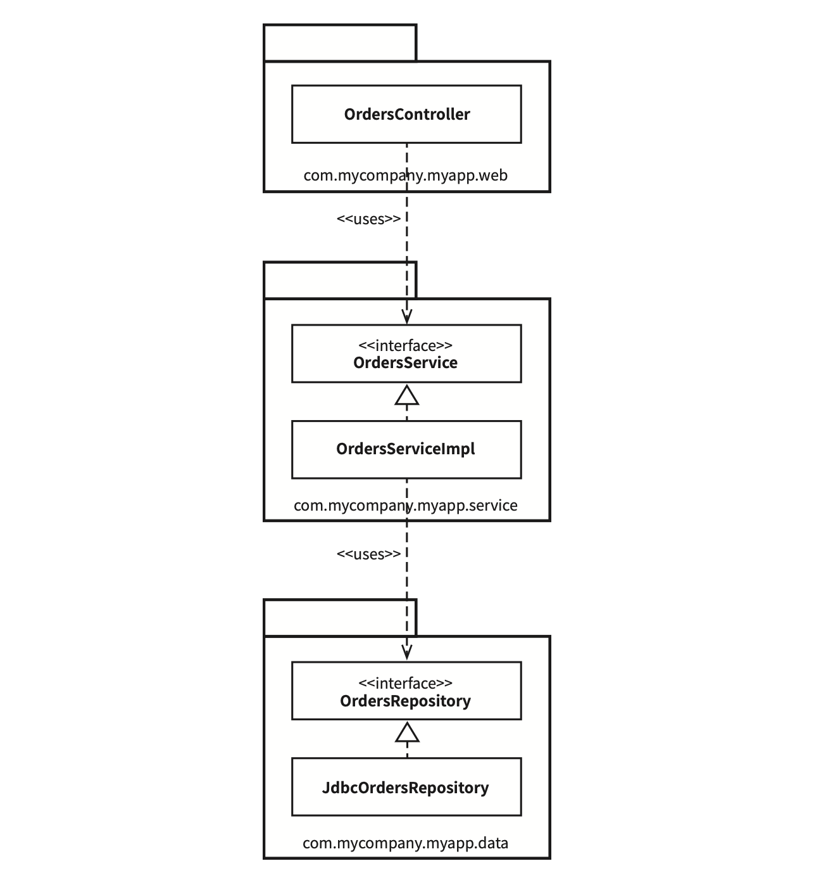
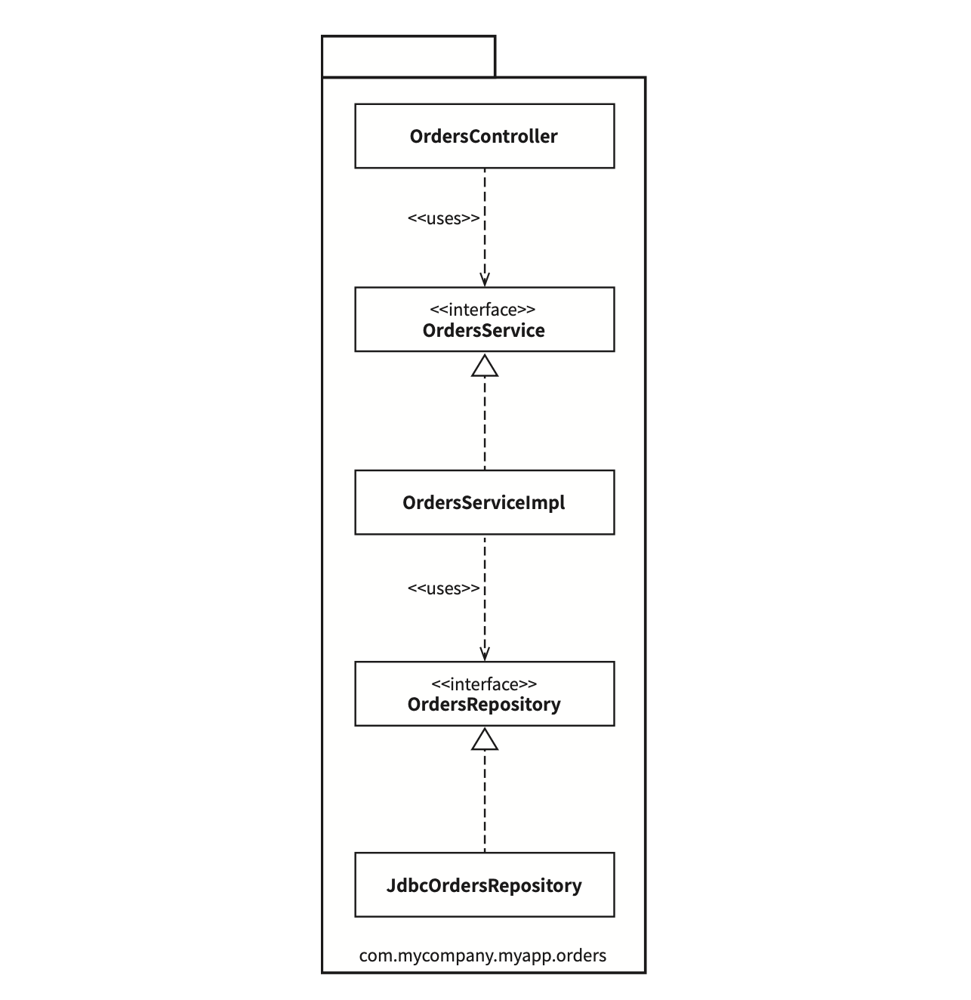
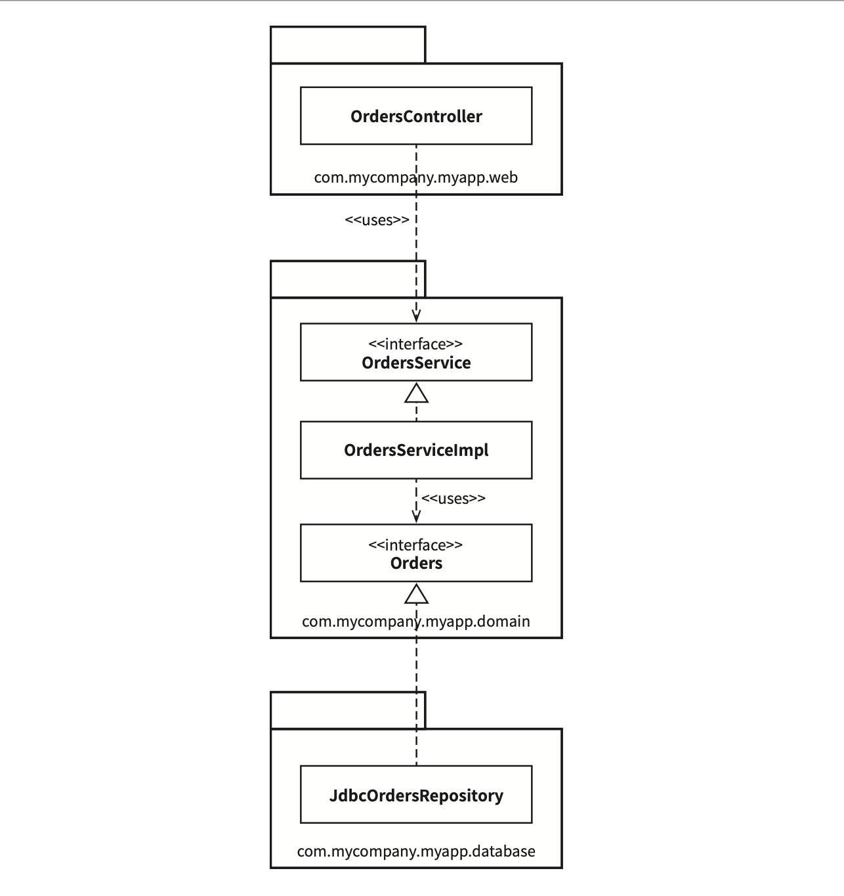
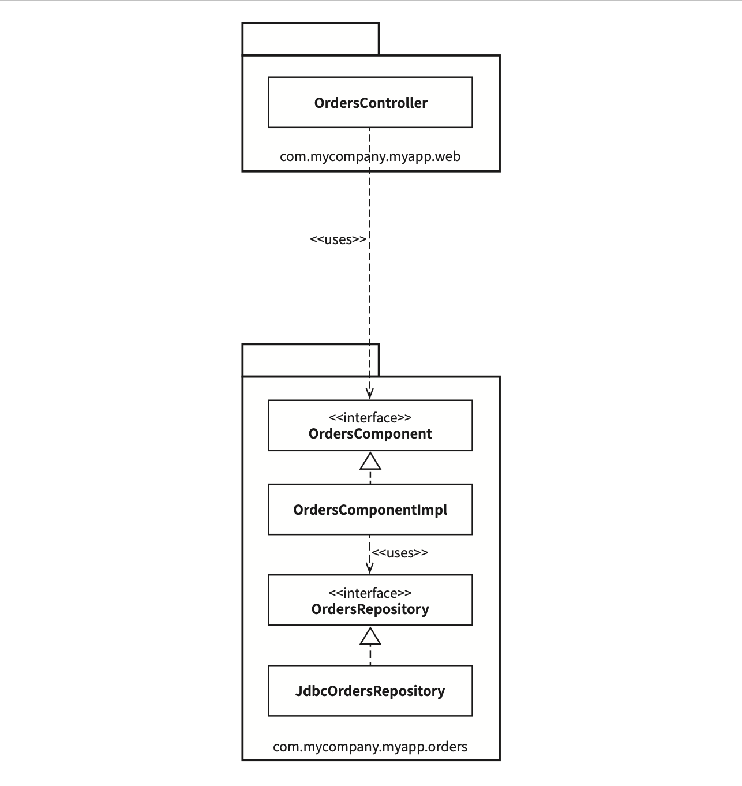
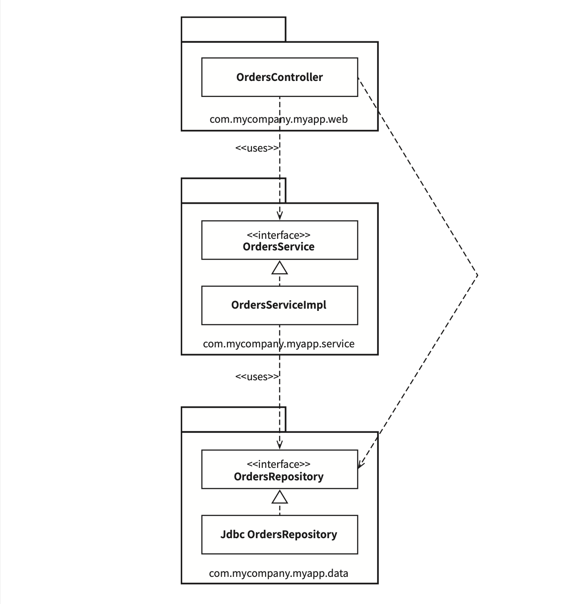
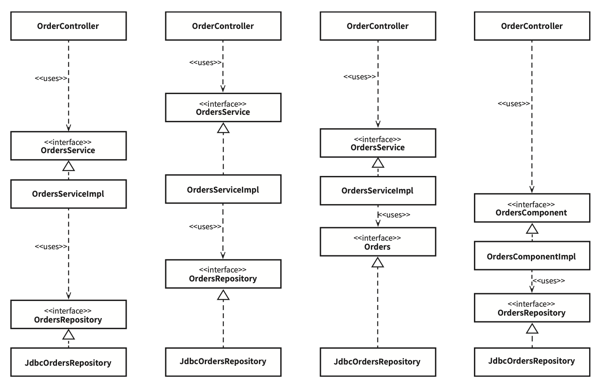
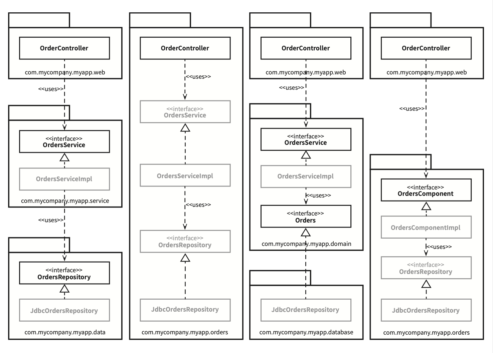
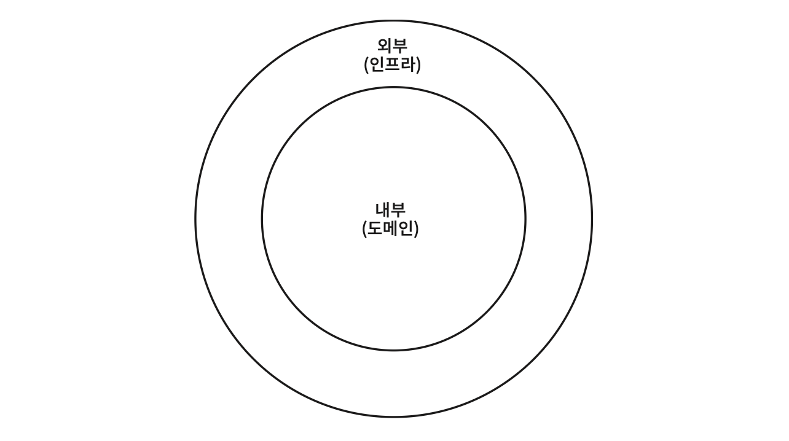

# Chapter 34: The Missing Chapter (빠져 있는 장)

*시몬 브라운(Simon Brown) 기고*

## 핵심 질문

아키텍처 원칙을 알고 있더라도, 실제 코드를 어떻게 조직화해야 하는가? 계층 기반 패키지, 기능 기반 패키지, 포트와 어댑터, 컴포넌트 기반 패키지 -- 네 가지 접근법의 장단점은 무엇이며, 접근 지시자와 캡슐화는 왜 결정적으로 중요한가?

---

## 1. 구현 세부사항의 중요성

지금까지 읽은 모든 조언은 더 나은 소프트웨어를 설계하는 데 확실히 도움이 될 것이다 -- 올바르게 정의된 경계, 명확한 책임, 통제된 의존성을 가진 클래스와 컴포넌트로 구성될 것이다. 하지만 **악마는 항상 디테일(구현 세부사항)에 있는 법**이며, 이점을 심사숙고하지 않는다면 마지막 고비에 걸려 넘어지기 십상이다.

예를 들어 온라인 서점을 구축하고 있으며, "고객이 주문 상태를 조회할 수 있어야 한다"는 유스케이스를 구현해야 한다고 가정하자. 이 예제에서는 자바를 사용하지만 원칙은 다른 프로그래밍 언어에도 똑같이 적용된다.

---

## 2. 접근법 1: 계층 기반 패키지 (Package by Layer)

아마도 가장 단순한 첫 번째 설계 방식은 전통적인 **수평 계층형 아키텍처**다. 기술적인 관점에서 해당 코드가 하는 일에 기반해 그 코드를 분할한다.



### 2.1 구조

이 전형적인 계층형 아키텍처에는 웹, '업무 규칙', 영속성 코드를 위해 계층이 각각 하나씩 존재한다. 코드는 계층이라는 얇은 수평 조각으로 나뉘며, 각 계층은 유사한 종류의 것들을 묶는 도구로 사용된다. '엄격한 계층형 아키텍처'의 경우 계층은 반드시 바로 아래 계층에만 의존해야 한다.

```
com.mycompany.myapp.web
  └── OrdersController          (웹 컨트롤러, 웹 기반 요청 처리)

com.mycompany.myapp.service
  ├── <<interface>> OrdersService    (주문 관련 '업무 규칙' 정의)
  └── OrdersServiceImpl              (OrdersService의 구현체)

com.mycompany.myapp.data
  ├── <<interface>> OrdersRepository (영구 저장된 주문 정보 접근 방법 정의)
  └── JdbcOrdersRepository           (OrdersRepository의 구현체)
```

### 2.2 자바 타입 설명

| 타입 | 역할 | 패키지 |
|------|------|--------|
| `OrdersController` | 웹 컨트롤러, 웹 기반 요청 처리 (Spring MVC 컨트롤러 등) | `web` |
| `OrdersService` | 주문 관련 '업무 규칙'을 정의하는 인터페이스 | `service` |
| `OrdersServiceImpl` | OrdersService의 구현체(*이러한 클래스 명명법(~Impl)은 끔찍한 방식이지만, 나중에 보겠듯이 큰 문제가 되지 않을 수도 있다.*) | `service` |
| `OrdersRepository` | 영구 저장된 주문 정보에 접근하는 방법을 정의하는 인터페이스 | `data` |
| `JdbcOrdersRepository` | OrdersRepository 인터페이스의 구현체 | `data` |

### 2.3 장단점

마틴 파울러(Martin Fowler)는 '프레젠테이션 도메인 데이터 계층화(Presentation Domain Data Layering)'(*https://martinfowler.com/bliki/PresentationDomainDataLayering.html*)에서 처음 시작하기에는 계층형 아키텍처가 적합하다고 얘기했다. 이 아키텍처는 엄청난 복잡함을 겪지 않고도 무언가를 작동시켜 주는 아주 빠른 방법이다.

하지만 소프트웨어가 커지고 복잡해지기 시작하면, 머지 않아 큰 그릇 세 개만으로는 모든 코드를 담기엔 부족하다는 사실을 깨닫게 된다.

엉클 밥(Uncle Bob)이 이미 언급했듯이, 계층형 아키텍처는 **업무 도메인에 대해 아무것도 말해주지 않는다**는 문제도 있다. 전혀 다른 업무 도메인이라도 코드를 계층형 아키텍처로 만들어서 나란히 놓고 보면, 웹, 서비스, 리포지터리로 구성된 모습이 기분 나쁠 정도로 비슷하게 보일 것이다.

---

## 3. 접근법 2: 기능 기반 패키지 (Package by Feature)

코드를 조직화하는 또 다른 선택지로 '기능 기반 패키지' 구조가 있다. 서로 연관된 기능, 도메인 개념, 또는 (도메인 주도 설계 용어를 사용한다면) Aggregate Root(*Aggregate Root — 에릭 에반스(Eric Evans)의 《도메인 주도 설계》에 나온 개념으로, Aggregate는 데이터 변경의 단위로 다루는 연관 객체의 묶음이다. 모든 Aggregate는 Root를 가지며, 외부에서 객체에 접근할 때는 반드시 Aggregate Root를 통해야 한다.*)에 기반하여 **수직의 얇은 조각**으로 코드를 나누는 방식이다.



### 3.1 구조

등장하는 인터페이스와 클래스는 이전과 같지만, **모두가 단 하나의 패키지에 속하게 된다.**

```
com.mycompany.myapp.orders
  ├── OrdersController
  ├── <<interface>> OrdersService
  ├── OrdersServiceImpl
  ├── <<interface>> OrdersRepository
  └── JdbcOrdersRepository
```

'계층 기반 패키지'를 아주 간단히 리팩터링한 형태지만, 이제 코드의 상위 수준 구조가 **업무 도메인에 대해 무언가를 알려주게** 된다. 이 코드 베이스가 웹, 서비스, 리포지터리가 아니라 **주문과 관련한 무언가**를 한다는 걸 볼 수 있다.

### 3.2 장점

'주문 조회하기' 유스케이스가 변경될 경우 변경해야 할 코드를 모두 찾는 작업이 더 쉬워질 수 있다. 변경해야 할 코드가 여러 군데 퍼져 있지 않고 **모두 한 패키지에 담겨 있기** 때문이다.

### 3.3 한계

수평적 계층화(계층 기반 패키지)의 문제를 깨닫고 수직적 계층화(기능 기반 패키지)로 전환하는 팀을 자주 목격했다. 하지만 **두 접근법 모두 차선책**이다.

---

## 4. 접근법 3: 포트와 어댑터 (Ports and Adapters)

'포트와 어댑터(Ports and Adapters)' 혹은 '육각형 아키텍처(Hexagonal Architecture)', '경계, 컨트롤러, 엔티티(BCE)' 등의 방식으로 접근하는 이유는 **업무/도메인에 초점을 둔 코드가 프레임워크나 데이터베이스 같은 기술적인 세부 구현과 독립적이며 분리된 아키텍처를 만들기 위해서**다.

### 4.1 내부와 외부

요약하자면, 코드 베이스는 **'내부'(도메인)**와 **'외부'(인프라)**로 구성된다.

```
┌─────────────────────────────────┐
│         외부 (인프라)             │
│   ┌───────────────────────┐     │
│   │     내부 (도메인)       │     │
│   │                       │     │
│   └───────────────────────┘     │
└─────────────────────────────────┘
```

- **'내부' 영역**: 도메인 개념을 모두 포함
- **'외부' 영역**: 외부 세계(UI, 데이터베이스, 서드파티 통합)와의 상호작용을 포함
- **주요 규칙**: '외부'가 '내부'에 의존하며, **절대 그 반대로는 안 된다**

### 4.2 구조



```
com.mycompany.myapp.web         (외부)
  └── OrdersController

com.mycompany.myapp.domain      (내부)
  ├── <<interface>> OrdersService
  ├── OrdersServiceImpl
  └── <<interface>> Orders        (이전의 OrdersRepository)

com.mycompany.myapp.database    (외부)
  └── JdbcOrdersRepository
```

`com.mycompany.myapp.domain` 패키지가 '내부'이며, 나머지 패키지는 모두 '외부'다. 의존성이 **'내부'를 향해 흐르는** 모습에 주목하라.

이전 다이어그램의 `OrdersRepository`가 `Orders`라는 간단한 이름으로 바뀌었음을 눈치챌 수 있다. 이는 도메인 주도 설계라는 세계관에서 비롯된 명명법으로, **'내부'에 존재하는 모든 것의 이름은 반드시 '유비쿼터스 도메인 언어(ubiquitous domain language)' 관점에서 기술**하라고 조언한다. 도메인에 대해 논의할 때 우리는 '주문'에 대해 말하는 것이지, '주문 리포지터리'에 대해 말하는 것이 아니다.

---

## 5. 접근법 4: 컴포넌트 기반 패키지 (Package by Component)

Simon Brown이 제안하는 또 다른 선택지인 '컴포넌트 기반 패키지'는 지금까지의 모든 것들을 혼합한 것으로, **큰 단위(coarse-grained)의 단일 컴포넌트와 관련된 모든 책임을 하나의 자바 패키지로 묶는 데 주안점**을 둔다.



### 5.1 구조

```
com.mycompany.myapp.web          (UI 분리)
  └── OrdersController

com.mycompany.myapp.orders       (업무 로직 + 영속성을 하나로)
  ├── <<interface>> OrdersComponent
  ├── OrdersComponentImpl
  ├── <<interface>> OrdersRepository
  └── JdbcOrdersRepository
```

본질적으로 이 접근법에서는 **'업무 로직'과 영속성 관련 코드를 하나로 묶는다.** 이 묶음을 '컴포넌트'라고 부른다.

### 5.2 컴포넌트의 두 가지 정의

| 정의 출처 | 내용 |
|-----------|------|
| **Uncle Bob** | 컴포넌트는 **배포 단위**다. 시스템의 구성 요소로, 배포할 수 있는 가장 작은 단위다. 자바의 경우 jar 파일이 컴포넌트다. |
| **Simon Brown** | 컴포넌트는 **멋지고 깔끔한 인터페이스로 감싸진 연관된 기능들의 묶음**으로, 애플리케이션과 같은 실행 환경 내부에 존재한다. |

Simon Brown의 정의는 'C4 소프트웨어 아키텍처 모델'(*자세한 내용은 https://www.structurizr.com/help/c4 를 참고하라.*)에 따른 것으로, 소프트웨어 시스템의 정적 구조를 컨테이너, 컴포넌트, 클래스(또는 코드)의 측면에서 계층적으로 생각하는 방법이다. 이때 각 컴포넌트가 개별 jar 파일로 분리될지 여부는 **직교적인 관심사**(*orthogonal concern — 한 요소에서 발생한 변경이 다른 변경에 영향을 미치지 않을 때, 두 요소는 서로 '직교' 관계라고 말한다. '독립적인', 또는 '관련이 없는'과 동일한 의미다.*)다.

### 5.3 주된 이점

- 주문과 관련된 무언가를 코딩해야 할 때 오직 한 곳, 즉 `OrdersComponent`만 둘러보면 된다
- 컴포넌트 내부에서 관심사의 분리는 여전히 유효하다 (업무 로직은 데이터 영속성과 분리)
- 하지만 이는 **컴포넌트 구현의 세부사항**이며, 사용자는 알 필요가 없다
- 마이크로서비스 아키텍처에서 얻는 이점과도 유사하다
- **모노리틱 애플리케이션에서 컴포넌트를 잘 정의하면 마이크로서비스 아키텍처로 가기 위한 발판**으로 삼을 수 있다

---

## 6. 계층형 아키텍처의 추가적인 문제: 우회

계층형 아키텍처를 좋지 않은 아키텍처로 여겨야 하는 이유는 또 있다. 다음과 같은 시나리오를 생각해 보자.

### 6.1 신입 개발자 시나리오

팀에서 신규 인력을 고용하여 주문과 관련된 또 다른 유스케이스를 구현하라고 지시했다. 이 신입은 빨리 깊은 인상을 남기고 싶어한다.

1. `OrdersController`가 이미 존재한다는 사실을 발견 -- 웹 페이지의 신규 코드를 추가할 위치로 결정
2. 데이터베이스로부터 주문과 관련된 데이터가 필요 -- `OrdersRepository`가 이미 만들어져 있음을 발견
3. **"단순히 이 구현체를 내가 만들 컨트롤러에 의존성으로 주입하면 될 거야. 완벽해!"**
4. 잠시 코드를 조작해서 웹 페이지가 동작하도록 만든다



결과: `OrdersController`가 `OrdersService`를 **우회**하고 `OrdersRepository`에 직접 접근한다. 의존성 화살표는 여전히 아래를 향하지만, 업무 로직 계층이 무시되었다.

이러한 구조를 **'완화된 계층형 아키텍처'(relaxed layered architecture)**라고 부르며, 계층이 인접한 계층을 건너뛰는 일이 허용된다. CQRS 패턴(*CQRS(Command Query Responsibility Segregation) 패턴 — 데이터를 변경하고 조회하는 패턴을 서로 분리한다.*)을 지키려는 경우에는 의도된 결과일 수 있지만, 그 외의 경우에서는 업무 로직 계층을 우회하는 일은 바람직하지 못하다.

### 6.2 아키텍처 원칙과 강제

이 문제를 해결하려면 **지침(아키텍처 원칙)**이 필요하다: "웹 컨트롤러는 절대로 리포지터리에 직접 접근해서는 안 된다"

강제 방법에는 세 가지가 있다:

| 방법 | 설명 | 문제점 |
|------|------|--------|
| **자기 규율 + 코드 리뷰** | "우리는 개발자를 믿습니다" | 자금 부족이나 납기 압박 시 무너진다 |
| **정적 분석 도구** | NDepend, Structure101, Checkstyle 등으로 위반 검사 | 조잡하고 피드백 주기가 길다 |
| **컴파일러** | 접근 지시자를 활용해 컴파일 시점에 강제 | **가장 바람직하다** |

개인적으로는 가능하면 **컴파일러를 사용해서 아키텍처를 강제하는 방식**을 선호한다. '컴포넌트 기반 패키지'를 도입해야 하는 이유가 바로 이것이다.

---

## 7. 구현 세부사항엔 항상 문제가 있다

표면상으로는 네 가지 접근법이 완전히 서로 다른 방식처럼 보이지만, **세부사항을 잘못 구현하면 이러한 견해도 아주 빠르게 흐트러지기 시작한다.**

자바와 같은 언어에서 `public` 접근 지시자를 지나칠 정도로 방만하게 사용하는 모습이 자주 보인다. 개발자인 우리는 `public` 키워드를 아무런 고민 없이 마치 본능적으로 사용하는 것처럼 보인다.

모든 타입에서 `public` 지시자를 사용한다는 건 사용하는 프로그래밍 언어가 제공하는 **캡슐화 관련 이점을 활용하지 않겠다**는 뜻이다. 이로 인해 누군가가 구체적인 구현 클래스의 인스턴스를 직접 생성하는 코드를 작성하는 일을 절대 막을 수 없으니, 결국 당신이 지향하는 아키텍처 스타일을 위반하게 될 것이다.

---

## 8. 조직화 vs. 캡슐화

만약 자바 애플리케이션에서 **모든 타입을 public으로 지정**한다면, 패키지는 단순히 조직화를 위한 메커니즘(폴더와 같이 무언가를 묶는 방식)으로 전락하여 **캡슐화를 위한 메커니즘이 될 수 없다.**

### 8.1 모든 타입이 public일 때

public 지시자를 과용하면 네 가지 아키텍처 접근법은 본질적으로 **완전히 같아진다.**



각 타입 사이의 화살표를 유심히 살펴보면, 채택하려는 아키텍처 접근법과 아무런 관계 없이 화살표들이 모두 동일한 방향을 가리킨다. 개념적으로 이 접근법들은 매우 다르지만, **구문적으로는 완전히 똑같다.** 모든 타입을 public으로 선언한다면, 우리가 실제로 갖게 되는 것은 수평적 계층형 아키텍처를 표현하는 네 가지 방식에 지나지 않는다.

### 8.2 접근 지시자를 적절히 사용할 때

자바에서 접근 지시자를 적절하게 사용하면, 타입을 패키지로 배치하는 방식에 따라서 각 타입에 접근할 수 있는 정도가 실제로 크게 달라질 수 있다.



### 8.3 접근법별 접근 지시자 활용

| 접근법 | public 타입 | package-protected 타입 | 핵심 포인트 |
|--------|------------|------------------------|------------|
| **계층 기반 패키지** | `OrdersService`, `OrdersRepository` (인터페이스) | `OrdersServiceImpl`, `JdbcOrdersRepository` (구현체) | 외부 패키지에서 인터페이스에만 접근 |
| **기능 기반 패키지** | `OrdersController` (진입점) | 나머지 모두 | 패키지 밖에서는 컨트롤러를 통해서만 접근 가능 |
| **포트와 어댑터** | `OrdersService`, `Orders` (인터페이스) | `OrdersServiceImpl`, `JdbcOrdersRepository` (구현체) | 구현 클래스는 런타임에 의존성 주입 |
| **컴포넌트 기반 패키지** | `OrdersComponent` (인터페이스) | `OrdersComponentImpl`, `OrdersRepository`, `JdbcOrdersRepository` | **가장 제한적** -- 외부에서 `OrdersRepository`에 직접 접근 불가 |

> **핵심 통찰**: '컴포넌트 기반 패키지' 접근법에서는 이 패키지 외부의 코드에서 `OrdersRepository` 인터페이스나 구현체를 직접 사용할 수 있는 방법이 전혀 없다. 따라서 우리는 **컴파일러의 도움을 받아서** 아키텍처 접근법을 강제할 수 있다. .NET에서도 `internal` 키워드를 사용하면 동일한 결과를 얻을 수 있다.

---

## 9. 다른 결합 분리 모드

프로그래밍 언어가 제공하는 방법 외에도 소스 코드 의존성을 분리하는 방법은 존재한다.

### 9.1 모듈 시스템

자바에는 OSGi 같은 모듈 프레임워크나 자바 9에서 제공하는 새로운 모듈 시스템이 있다. 모듈 시스템을 제대로 사용하면 `public` 타입과 외부에 공표할 타입을 분리할 수 있다.

### 9.2 소스 코드 트리 분리

다른 선택지로는 소스 코드 수준에서 의존성을 분리하는 방법도 있다. 포트와 어댑터를 예로 들면, 다음과 같은 소스 코드 트리를 만들 수 있다:

| 소스 코드 트리 | 포함 내용 | 의존성 |
|---------------|-----------|--------|
| **업무와 도메인** | `OrdersService`, `OrdersServiceImpl`, `Orders` | 프레임워크/기술과 독립적 |
| **웹** | `OrdersController` | 업무/도메인에 컴파일 시점 의존성 |
| **데이터 영속성** | `JdbcOrdersRepository` | 업무/도메인에 컴파일 시점 의존성 |

마지막 두 소스 코드 트리는 업무와 도메인 코드에 대해 컴파일 시점에 의존성을 가지며, 업무와 도메인 코드 자체는 웹이나 데이터 영속성 코드에 대해서는 아무것도 알지 못한다.

이상적으로는 이러한 형태를 반복적으로 적용하여 애플리케이션을 구성하는 모든 컴포넌트 각각을 개별적인 소스 코드 트리로 구성해야 한다. **하지만 이는 너무 이상적인 해결책이다.** 현실에서 소스 코드를 이처럼 나누다 보면 성능, 복잡성, 유지보수 문제가 생기기 때문이다.

### 9.3 페리페리크 안티 패턴

포트와 어댑터 접근법을 적용할 때 단순히 소스 코드 트리를 두 개만 만드는 간단한 방법도 있다:

- **도메인 코드 ('내부')**
- **인프라 코드 ('외부')**



하지만 여기에는 잠재적인 절충 사항이 있다. Simon Brown은 이를 **'포트와 어댑터에 대한 페리페리크(Peripherique) 안티 패턴'**이라고 부른다.

프랑스 파리에는 블러바드 페리페리크(Boulevard Peripherique)라는 원형 순환도로가 있는데, 이 도로를 이용하면 북적대는 파리 시내에 진입하지 않고도 파리 전체를 돌 수 있다.

마찬가지로, 인프라 코드를 단일 소스 코드에 모두 모아둔다는 말은 **특정 영역(예: 웹 컨트롤러)에 있는 인프라 코드가 다른 영역(예: 데이터베이스 리포지터리)에 있는 코드를 직접 호출할 수 있다**는 뜻이다. 도메인을 통하지 않고 말이다. 특히 해당 코드에 적절한 접근 지시자를 적용하는 걸 잊어버린 경우라면 이러한 호출을 막기는 더욱 힘들다.

---

## 10. 결론: 빠져 있는 조언

이 장은 최적의 설계를 꾀했더라도, **구현 전략에 얽힌 복잡함을 고려하지 않으면 설계가 순식간에 망가질 수도 있다**는 사실을 강조하는 데 그 목적이 있다.

다음 사항을 고민하라:

1. 설계를 어떻게 해야만 원하는 코드 구조로 **매핑**할 수 있을지
2. 그 코드를 어떻게 **조직화**할지
3. 런타임과 컴파일타임에 어떤 **결합 분리 모드**를 적용할지
4. 가능하다면 선택사항을 열어두되, **실용주의적으로** 행하라
5. 팀의 규모, 기술 수준, 해결책의 복잡성을 **일정과 예산**이라는 제약과 동시에 고려하라
6. 선택된 아키텍처 스타일을 강제하는 데 **컴파일러의 도움**을 받을 수 있을지를 고민하라
7. 데이터 모델과 같은 다른 영역에 **결합되지 않도록** 주의하라

**구현 세부사항에는 항상 문제가 있는 법이다.**

---

## 요약

- 코드 조직화에는 네 가지 주요 접근법이 있다: **계층 기반 패키지**, **기능 기반 패키지**, **포트와 어댑터**, **컴포넌트 기반 패키지**
- 계층 기반 패키지는 단순하지만 업무 도메인에 대해 아무것도 말해주지 않으며, 계층 우회 문제가 있다
- 기능 기반 패키지는 도메인을 드러내지만 여전히 차선책이다
- 포트와 어댑터는 내부(도메인)와 외부(인프라)를 분리하지만, 페리페리크 안티 패턴에 주의해야 한다
- 컴포넌트 기반 패키지는 업무 로직과 영속성을 하나의 컴포넌트로 묶어 **컴파일러를 통한 아키텍처 강제**가 가능하다
- `public` 접근 지시자를 과용하면 어떤 아키텍처 접근법이든 **사실상 동일해진다**
- 접근 지시자를 적절히 사용하면 컴파일 시점에 아키텍처 원칙을 강제할 수 있다
- 아키텍처와 설계 원칙을 알더라도, **구현 전략을 고려하지 않으면 설계는 순식간에 망가진다**

---

## 다른 챕터와의 관계

- **Chapter 22 (클린 아키텍처)**: 포트와 어댑터 접근법은 클린 아키텍처의 동심원 모델과 직접적으로 대응한다. 내부(도메인) = 엔티티/유스케이스, 외부(인프라) = 프레임워크와 드라이버.
- **Chapter 7 (SRP, 단일 책임 원칙)**: 컴포넌트 기반 패키지에서 관련 기능을 하나로 묶는 것은 SRP의 실천이다.
- **Chapter 14 (컴포넌트 결합)**: CCP(공통 폐쇄 원칙), CRP(공통 재사용 원칙)는 패키지를 어떻게 구성할지에 직접적인 영향을 미친다.
- **Chapter 11 (DIP, 의존성 역전 원칙)**: 포트와 어댑터에서 외부가 내부에 의존하고 그 반대가 아닌 것은 DIP의 적용이다.
- **Chapter 32 (프레임워크는 세부사항이다)**: 프레임워크를 바깥쪽에 두는 원칙은 포트와 어댑터 접근법의 핵심과 일치한다.
- **Chapter 30 (데이터베이스는 세부사항이다)**: 데이터 영속성 코드를 외부에 위치시키는 것은 이 원칙의 실천이다.
- **Chapter 26 (메인 컴포넌트)**: 의존성 주입을 통해 구현체를 연결하는 것은 메인 컴포넌트의 책임이다.
